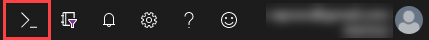

<!--
!["Microsoft Cloud Workshops"][logo]

<div class="MCWHeader1">
Cloud-native applications
</div>

<div class="MCWHeader2">
Before the hands-on lab setup guide
</div>

<div class="MCWHeader3">
February 2020
</div>

Information in this document, including URL and other Internet Web site references, is subject to change without notice. Unless otherwise noted, the example companies, organizations, products, domain names, e-mail addresses, logos, people, places, and events depicted herein are fictitious, and no association with any real company, organization, product, domain name, e-mail address, logo, person, place or event is intended or should be inferred. Complying with all applicable copyright laws is the responsibility of the user. Without limiting the rights under copyright, no part of this document may be reproduced, stored in or introduced into a retrieval system, or transmitted in any form or by any means (electronic, mechanical, photocopying, recording, or otherwise), or for any purpose, without the express written permission of Microsoft Corporation.

Microsoft may have patents, patent applications, trademarks, copyrights, or other intellectual property rights covering subject matter in this document. Except as expressly provided in any written license agreement from Microsoft, the furnishing of this document does not give you any license to these patents, trademarks, copyrights, or other intellectual property.

The names of manufacturers, products, or URLs are provided for informational purposes only and Microsoft makes no representations and warranties, either expressed, implied, or statutory, regarding these manufacturers or the use of the products with any Microsoft technologies. The inclusion of a manufacturer or product does not imply endorsement of Microsoft of the manufacturer or product. Links may be provided to third party sites. Such sites are not under the control of Microsoft and Microsoft is not responsible for the contents of any linked site or any link contained in a linked site, or any changes or updates to such sites. Microsoft is not responsible for webcasting or any other form of transmission received from any linked site. Microsoft is providing these links to you only as a convenience, and the inclusion of any link does not imply endorsement of Microsoft of the site or the products contained therein.

© 2020 Microsoft Corporation. All rights reserved.

**Contents**
-->

<!-- TOC -->

- [Cloud-native applications before the hands-on lab setup guide](#cloud-native-applications-before-the-hands-on-lab-setup-guide)
    - [Requirements](#requirements)
    - [Before the hands-on lab](#before-the-hands-on-lab)
        - [Task 1: Setup Azure Cloud Shell](#task-1-setup-azure-cloud-shell)
        - [Task 2: Download Starter Files](#task-2-download-starter-files)
        - [Task 3: Resource Group](#task-3-resource-group)
        - [Task 4: Create an SSH key](#task-4-create-an-ssh-key)
        - [Task 5: Create a Service Principal](#task-5-create-a-service-principal)
        - [Task 6: Deploy ARM Template](#task-6-deploy-arm-template)
        - [Task 7: Setup Azure DevOps project](#task-7-setup-azure-devops-project)
        - [Task 8: Connect securely to the build agent](#task-8-connect-securely-to-the-build-agent)
        - [Task 9: Complete the build agent setup](#task-9-complete-the-build-agent-setup)
        - [Task 10: Clone Repositories to the Build Agent](#task-10-clone-repositories-to-the-build-agent)
- [クラウド ネイティブのアプリケーションに関するハンズオン ラボの事前セットアップ ガイド <a name="クラウド-ネイティブのアプリケーションに関するハンズオン-ラボの事前セットアップ-ガイド"></a>](#クラウド-ネイティブのアプリケーションに関するハンズオン-ラボの事前セットアップ-ガイド-a-nameクラウド-ネイティブのアプリケーションに関するハンズオン-ラボの事前セットアップ-ガイドa)
    - [前提条件 <a name="前提条件"></a>](#前提条件-a-name前提条件a)
    - [ハンズオン ラボを始める前に <a name="ハンズオン-ラボを始める前に"></a>](#ハンズオン-ラボを始める前に-a-nameハンズオン-ラボを始める前にa)
        - [タスク 1: Azure Cloud Shell のセットアップ <a name="タスク-1-azure-cloud-shell-のセットアップ"></a>](#タスク-1-azure-cloud-shell-のセットアップ-a-nameタスク-1-azure-cloud-shell-のセットアップa)
        - [タスク 2: スターター ファイルのダウンロード <a name="タスク-2-スターター-ファイルのダウンロード"></a>](#タスク-2-スターター-ファイルのダウンロード-a-nameタスク-2-スターター-ファイルのダウンロードa)
        - [タスク 3: リソース グループ <a name="タスク-3-リソース-グループ"></a>](#タスク-3-リソース-グループ-a-nameタスク-3-リソース-グループa)
        - [タスク 4: SSH キーの作成 <a name="タスク-4-ssh-キーの作成"></a>](#タスク-4-ssh-キーの作成-a-nameタスク-4-ssh-キーの作成a)
        - [タスク 5: サービス プリンシパルの作成 <a name="タスク-5-サービス-プリンシパルの作成"></a>](#タスク-5-サービス-プリンシパルの作成-a-nameタスク-5-サービス-プリンシパルの作成a)
        - [タスク 6: ARM テンプレートの展開 <a name="タスク-6-arm-テンプレートの展開"></a>](#タスク-6-arm-テンプレートの展開-a-nameタスク-6-arm-テンプレートの展開a)
        - [タスク 7: Azure DevOps プロジェクトのセットアップ <a name="タスク-7-azure-devops-プロジェクトのセットアップ"></a>](#タスク-7-azure-devops-プロジェクトのセットアップ-a-nameタスク-7-azure-devops-プロジェクトのセットアップa)
        - [タスク 8: ビルド エージェントとのセキュアな接続 <a name="タスク-8-ビルド-エージェントとのセキュアな接続"></a>](#タスク-8-ビルド-エージェントとのセキュアな接続-a-nameタスク-8-ビルド-エージェントとのセキュアな接続a)
        - [タスク 9: ビルド エージェントのセットアップの完了 <a name="タスク-9-ビルド-エージェントのセットアップの完了"></a>](#タスク-9-ビルド-エージェントのセットアップの完了-a-nameタスク-9-ビルド-エージェントのセットアップの完了a)
        - [タスク 10: リポジトリをビルド エージェントに複製 <a name="タスク-10-リポジトリをビルド-エージェントに複製"></a>](#タスク-10-リポジトリをビルド-エージェントに複製-a-nameタスク-10-リポジトリをビルド-エージェントに複製a)

<!-- /TOC -->
<!--
# Cloud-native applications before the hands-on lab setup guide

## Requirements

1. Microsoft Azure subscription must be pay-as-you-go or MSDN.

   - Trial subscriptions will _not_ work.

   - To complete this lab setup (including [Task 5: Create a Service Principal](#Task-5-Create-a-Service-Principal)) ensure your account includes the following:

     - Has the [Owner](https://docs.microsoft.com/en-us/azure/role-based-access-control/built-in-roles#owner) built-in role for the subscription you use.

     - Is a [Member](https://docs.microsoft.com/en-us/azure/active-directory/fundamentals/users-default-permissions#member-and-guest-users) user in the Azure AD tenant you use. (Guest users will not have the necessary permissions).

     > **Note** If you do not meet these requirements, ask another member user with subscription owner rights to login to the portal and execute the task to create the service principal.

   - You must have enough cores available in your subscription to create the build agent and Azure Kubernetes Service cluster in [Task 6: Deploy ARM Template](#Task-6-Deploy-ARM-Template). You'll need eight cores if following the exact instructions in the lab, more if you choose additional agents or larger VM sizes. Execute the steps required before the lab to see if you need to request more cores in your sub.

2. An account in Azure DevOps.

3. Local machine or a virtual machine configured with:

   - A browser, preferably Chrome for consistency with the lab implementation tests.

4. You will be asked to install other tools throughout the exercises.

## Before the hands-on lab

**Duration**: 1 hour

You should follow all of the steps provided in this section _before_ taking part in the hands-on lab ahead of time as some of these steps take time.

### Task 1: Setup Azure Cloud Shell

1. Open a cloud shell by selecting the cloud shell icon in the menu bar.

   

2. The cloud shell opens in the browser window. Choose "Bash" if prompted or use the left-hand dropdown on the shell menu bar to choose "Bash" (as shown).

   

3. You should make sure to set your default subscription correctly. To view your current subscription type:

   ```bash
   az account show
   ```

   

4. To list all of your subscriptions, type:

   ```bash
   az account list
   ```

   

5. To set your default subscription to something other than the current selection, type the following, replacing {id} with the desired subscription id value:

   ```bash
   az account set --subscription {id}
   ```

### Task 2: Download Starter Files

In this task, you use `git` to copy the lab content to your cloud shell so that the lab starter files will be available.

> **Note**: If you don't have a cloud shell available, refer back to [Task 1: Setup Azure Cloud Shell](#task-1-setup-azure-cloud-shell).

1. Type the following command and press `<ENTER>`:

   ```bash
   git clone https://github.com/microsoft/MCW-Cloud-native-applications.git
   ```

2. The lab files download.

   

3. We do not need the `.git` folder, and later steps will be less complex if we remove it. Run this command:

   ```bash
   rm -rf MCW-Cloud-native-applications/.git
   ```

### Task 3: Resource Group

Create an Azure Resource Group to hold most of the resources that you create in this hands-on lab. This approach makes it easier to clean up later.

1. In your cloud shell window, you type a command similar to the following command:

   > **Note**: If you don't have a cloud shell available, refer back to [Task 1: Setup Azure Cloud Shell](#task-1-setup-azure-cloud-shell).

   ```bash
   az group create -l [LOCATION] -n fabmedical-[SUFFIX]
   ```

   - **Suffix:** Throughout the lab, suffix should be used to make resources unique, like your email prefix or your first initial and last name.

   - **Location:** Choose a region where all Azure Container Registry SKUs have to be available, which is currently: Canada Central, Canada East, North Central US, Central US, South Central US, East US, East US 2, West US, West US 2, West Central US, France Central, UK South, UK West, North Europe, West Europe, Australia East, Australia Southeast, Brazil South, Central India, South India, Japan East, Japan West, Korea Central, Southeast Asia, East Asia, and remember this for future steps so that the resources you create in Azure are all kept within the same region.

   Example:

   ```bash
   az group create -l westus -n fabmedical-sol
   ```

2. When this completes, the Azure Portal shows your Resource Group.

   

### Task 4: Create an SSH key

You create VMs during the upcoming exercises. In this section, you create an SSH key to access the VMs securely.

1. From the cloud shell command line, enter the following command to ensure that a directory for the SSH keys exists. You can ignore any errors you see in the output.

   > **Note**: If you don't have a cloud shell available, refer back to [Task 1: Setup Azure Cloud Shell](#task-1-setup-azure-cloud-shell).

   ```bash
   mkdir .ssh
   ```

2. From the cloud shell command line, enter the following command to generate an SSH key pair. You can replace "admin" with your preferred name or handle.

   ```bash
   ssh-keygen -t RSA -b 2048 -C admin@fabmedical
   ```

3. When asked to save the generated key to a file, enter `.ssh/fabmedical` for the name.

4. Enter a passphrase when prompted, and **don't forget it**!

5. Because you entered ".ssh/fabmedical", ssh-keygen generates the file in the ".ssh" folder in your user folder, where the cloud shell opens by default.

   

6. From the cloud shell command line, enter the following command to output the public key content. Copy this information to use later.

    ```bash
    cat .ssh/fabmedical.pub
    ```

7. Keep this cloud shell open and remain in the default directory. You will use this shell in later tasks.

    

### Task 5: Create a Service Principal

Azure Kubernetes Service requires an Azure Active Directory service principal to interact with Azure APIs. The service principal is needed to dynamically manage resources such as user-defined routes and the Layer 4 Azure Load Balancer. The easiest way to set up the service principal is by using the Azure cloud shell.

> **Note**: To complete this task, ensure your account is an [Owner](https://docs.microsoft.com/en-us/azure/role-based-access-control/built-in-roles#owner) built-in role for the subscription you use and is a [Member](https://docs.microsoft.com/en-us/azure/active-directory/fundamentals/users-default-permissions#member-and-guest-users) user in the Azure AD tenant you use. You may have trouble creating a service principal if you do not meet these requirements.

1. To create a service principal, type the following command in the cloud shell command line, replacing {id} with your subscription identifier, and replacing suffix with your chosen suffix to make the name unique:

   > **Note**: If you don't have a cloud shell available, refer back to [Task 1: Setup Azure Cloud Shell](#task-1-setup-azure-cloud-shell).

   ```bash
   az ad sp create-for-rbac --role="Contributor" --scopes="/subscriptions/{id}" --name="http://Fabmedical-sp-{SUFFIX}"
   ```

2. The command produces output like this. Copy this information to use later.

   

3. To get the service principal object id, type the following command, replacing {appId} with your service principal appId:

   ```bash
   az ad sp show --id {appId} --query "{objectId:@.objectId}"
   ```

4. The command produces output like this. Copy this information to use later.

   

### Task 6: Deploy ARM Template

In this section, you configure and execute an ARM template that creates all the resources that you need throughout the exercises.

1. In Azure cloud shell, switch to the ARM template directory:

   > **Note**: If you don't have a cloud shell available, refer back to [Task 1: Setup Azure Cloud Shell](#task-1-setup-azure-cloud-shell).

   ```bash
   cd MCW-Cloud-native-applications/Hands-on\ lab/arm/
   ```

2. Open the azuredeploy.parameters.json file for editing using Azure Cloud Shell editor.

   ```bash
   code azuredeploy.parameters.json
   ```

   

3. Update the values for the various keys so that they match your environment:

   - **Suffix**: Enter a shortened version of your SUFFIX with a max of 3 chars.
   - **VirtualMachineAdminUsernameLinux**: The Linux Build Agent VM admin username (example: `"adminfabmedical"`).
   - **VirtualMachineAdminPublicKeyLinux**: The Linux Build Agent VM admin ssh public key. You find this value in the `.ssh/fabmedical.pub` file created previously (example: `"ssh-rsa AAAAB3N(...)vPiybQV admin@fabmedical"`).
   - **KubernetesServicePrincipalClientId**: The Kubernetes Cluster Service Principal Client Id. Use the service principal “appId” from a previous step.
   - **KubernetesServicePrincipalClientSecret**: The Kubernetes Cluster Service Principal Client Secret. Use the service principal “password” from a previous step.
   - **KubernetesServicePrincipalObjectId**: The Kubernetes Cluster Service Principal Object Id. Use the service principal “objectId” from a previous step.
   - **CosmosLocation**: The primary location of the Azure Cosmos DB. Use the same location as the resource group previously created (example: `"eastus"`).
   - **CosmosLocationName**: The name of the primary location of the Azure Cosmos DB. Use the name of the same location as the resource group previously created (example: `"East US"`).
   - **CosmosPairedLocation**: The secondary location of the Azure Cosmos DB. Use a location from the list below (example: `"westus"`).
   - **CosmosPairedLocationName**: The name of the secondary location of the Azure Cosmos DB. Use the location name from the list below that matches the secondary location defined in the previous key (example: `"West US"`).
   

   | Location           | Location Name       |
   | ------------------ | ------------------- |
   | canadacentral      | Canada Central      |
   | canadaeast         | Canada East         |
   | northcentralus     | North Central US    |
   | centralus          | Central US          |
   | southcentralus     | South Central US    |
   | eastus             | East US             |
   | eastus2            | East US 2           |
   | westus             | West US             |
   | westus2            | West US 2           |
   | westcentralus      | West Central US     |
   | francecentral      | France Central      |
   | uksouth            | UK South            |
   | ukwest             | UK West             |
   | northeurope        | North Europe        |
   | westeurope         | West Europe         |
   | australiaeast      | Australia East      |
   | australiasoutheast | Australia Southeast |
   | brazilsouth        | Brazil South        |
   | centralindia       | Central India       |
   | southindia         | South India         |
   | japaneast          | Japan East          |
   | japanwest          | Japan West          |
   | koreacentral       | Korea Central       |
   | southeastasia      | Southeast Asia      |
   | eastasia           | East Asia           |

4. Select the **...** button and select **Save**.

   

5. Select the **...** button again and select **Close Editor**.

   

6. Create the needed resources by typing the following instruction (case sensitive), replacing {resourceGroup} with the name of the previously created resource group:

   ```bash
   az group deployment create --resource-group {resourceGroup} --template-file azuredeploy.json --parameters azuredeploy.parameters.json
   ```

   This command takes up to 30 to 60 minutes to deploy all lab resources. You can continue to the next task to setup Azure DevOps while the deployment runs.

### Task 7: Setup Azure DevOps project

FabMedical has provided starter files for you. They have taken a copy of the websites for their customer Contoso Neuro and refactored it from a single node.js site into a website with a content API that serves up the speakers and sessions. This refactored code is a starting point to validate the containerization of their websites. Use this to help them complete a POC that validates the development workflow for running the website and API as Docker containers and managing them within the Azure Kubernetes Service environment.

1. Open a **new** Azure Cloud Shell console.

2. Navigate to the FabMedical source code folder and list the contents.

   ```bash
   cd ~/MCW-Cloud-native-applications/Hands-on\ lab/lab-files/developer/
   ll
   ```

   > **Important note**: If you will be taking the Infrastructure edition of the lab, instead of using the above instructions, type the following ones:
   >
   > ```bash
   > cd ~/MCW-Cloud-native-applications/Hands-on\ lab/lab-files/infrastructure/
   > ll
   > ```
   >
   > This will take you to the version of the starter files that will be used by that edition of the lab.

3. You'll see the listing includes three folders, one for the web site, another for the content API and one to initialize API data:

   ```bash
   content-api/
   content-init/
   content-web/
   ```

4. Set your username and email, which git uses for commits.

   ```bash
   git config --global user.email "you@example.com"
   git config --global user.name "Your Name"
   ```

5. Configure git CLI to cache your credentials, so that you don't have to keep
   re-typing them.

   ```bash
   git config --global credential.helper cache
   ```

6. Open a new browser tab to visit [Azure DevOps][devops] and log into your
   account.

   If you have never logged into this account, Azure DevOps takes you through a first-run experience:

   - Confirm your contact information and select next.
   - Select "Create new account".
   - Enter a fabmedical-SUFFIX for your account name and select Continue.

7. Create an Azure DevOps Project.

   - Enter fabmedical as the project name.
   - Ensure the project is Private.
   - Choose the "Advanced" dropdown.
   - Ensure the Version control is set to Git.
   - Select the "Create" button.

   

8. Enable multi-stage pipelines:

   - Select your user icon in the top right corner.
   - Then choose the three dots to access the "Preview Features" menu item.
   - Toggle multi-stage pipelines to "On".

9. Next, add an Azure Service Connection to your Azure DevOps account. Select the
   Project settings gear icon to access your settings. Then select Service Connections.

10. Choose "+ New service connection". Then pick "Azure Resource Manager" from
    the menu.

    

11. Select the link indicated in the screenshot below to access the advanced settings.

    

12. Enter the required information using the service principal information you
    created earlier.

    - **Connection name**: azurecloud
    - **Environment**: AzureCloud
    - **Scope Level**: Subscription
    - **Subscription ID**: Enter `id` from `az account show` output.
    - **Subscription name**: Enter `name` from `az account show` output.
    - **Service principal client ID**: Enter `appId` from service principal output.
    - **Service principal key**: Enter `password` from service principal output.
    - **Tenant ID**: Enter `tenant` from service principal output.

    

13. Select "Verify connection" then select "OK".

    > **Note**: If the connection does not verify, then recheck and reenter the required data.

14. Next, add another Azure Service Connection to your Azure DevOps account.
    Select the Project settings gear icon to access your settings. Then choose
    Service Connections.

15. Choose "+ New service connection". Then pick "Docker Registry" from
    the menu.

    

16. Enter the required information using the service principal information you
    created earlier.

    - **Environment**: Azure Container Registry

    - **Connection name**: Fabmedical ACR

    - **Azure Subscription**: Choose the subscription you are using for the lab.

    - **Azure Container Registry**: Choose the registry created for you by the ARM deployment.

    

17. Select "OK".

18. Next, choose "Repos" then use the repository dropdown to create a new
    repository by selecting "+ New repository".

    

    - Enter "content-web" as the repository name.

    - Once Azure DevOps creates the repository, select "Generate Git credentials".

    

19. Copy the Personal Access Token and save it for later steps.

20. Using your cloud shell window, initialize a new git repository for `content-web`.

    ```bash
    cd content-web
    git init
    git add .
    git commit -m "Initial Commit"
    ```

21. Return to your Azure DevOps tab and copy the commands to add your Azure DevOps repository as a new remote for push. Copy the commands for "**HTTPS**" similar to this example:

    ```bash
    git remote add origin https://fabmedical-sol@dev.azure.com/fabmedical-sol/fabmedical/_git/content-web
    git push -u origin --all
    ```

22. Now use the commands copied from Azure DevOps to configure the remote repository and push the code to Azure DevOps. When prompted for a password, paste your Azure DevOps Personal Access Token you copied earlier in this task.

23. Return to Azure DevOps and use the repository dropdown to create a second repository called `content-api`.

    > Note: You do not need to generate git credentials again. The same PAT works for both repositories.

24. Using your cloud shell window, initialize a new git repository in the `content-api` directory.

    ```bash
    cd ../content-api
    git init
    git add .
    git commit -m "Initial Commit"
    ```

25. Copy the commands to add your `content-api` repository as a new remote for push. Copy the commands for "**HTTPS**".

26. Now use the commands copied from Azure DevOps to configure the remote repository and push the code to Azure DevOps. If prompted for a password, paste your Azure DevOps Personal Access Token you copied earlier in this task.

27. Use the repository drop down to create a third repository called
    `content-init`.

    > Note: You do not need to generate git credentials again. The same PAT works for both repositories.

28. Using your cloud shell window, initialize a new git repository in the `content-init` directory.

    ```bash
    cd ../content-init
    git init
    git add .
    git commit -m "Initial Commit"
    ```

29. Copy the commands to add your `content-init` repository as a new remote for push. Copy the commands for "**HTTPS**".

30. Now use the commands copied from Azure DevOps to configure the remote repository and push the code to Azure DevOps. If prompted for a password, paste your Azure DevOps Personal Access Token you copied earlier in this task.

### Task 8: Connect securely to the build agent

In this section, you validate that you can connect to the new build agent
VM.

1. Open a **new** Azure Cloud Shell console and run the following command to find the IP address for
   the build agent VM provisioned when you ran the ARM deployment:

   > **Note**: If you don't have a cloud shell available, refer back to [Task 1: Setup Azure Cloud Shell](#task-1-setup-azure-cloud-shell).

   ```bash
   az vm show -d -g fabmedical-[SUFFIX] -n fabmedical-[SHORTssh  SUFFIX] --query publicIps -o tsv
   ```

   Example:

   ```bash
   az vm show -d -g fabmedical-sol -n fabmedical-SOL --query publicIps -o tsv
   ```

2. In the cloud shell output, take note of the public IP address for the VM.

   

3. Connect to the new VM you created by typing the following command:

   ```bash
    ssh -i [PRIVATEKEYNAME] [BUILDAGENTUSERNAME]@[BUILDAGENTIP]
   ```

   Replace the bracketed values in the command as follows:

   - [PRIVATEKEYNAME]: Use the private key name ".ssh/fabmedical," created above.

   - [BUILDAGENTUSERNAME]: Use the username for the VM, such as adminfabmedical.

   - [BUILDAGENTIP]: The IP address for the build agent VM, retrieved in the previous step.

   ```bash
   ssh -i .ssh/fabmedical adminfabmedical@52.174.141.11
   ```

4. When asked to confirm if you want to connect, as the authenticity of the connection cannot be validated, type "yes".

5. When asked for the passphrase for the private key you created previously, enter this value.

6. SSH connects to the VM and displays a command prompt such as the following. Keep this cloud shell window open for the next step:

   `adminfabmedical@fabmedical-SUFFIX:~$`

   

> **Note**: If you have issues connecting, you may have pasted the SSH public key incorrectly in the ARM template. Unfortunately, if this is the case, you will have to recreate the VM and try again.

### Task 9: Complete the build agent setup

In this task, you update the packages and install the Docker engine.

1. Go to the cloud shell window that has the SSH connection open to the build agent VM.

2. Update the Ubuntu packages and install curl and support for repositories over HTTPS in a single step by typing the following in a single line command. Respond by typing "Y" and pressing enter, if asked if you would like to proceed.

   ```bash
   sudo apt-get update && sudo apt install apt-transport-https ca-certificates curl software-properties-common
   ```

3. Add Docker's official GPG key by typing the following in a single line command:

   ```bash
   curl -fsSL https://download.docker.com/linux/ubuntu/gpg | sudo apt-key add -
   ```

4. Add Docker's stable repository to Ubuntu packages list by typing the following in a single line command:

   ```bash
   sudo add-apt-repository "deb [arch=amd64] https://download.docker.com/linux/ubuntu $(lsb_release -cs) stable"
   ```

5. Add NodeJs PPA to use NodeJS LTS release and update the Ubuntu packages and install Docker engine, node.js, and the node package manager by typing the following commands, each on their own line. If asked if you would like to proceed, respond by typing "Y" and pressing enter.

   ```bash
   sudo apt-get install curl python-software-properties

   curl -sL https://deb.nodesource.com/setup_12.x | sudo -E bash -

   sudo apt-get update && sudo apt-get install -y docker-ce nodejs mongodb-clients
   ```

6. Now, upgrade the Ubuntu packages to the latest version by typing the following in a single line command. If asked if you would like to proceed, respond by typing "Y" and pressing enter.

   ```bash
   sudo apt-get upgrade
   ```

7. Install `docker-compose`

   ```bash
   sudo curl -L https://github.com/docker/compose/releases/download/1.21.2/docker-compose-`uname -s`-`uname -m` -o /usr/local/bin/docker-compose
   sudo chmod +x /usr/local/bin/docker-compose
   ```

8. When the command has completed, check the Docker version installed by executing this command. The output may look something like that shown in the following screenshot. Note that the server version is not shown yet, because you didn't run the command with elevated privileges (to be addressed shortly).

   ```bash
   docker version
   ```

   

9. You may check the versions of node.js and npm as well, just for information purposes, using these commands:

   ```bash
   nodejs --version

   npm -version
   ```

10. Install the Angular CLI.

    ```bash
    sudo npm install -g @angular/cli
    ```

11. To remove the requirement to use sudo, add your user to the Docker group. You can ignore any errors you see in the output.

    ```bash
    sudo usermod -aG docker $USER
    ```

    

12. For the user permission changes to take effect, exit the SSH
    session by typing 'exit', then press \<Enter\>. Reconnect to the build agent
    VM using SSH as you did in the previous task.

13. Repeat the Docker version command, and note the output now shows the server version as well.

    

14. Run a few Docker commands:

    - One to see if there are any containers presently running.

      ```bash
      docker container ls
      ```

    - One to see if any containers exist, whether running or not.

      ```bash
      docker container ls -a
      ```

15. In both cases, you have an empty list but no errors while running the command. Your build agent is ready with the Docker engine running correctly.

    

### Task 10: Clone Repositories to the Build Agent

In this task, you clone your repositories from Azure DevOps so you can work
with them on the build agent.

1. As you previously did in cloud shell, set your username and email which are
   used for git commits.

   ```bash
   git config --global user.email "you@example.com"
   git config --global user.name "Your Name"
   ```

   > **Note**: In some cases, the `root` user owns your user's `.config` folder. If this happens, run the following command to return ownership to `adminfabmedical` and then try the `git` command again:

   ```bash
   sudo chown -R $USER:$(id -gn $USER) /home/adminfabmedical/.config
   ```

2. Configure git CLI to cache your credentials, so that you don't have to keep
   re-typing them.

   ```bash
   git config --global credential.helper cache
   ```

   > **Note**: In some cases, the `root` user owns your user's `.config` folder. If this happens, run the following command to return ownership to `adminfabmedical` and then try the `git` command again:

   ```bash
   sudo chown -R $USER:$(id -gn $USER) /home/adminfabmedical/.config
   ```

3. Visit the `content-web` repository in Azure DevOps and select "Clone" in the
   right corner.

   

4. Copy the repository URL.

5. Use the repository URL to clone the content-web code to your build agent machine.

   ```bash
   git clone <REPOSITORY_URL>
   ```

   > **Note**: In some cases, the `root` user owns your user's `.config` folder. If this happens, run the following command to return ownership to `adminfabmedical` and then try the `git` command again:

   ```bash
   sudo chown -R $USER:$(id -gn $USER) /home/adminfabmedical/.config
   ```

6. When prompted for a password, use your PAT token from previous steps.

7. In your browser, switch to the `content-api` repository and select "Clone" to see and copy the repository URL.

8. Use the repository URL and `git clone` to copy the content-api code to your build agent.

9. In your browser, switch to the `content-init` repository and select "Clone" to see and copy the repository URL.

10. Use the repository URL and `git clone` to copy the content-init code to your build agent.

> **Note**: Keep this cloud shell window open as your build agent SSH
> connection. The lab instructs you to open additional cloud shell sessions
> as and when needed.

You should follow all steps provided _before_ performing the Hands-on lab.

[logo]: https://github.com/Microsoft/MCW-Template-Cloud-Workshop/raw/master/Media/ms-cloud-workshop.png
[devops]: https://dev.azure.com

-->


!["マイクロソフト クラウド ワークショップ"][logo]

<div class="MCWHeader1">
クラウド ネイティブのアプリケーション
</div>

<div class="MCWHeader2">
ハンズオン ラボの事前セットアップ ガイド
</div>

<div class="MCWHeader3">
2020 年 2 月
</div>

このドキュメントに記載されている情報 (URL や他のインターネット Web サイト参照を含む) は、将来予告なしに変更することがあります。別途記載されていない場合、このソフトウェアおよび関連するドキュメントで使用している会社、組織、製品、ドメイン名、電子メール アドレス、ロゴ、人物、場所、出来事などの名称は架空のものです。実在する商品名、団体名、個人名などとは一切関係ありません。お客様ご自身の責任において、適用されるすべての著作権関連法規に従ったご使用をお願いいたします。著作権法による制限に関係なく、マイクロソフトの書面による許可なしに、このドキュメントの一部または全部を複製したり、検索システムに保存または登録したり、別の形式に変換したりすることは、手段、目的を問わず禁じられています。ここでいう手段とは、複写や記録など、電子的、または物理的なすべての手段を含みます。

マイクロソフトは、このドキュメントに記載されている内容に関し、特許、特許申請、商標、著作権、またはその他の無体財産権を有する場合があります。別途マイクロソフトのライセンス契約上に明示の規定のない限り、このドキュメントはこれらの特許、商標、著作権、またはその他の知的財産権に関する権利をお客様に許諾するものではありません。

製造元名、製品名、URL は、情報提供のみを目的としており、これらの製造元またはマイクロソフトのテクノロジを搭載した製品の使用について、マイクロソフトは、明示的、黙示的、または法令によるいかなる表明も保証もいたしません。製造元または製品に対する言及は、マイクロソフトが当該製造元または製品を推奨していることを示唆するものではありません。掲載されているリンクは、外部サイトへのものである場合があります。これらのサイトはマイクロソフトの管理下にあるものではなく、リンク先のサイトのコンテンツ、リンク先のサイトに含まれているリンク、または当該サイトの変更や更新について、マイクロソフトは一切責任を負いません。リンク先のサイトから受信した Web キャストまたはその他の形式での通信について、マイクロソフトは責任を負いません。マイクロソフトは受講者の便宜を図る目的でのみ、これらのリンクを提供します。また、リンクの掲載は、マイクロソフトが当該サイトまたは当該サイトに掲載されている製品を推奨していることを示唆するものではありません。

© 2020 Microsoft Corporation. All rights reserved.

**このドキュメントの内容**

<!-- TOC -->

- [クラウド ネイティブのアプリケーションに関するハンズオン ラボの事前セットアップ ガイド](#クラウド-ネイティブのアプリケーションに関するハンズオン-ラボの事前セットアップ-ガイド)
  - [前提条件](#前提条件)
  - [ハンズオン ラボを始める前に](#ハンズオン-ラボを始める前に)
    - [タスク 1: Azure Cloud Shell のセットアップ](#タスク-1-azure-cloud-shell-のセットアップ)
    - [タスク 2: スターター ファイルのダウンロード](#タスク-2-スターター-ファイルのダウンロード)
    - [タスク 3: リソース グループ](#タスク-3-リソース-グループ)
    - [タスク 4: SSH キーの作成](#タスク-4-ssh-キーの作成)
    - [タスク 5: サービス プリンシパルの作成](#タスク-5-サービス-プリンシパルの作成)
    - [タスク 6: ARM テンプレートの展開](#タスク-6-arm-テンプレートの展開)
    - [タスク 7: Azure DevOps プロジェクトのセットアップ](#タスク-7-azure-devops-プロジェクトのセットアップ)
    - [タスク 8: ビルド エージェントとのセキュアな接続](#タスク-8-ビルド-エージェントとのセキュアな接続)
    - [タスク 9: ビルド エージェントのセットアップの完了](#タスク-9-ビルド-エージェントのセットアップの完了)
    - [タスク 10: リポジトリをビルド エージェントに複製](#タスク-10-リポジトリをビルド-エージェントに複製)

<!-- /TOC -->

# クラウド ネイティブのアプリケーションに関するハンズオン ラボの事前セットアップ ガイド <a name="クラウド-ネイティブのアプリケーションに関するハンズオン-ラボの事前セットアップ-ガイド"></a>

## 前提条件 <a name="前提条件"></a>

1. Microsoft Azure サブスクリプションが従量課金制または MSDN であること。

   - 試用版のサブスクリプションは使用できません。

   - このラボのセットアップ (「[タスク 5: サービス プリンシパルの作成](#タスク-5-サービス-プリンシパルの作成)」を含む) を完了するには、お使いのアカウントが以下の条件を満たしている必要があります。

     - 使用するサブスクリプション用に、組み込みの[オーナー (英語)](https://docs.microsoft.com/ja-jp/azure/role-based-access-control/built-in-roles#owner) のロールを保有している。

     - 使用している Azure AD テナントの[メンバー (英語)](https://docs.microsoft.com/ja-jp/azure/active-directory/fundamentals/users-default-permissions#member-and-guest-users) ユーザーである (ゲスト ユーザーには、必要な権限がありません)。

     > **注:** これらの要件を満たしていない場合、ポータルにログインしてサービス プリンシパルを作成する作業は、サブスクリプション オーナーの権限を持つ他のメンバー ユーザーに依頼してください。

   - 「[タスク 6: ARM テンプレートの展開](#タスク-6-arm-テンプレートの展開)」でビルド エージェントと Azure Kubernetes Service クラスターを作成できるよう、サブスクリプションには十分な数のコアを用意する必要があります。ラボの指示に正確に従えば、必要なコアの数は 8 つですが、エージェントの数を増やす場合や、VM のサイズを大きくするときには、さらにコアが必要になります。ラボの開始前に必要な手順を実行し、追加コアの要求申請が必要ないか確認しましょう。

2. Azure DevOps のアカウント

3. 以下のソフトを備えたローカル マシンまたは仮想マシン

   - 任意のブラウザー。ラボの実装テストの一貫性を保つうえで Chrome が望ましい。

4. 演習では、別のツールのインストールを求められます。

## ハンズオン ラボを始める前に <a name="ハンズオン-ラボを始める前に"></a>

**所要時間**: 1 時間

ハンズオン ラボに参加する_前_に、リハーサルとしてこのセクションで説明する手順すべてを実際に確認しておくようお勧めします。その際、余裕を持ったスケージュールを立ててください。一部のステップである程度の時間が必要になるためです。

### タスク 1: Azure Cloud Shell のセットアップ <a name="タスク-1-azure-cloud-shell-のセットアップ"></a>

1. メニュー バーの Azure Cloud Shell のアイコンを選択して、Azure Cloud Shell を開きます。

   

2. ブラウザー ウィンドウで Azure Cloud Shell が起動します。選択を求められた場合は、[Bash] を選択します。または、Azure Cloud Shell のメニュー バーの左にあるドロップダウンで [Bash] を選択します (以下を参照)。

   

3. 既定のサブスクリプションが正しく設定されていることを確認します。現在のサブスクリプションを表示するには、以下のように入力します。

   ```bash
   az account show
   ```

   

4. すべてのサブスクリプションを一覧表示するには、以下のように入力します。

   ```bash
   az account list
   ```

   

5. 既定のサブスクリプションを今選択しているもの以外に変更する場合は以下のように入力します。{id} の部分には、変更先のサブスクリプションの ID の値を入力します。

   ```bash
   az account set --subscription {id}
   ```

### タスク 2: スターター ファイルのダウンロード <a name="タスク-2-スターター-ファイルのダウンロード"></a>

このタスクでは、`git` でラボのコンテンツを Azure Cloud Shell にコピーし、ラボのスターター ファイルが利用できるようにします。

> **注**: Azure Cloud Shell が利用できない場合は、「[タスク 1: Azure Cloud Shell のセットアップ](#タスク-1-azure-cloud-shell-のセットアップ)」の項目に戻ります。

1. 以下のコマンドを入力して `Enter` キーを押します。

   ```bash
   git clone https://github.com/microsoft/MCW-Cloud-native-applications.git
   ```

2. ラボのファイルがダウンロードされます。

   

3. `.git` フォルダーは必要ないので、削除すれば、後の作業がシンプルになります。以下のコマンドを実行します。

   ```bash
   rm -rf MCW-Cloud-native-applications/.git
   ```

4. これにより、今回のハンズオンで使用するFabrikam Medical 社イベント情報を提供するシステムのサンプルのコードが、開発環境として利用するAzure Cloud Shell 上にダウンロードできました。

   

### タスク 3: リソース グループ <a name="タスク-3-リソース-グループ"></a>

Azure リソース グループを作成し、このハンズオン ラボで作成するリソースの大部分を格納します。これによって、後のクリーンアップの作業が容易になります。

1. Azure Cloud Shell ウィンドウで、以下に示すようなコマンドを入力します。

   > **注**: Azure Cloud Shell が利用できない場合は、「[タスク 1: Azure Cloud Shell のセットアップ](#タスク-1-azure-cloud-shell-のセットアップ)」の項目に戻ります。

   ```bash
   az group create -l [LOCATION] -n fabmedical-[SUFFIX]
   ```

   - **SUFFIX (サフィックス):** このラボでは全体を通じ、サフィックスは、メール アドレスのプレフィックスや姓名、イニシャルなどのリソースを一意のものとして扱う場合に使用します。

   - **LOCATION (ロケーション):** すべての Azure Container Registry SKU を利用できるようにする必要のある地域を選択します。現在利用可能な地域は次のとおりです。

   | Location (拠点)    | Location Name (拠点の名称) |
   | ------------------ | ------------------- |
   | canadacentral      | Canada Central      |
   | canadaeast         | Canada East         |
   | northcentralus     | North Central US    |
   | centralus          | Central US          |
   | southcentralus     | South Central US    |
   | eastus             | East US             |
   | eastus2            | East US 2           |
   | westus             | West US             |
   | westus2            | West US 2           |
   | westcentralus      | West Central US     |
   | francecentral      | France Central      |
   | uksouth            | UK South            |
   | ukwest             | UK West             |
   | northeurope        | North Europe        |
   | westeurope         | West Europe         |
   | australiaeast      | Australia East      |
   | australiasoutheast | Australia Southeast |
   | brazilsouth        | Brazil South        |
   | centralindia       | Central India       |
   | southindia         | South India         |
   | japaneast          | Japan East          |
   | japanwest          | Japan West          |
   | koreacentral       | Korea Central       |
   | southeastasia      | Southeast Asia      |
   | eastasia           | East Asia           |

     Azure で作成したリソースをすべて同じ地域に配置するうえで、この情報を後のステップで使用します。そのため、この情報を忘れないようにしてください。

   次のコマンド例は、「米国東部にあるeastusリージョンに fabmedical-solという名前のリソースグループを作成する」するもです。**solの部分は各自で任意の値に変更**してください。

   ```bash
   az group create -l eastus -n fabmedical-sol
   ```

2. 作業が完了すると、Azure ポータルにリソース グループが表示されます。

   

### タスク 4: SSH キーの作成 <a name="タスク-4-ssh-キーの作成"></a>

次の演習では VM を作成します。このセクションでは、VM にセキュアにアクセスするための SSH キーを作成します。

1. Cloud Shell のコマンド ラインで以下のコマンドを入力し、SSH キーのディレクトリが存在することを確認します。出力に表示されるエラーは無視して構いません。

   > **注**: Azure Cloud Shell が利用できない場合は、「[タスク 1: Azure Cloud Shell のセットアップ](#タスク-1-azure-cloud-shell-のセットアップ)」の項目に戻ります。

   ```bash
   mkdir .ssh
   ```

2. Cloud Shell のコマンド ラインで以下のコマンドを入力し、SSH キーのペアを生成します。「admin」は任意の名前やハンドルに変更できます。

   ```bash
   ssh-keygen -t RSA -b 2048 -C admin@fabmedical
   ```

3. 生成したキーをファイルに保存するよう求められたときは、ファイル名として「`.ssh/fabmedical`」と入力します。

4. 画面の指示に従い、パスフレーズを入力します。**入力したパスフレーズは忘れないようにしてください。** 

5. 「.ssh/fabmedical」と入力したので、ssh-keygen は、ユーザー フォルダーの「.ssh」フォルダーにファイルを生成します。既定では、Cloud Shell はこのフォルダーを開きます。

   

6. Cloud Shell のコマンド ラインで以下のコマンドを入力し、公開キーの内容を出力します。後で使用できるよう、この情報をコピーします。

    ```bash
    cat .ssh/fabmedical.pub
    ```

7. この Cloud Shell を開いたままにして、既定のディレクトリにとどまります。このシェルは後のタスクで使用します。

    

### タスク 5: サービス プリンシパルの作成 <a name="タスク-5-サービス-プリンシパルの作成"></a>

Azure Kubernetes Service には、Azure API とやり取りをするために、Azure Active Directory のサービス プリンシパルが必要です。サービス プリンシパルは、ユーザー定義のルートやレイヤー 4 の Azure Load Balancer などのリソースを動的に管理する際に必要になります。サービス プリンシパルを設定する最も簡単な方法は、Azure Cloud Shell を使用する方法です。

> **注**: このタスクを完了するためには、お使いのアカウントが、使用するサブスクリプションに対応したロールの組み込まれた[オーナー (英語)](https://docs.microsoft.com/ja-jp/azure/role-based-access-control/built-in-roles#owner) であり、使用する Azure AD テナントの[メンバー (英語)](https://docs.microsoft.com/ja-jp/azure/active-directory/fundamentals/users-default-permissions#member-and-guest-users) ユーザーであることを確認します。以下の要件を満たしていないと、サービス プリンシパルの作成時にトラブルが発生する可能性があります。

1. 次のコマンドを実行してご自身のサブスクリプション ID を確認します。
   ```bash
    az account show
    {
      "environmentName": "xxxxx",
      "homeTenantId": "xxxxxxx-xxxx-xxxx-xxxx-xxxx"
      "id": "12345678-9876-5432-1111-987654321"
      "isDefault": true,
    },
   ```
   このコマンド結果でidの部分が、ご自身のサブスクリプション ID となります。

   サービス プリンシパルを作成するには、Cloud Shell のコマンド ラインで以下のコマンドを入力します。{id} はお使いのサブスクリプション ID と置き換えます。サフィックスは、名前を一意のものとして扱うために選択したサフィックスと置き換えます。

   > **注**: Azure Cloud Shell が利用できない場合は、「[タスク 1: Azure Cloud Shell のセットアップ](#タスク-1-azure-cloud-shell-のセットアップ)」の項目に戻ります。

   ```bash
   az ad sp create-for-rbac --role="Contributor" --scopes="/subscriptions/{id}" --name="http://Fabmedical-sp-{SUFFIX}"
   ```
   たとえば、サービスプリンシパル IDが「12345678-9876-5432-1111-987654321」、SUFFIXを「sol」の場合、次のようなコマンドになります。この2つの値はご自身の環境によって異なりますので、読み替えてください。

   ```bash
   az ad sp create-for-rbac --role="Contributor" --scopes="/subscriptions/12345678-9876-5432-1111-987654321" --name="http://Fabmedical-sp-sol"
   ```


2. コマンドにより、以下のような出力が生成されます。この情報は後でユーザーにコピーします。

   

3. サービス プリンシパルのオブジェクト ID を取得するには、以下のコマンドを入力します。{appId} は、手順2 で作成したサービスプリンシパルの AppID と置き換えます。

   ```bash
   az ad sp show --id {appId} --query "{objectId:@.objectId}"
   ```

   たとえば、手順2でサービスプリンシパルのAppIDが「"appId": "abcd1234-5678-efjk-9876-54321abc"」と出力された場合、次のようになります。

   ```bash
   az ad sp show --id abcd1234-5678-efjk-9876-54321abc --query "{objectId:@.objectId}"
   ```

4. コマンドにより、以下のような出力が生成されます。この情報は後でユーザーにコピーします。

   

### タスク 6: ARM テンプレートの展開 <a name="タスク-6-arm-テンプレートの展開"></a>

このセクションでは、ARM テンプレートを構成して実行し、演習全体で必要になるすべてのリソースを作成します。


1. Azure Cloud Shell で、以下のように、ARM テンプレートのディレクトリへ切り替えを行います。

   > **注**: Azure Cloud Shell が利用できない場合は、「[タスク 1: Azure Cloud Shell のセットアップ](#タスク-1-azure-cloud-shell-のセットアップ)」の項目に戻ります。

   ```bash
   cd MCW-Cloud-native-applications/Hands-on\ lab/arm/
   ```

2. azuredeploy.parameters.json ファイルを開き、Azure Cloud Shell エディターで編集します。

   ```bash
   code azuredeploy.parameters.json
   ```

   

3. ご自身の環境に合わせて各種パラメータのキーの値を更新します。

   |                   設定値                   |                                                                                        説明                                                                                        |
   | ------------------------------------------ | ---------------------------------------------------------------------------------------------------------------------------------------------------------------------------------- |
   | **Suffix**                                 | 最大 3 文字で、短縮形の SUFFIX (サフィックス) を入力                                                                                                                               |
   | **VirtualMachineAdminUsernameLinux**       | Linux ビルド エージェント VM 管理者のユーザー名 (例: `「adminfabmedical」`) を入力                                                                                                 |
   | **VirtualMachineAdminPublicKeyLinux**      | Linux ビルド エージェント VM 管理者の SSH 公開キーを入力。この値は、前に作成した `.ssh/fabmedical.pub` ファイルにあります (例: `「ssh-rsa AAAAB3N(...)vPiybQV admin@fabmedical」`) |
   | **KubernetesServicePrincipalClientId**     | Kubernetes クラスター サービスのプリンシパル クライアント ID を入力。前のステップで使ったサービス プリンシパルの「appID」を使用します                                              |
   | **KubernetesServicePrincipalClientSecret** | Kubernetes クラスター サービスのプリンシパル クライアント シークレットを入力。前のステップで使ったサービス プリンシパルの「password」を使用します                                |
   | **KubernetesServicePrincipalObjectId**     | Kubernetes クラスター サービスのプリンシパル オブジェクト ID を入力。前のステップで使ったサービス プリンシパルの「objectId」を使用します。                                         |
   | **CosmosLocation**                         | Azure Cosmos DB のプライマリ拠点。前に作成したリソース グループと同じ拠点を使用します。(例: `「eastus」`)。                                                                        |
   | **CosmosLocationName**                     | Azure Cosmos DB のプライマリ拠点の名称。前に作成したリソース グループと同じ拠点の名称を使用します。(例: `「East US」`)。                                                           |
   | **CosmosPairedLocation**                   | Azure Cosmos DB のセカンダリ拠点。以下のリストの拠点を使用します。(例: `「westus」`)。                                                                                             |
   | **CosmosPairedLocationName**               | Azure Cosmos DB のセカンダリ拠点の名称。前のキーに定義したセカンダリ拠点に合致する拠点の名称を、以下のリストから選択します。(例: `「West US」`)。                                  |
   
   ここでCosmoDBの設定可能な拠点は以下の通りです。

   | Location (拠点)    | Location Name (拠点の名称) |
   | ------------------ | ------------------- |
   | canadacentral      | Canada Central      |
   | canadaeast         | Canada East         |
   | northcentralus     | North Central US    |
   | centralus          | Central US          |
   | southcentralus     | South Central US    |
   | eastus             | East US             |
   | eastus2            | East US 2           |
   | westus             | West US             |
   | westus2            | West US 2           |
   | westcentralus      | West Central US     |
   | francecentral      | France Central      |
   | uksouth            | UK South            |
   | ukwest             | UK West             |
   | northeurope        | North Europe        |
   | westeurope         | West Europe         |
   | australiaeast      | Australia East      |
   | australiasoutheast | Australia Southeast |
   | brazilsouth        | Brazil South        |
   | centralindia       | Central India       |
   | southindia         | South India         |
   | japaneast          | Japan East          |
   | japanwest          | Japan West          |
   | koreacentral       | Korea Central       |
   | southeastasia      | Southeast Asia      |
   | eastasia           | East Asia           |

4. [**...**] ボタン、[**Save (保存)**] の順に選択します。

   ![Azure Cloud Shell エディターのウィンドウのスクリーンショットです。ここでは、[...] ボタンが選択されており、[Save (保存)] のオプションが強調表示されています。](media/b4-image62.png)

5. 再度、[**...**] ボタンを選択し、[**Close Editor (エディターを閉じる)**] を選択します。

   ![Azure Cloud Shell エディターのウィンドウのスクリーンショットです。ここでは、[...] ボタンが選択されており、[Close Editor (エディターを閉じる)] のオプションが強調表示されています。](media/b4-image63.png)

6. 以下の命令 (大文字と小文字の区別あり) を入力し、必要なリソースを作成します。{resourceGroup} はタスク3で作成したリソース グループの名前と置き換えます。

   ```bash
   az group deployment create --resource-group {resourceGroup} --template-file azuredeploy.json --parameters azuredeploy.parameters.json
   ```

   このコマンドでラボの全リソースを展開する場合、完了するまでに 30 分から 60 分かかります。処理をそのままにして次のタスクに移ります。次は、Azure DevOps を設定します。

### タスク 7: Azure DevOps プロジェクトのセットアップ <a name="タスク-7-azure-devops-プロジェクトのセットアップ"></a>

FabMedical から、スターター ファイルが提供されています。このファイルでは、FabMedical の顧客である Contoso Neuro の Web サイトのコピーを取得し、スピーカーやセッションを提供するコンテンツ API で単一の Node.js から特定の Web サイトへと、このコピーをリファクターしています。リファクターされたこのコードを出発点として、Web サイトのコンテナー化を検証します。Web サイトと API を Docker コンテナーとして実行し、Azure Kubernetes Service 環境内で管理する開発ワークフローを確認しますが、リファクターされたコードによって、この概念実証 (PoC) を簡単に完了できます。

1. **新しい** Azure Cloud Shell コンソールを開きます。

2. FabMedical のソース コード フォルダーに移動し、フォルダーの内容を一覧表示します。

   ```bash
   cd ~/MCW-Cloud-native-applications/Hands-on\ lab/lab-files/infrastructure/
   ll
   ```

   > **重要**: 上記の手順の代わりにラボの開発者向けエディションを利用する場合は、以下のコマンドを入力します。
   >
   > ```bash
   > cd ~/MCW-Cloud-native-applications/Hands-on\ lab/lab-files/developer/
   > ll
   > ```
   >
   > このコマンドを実行すると、このラボのエディションで使用するバージョンのスターター ファイルに移動します。

3. 以下のように、Web サイト用のフォルダー、コンテンツ API 用のフォルダー、API データ初期化用のフォルダーの 3 つが表示されます。

   ```bash
   content-api/
   content-init/
   content-web/
   ```

4. git がコミットに使用するユーザー名とメール アドレスを設定します。

   ```bash
   git config --global user.email "you@example.com"
   git config --global user.name "Your Name"
   ```

5. git CLI を構成して資格情報をキャッシュします。これで資格情報の再入力が
   不要になります。

   ```bash
   git config --global credential.helper cache
   ```

6. ブラウザーの新しいタブで [Azure DevOps][devops] にアクセスし、
   アカウントにログインします。

   このアカウントに初めてログインする場合は、以下の手順を実行する必要があります。

   - 連絡先情報を確定し、[Next (次へ)] を選択します。
   - [Create new account (新規をアカウントを作成)] を選択します。
   - アカウント名として fabmedical-SUFFIX の 1 つを入力し、[Continue (続行)] を選択します。

7. Azure DevOps プロジェクトを作成します。

   - プロジェクト名として「fabmedical」を入力します。
   - プロジェクトがプライベートであることを確認します。
   - [Advanced (詳細)] ドロップダウンを選択します。
   - [Version control (バージョン管理)] が [Git] に設定されていることを確認します。
   - [Create (作成)] ボタンを選択します。

   ![プロジェクト作成のダイアログ。[Create (作成)] ボタンが矢印で示されている](media/b4-image51.png)

8. 以下の手順でマルチステージ パイプラインを有効にします。

   - 右上のユーザー アイコンを選択します。
   - 3 つのドットを選択して、[Preview Features (プレビュー機能)] メニュー アイテムにアクセスします。
   - マルチステージ パイプラインを [On] に切り替えます。

9. 次に、Azure サービスの接続を、Azure DevOps アカウントに追加します。プロジェクトの設定の歯車アイコンを選択し、設定にアクセスします。次に、[Service connections (サービス接続)] を選択します。

10. [Create service connection (+ サービス接続を作成)] を選択します。次に、メニューから [Azure Resource Manager] を選択します。

    ![Azure DevOps のスクリーンショット。ここでは、[Create service connection (+ サービス接続を作成)] が選択されており、Azure Resource Manager が強調表示されています。](media/vso-service-connection-settings-202004.png)

11. [Service principal (manual)] を選択し、詳細設定にアクセスします。

    ![[Add an Azure Resource Manager service connection (Azure Resource Manager サービス接続の追加)] ダイアログのスクリーンショット。ここでは、サブスクリプション情報を入力します。](media/vso-service-connection-settings2-202004.png)

12. 前に作成したサービス プリンシパルの情報を使用して、必要な情報を入力します
    。

    - **接続名**: azurecloud
    - **環境**: AzureCloud
    - **スコープ レベル**: Subscription
    - **サブスクリプション ID**: `az account show` で出力された `ID` を入力。
    - **サブスクリプション名**: `az account show` で出力された`名前`を入力。
    - **サービス プリンシパル クライアント ID**: サービス プリンシパルから出力した `AppID` を入力します。
    - **サービス プリンシパル キー**: サービス プリンシパルから出力した`パスワード`を入力します。
    - **テナント ID**: サービス プリンシパルから出力した`テナント`を入力します。

    

13. [Verify connection (接続の確認)]、[OK] の順に選択します。

    > **注**: 接続の確認ができないときは、再度チェックを行い、必要なデータを再入力します。

14. 次に、別の Azure サービスの接続を、Azure DevOps アカウントに追加します。
    プロジェクトの設定の歯車アイコンを選択し、設定にアクセスします。次に、
    [Service connections (サービス接続)] を選択します。

15. [+ New service connection (+ 新しいサービス接続)] を選択します。メニューから [Docker Registry (Docker レジストリ)] を
    選択します。

    ![[Add a Docker Registry service connection (Docker Registry サービス接続の追加)] ダイアログのスクリーンショット。](media/hol-2019-10-01_20-30-17.png)

16. 前に作成したサービス プリンシパルの情報を使用して、必要な情報を入力します
    。

    - **環境**: Azure Container Registry

    - **接続名**: Fabmedical ACR

    - **Azure サブスクリプション**: ラボで使用するサブスクリプションを選択します。

    - **Azure Container Registry**: ARM 環境で作成したレジストリを選択します。

    ![[Add a Docker Registry service connection (Docker Registry サービス接続の追加)] ダイアログのスクリーンショット。上記で説明した値が入力されています。](media/hol-2019-10-01_20-33-05.png)

17. [OK] を選択します。

18. 次に、[Repos (リポジトリ)] を選択し、リポジトリのドロップダウンから
    [+ New repository (+ 新規リポジトリ)] を選択し、新しいリポジトリを作成します。

    ![リポジトリのドロップダウンが表示され、[+ New repository (+ 新規リポジトリ)] アイテムが選択されています。](media/b4-image53.png)

    - リポジトリ名として「content-web」と入力します。

    - Azure DevOps でリポジトリが作成されたら、[Clone] ボタンをクリックして、[Generate Git credentials (Git 資格情報を生成)] を選択します。

    ![[Clone to your computer (コンピューターへのクローンの作成)] セクションが表示され、[Generate Git credentials (Git 資格情報を生成)] ボタンが選択されています。](media/b4-image50.png)

19. 個人用アクセス トークンをコピーし、後で使用できるよう保存します。

20. Cloud Shell ウィンドウで、`content-web` 用の git リポジトリを新たに初期化します。

    ```bash
    cd content-web
    git init
    git add .
    git commit -m "Initial Commit"
    ```

21. [Azure DevOps] タブに戻ります。  
[Clone] ボタンをクリックして、プッシュ用の新規リモートとして Azure DevOps リポジトリを追加するコマンドをコピーします。以下の例のように、「**HTTPS**」用のコマンドをコピーします。

    ```bash
    git remote add origin https://fabmedical-sol@dev.azure.com/fabmedical-sol/fabmedical/_git/content-web
    git push -u origin --all
    ```

22. Azure DevOps からコピーしたコマンドを使用してリモート リポジトリを構成し、Azure DevOps にコードをプッシュします。パスワードの入力を求められたら、このタスクで前にコピーした Azure DevOps の個人用アクセス トークンを貼り付けます。

23. Azure DevOps に戻り、リポジトリのドロップダウンで、「`content-api`」という名前の 2 つ目のリポジトリを作成します。

    > 注: Git 資格情報を再度生成する必要はありません。どちらのリポジトリにも同じ PAT が使用できます。

24. Cloud Shell ウィンドウで、`content-api` ディレクトリの git リポジトリを新たに初期化します。

    ```bash
    cd ../content-api
    git init
    git add .
    git commit -m "Initial Commit"
    ```

25. プッシュ用の新規リモートとして `content-api` リポジトリを追加するコマンドをコピーします。「**HTTPS**」用のコマンドをコピーします。

26. Azure DevOps からコピーしたコマンドを使用してリモート リポジトリを構成し、Azure DevOps にコードをプッシュします。パスワードの入力を求められたら、このタスクで前にコピーした Azure DevOps の個人用アクセス トークンを貼り付けます。

27. リポジトリのドロップダウンで、「`content-init`」という名前の 3 つ目のリポジトリを
    作成します。

    > 注: Git 資格情報を再度生成する必要はありません。どちらのリポジトリにも同じ PAT が使用できます。

28. Cloud Shell ウィンドウで、`content-init` ディレクトリの git リポジトリを新たに初期化します。

    ```bash
    cd ../content-init
    git init
    git add .
    git commit -m "Initial Commit"
    ```

29. プッシュ用の新規リモートとして `content-init` リポジトリを追加するコマンドをコピーします。「**HTTPS**」用のコマンドをコピーします。

30. Azure DevOps からコピーしたコマンドを使用してリモート リポジトリを構成し、Azure DevOps にコードをプッシュします。パスワードの入力を求められたら、このタスクで前にコピーした Azure DevOps の個人用アクセス トークンを貼り付けます。

### タスク 8: ビルド エージェントとのセキュアな接続 <a name="タスク-8-ビルド-エージェントとのセキュアな接続"></a>

このセクションでは、新規のビルド エージェント VM との接続を検証します
。

1. **新たに** Azure Cloud Shell コンソールを起動して以下のコマンドを実行します。
ARM 環境の実行時にプロビジョニングされたビルド エージェント VM の IP アドレスをこのコマンドで検索します。

   > **注**: Azure Cloud Shell が利用できない場合は、「[タスク 1: Azure Cloud Shell のセットアップ](#タスク-1-azure-cloud-shell-のセットアップ)」の項目に戻ります。

   ```bash
   az vm show -d -g fabmedical-[SUFFIX] -n fabmedical-[SHORTssh  SUFFIX] --query publicIps -o tsv
   ```

   例

   ```bash
   az vm show -d -g fabmedical-sol -n fabmedical-SOL --query publicIps -o tsv
   ```

2. この VM のパブリック IP アドレスを Cloud Shell の出力からメモします。

   

3. 以下のコマンドを入力して、新たに作成した VM に接続します。

   ```bash
    ssh -i [PRIVATEKEYNAME] [BUILDAGENTUSERNAME]@[BUILDAGENTIP]
   ```

   コマンドのかっこ内の値を以下のように置き換えます。

   - [PRIVATEKEYNAME] : 前に作成した公開キーの名前「.ssh/fabmedical」を使用します。

   - [BUILDAGENTUSERNAME] : VM のユーザー名として「adminfabmedical」を使用します。

   - [BUILDAGENTIP] : 前の手順で抽出したビルド エージェント VM の IP アドレスを入力します。

   ```bash
   ssh -i .ssh/fabmedical adminfabmedical@52.174.141.11
   ```

4. 接続の認証を確認できなくても、接続の確認を求められたときは、「yes」と入力します。

5. 前に作成した公開キーのパスフレーズを求められたときは、この値を入力します。

6. SSH が VM と接続し、以下のようなコマンド プロンプトが表示されます。Cloud Shell ウィンドウは次のステップで使用するので、オープンのままにします。

   `adminfabmedical@fabmedical-SUFFIX:~$`

   

> **注**: 接続に問題がある場合、ARM テンプレートへの SSH 公開キーの貼り付けが間違っている可能性があります。この場合、VM を再度作成し、もう一度、公開キーを貼り付けなければなりません。

### タスク 9: ビルド エージェントのセットアップの完了 <a name="タスク-9-ビルド-エージェントのセットアップの完了"></a>

このタスクでは、パッケージをアップデートし、Docker エンジンをインストールします。

1. ビルド エージェント VM との SSH 接続が確立している Cloud Shell ウィンドウに移動します。

2. 以下のような単一行のコマンドを入力し、HTTPS 経由にて 1 回で、Ubuntu パッケージのアップデートと、リポジトリに対応する cURL およびサポートのインストールを行います。続行するか確認を求められた場合は、「Y」と入力して、Enter を押します。

   ```bash
   sudo apt-get update && sudo apt install apt-transport-https ca-certificates curl software-properties-common
   ```

3. 以下のような単一行のコマンドを入力して、Docker の公式の GPG キーを追加します。

   ```bash
   curl -fsSL https://download.docker.com/linux/ubuntu/gpg | sudo apt-key add -
   ```

4. 以下のような単一行のコマンドを入力して、Docker の信頼できるリポジトリを Ubuntu パッケージのリストに追加します。

   ```bash
   sudo add-apt-repository "deb [arch=amd64] https://download.docker.com/linux/ubuntu $(lsb_release -cs) stable"
   ```

5. NodeJS LTS リリースを使用する NodeJs PPA の追加、Ubuntu パッケージのアップグレード、Docker エンジン、node.js、ノード パッケージ マネージャーのインストールを、以下のコマンドを入力して行います。それぞれのコマンドは、1 行ずつ入力します。続行するか確認を求められた場合は、「Y」と入力して、Enter を押します。

   ```bash
   sudo apt-get install curl python-software-properties

   curl -sL https://deb.nodesource.com/setup_12.x | sudo -E bash -

   sudo apt-get update && sudo apt-get install -y docker-ce nodejs mongodb-clients
   ```

6. 以下のような単一行のコマンドを入力して、Ubuntu パッケージを最新のバージョンにアップグレードします。続行するか確認を求められた場合は、「Y」と入力して、Enter を押します。

   ```bash
   sudo apt-get upgrade
   ```

7. `docker-compose` をインストールします。

   ```bash
   sudo curl -L https://github.com/docker/compose/releases/download/1.21.2/docker-compose-`uname -s`-`uname -m` -o /usr/local/bin/docker-compose
   sudo chmod +x /usr/local/bin/docker-compose
   ```

8. コマンドが完了したら、以下のコマンドを実行して、インストールされている Docker のバージョンをチェックします。以下のスクリーンショットのような出力が表示されます。昇格された特権でコマンドを実行していないため、サーバーのバージョンはまだ表示されません。この点に注意してください。なお、詳細については、すぐ後で説明します。

   ```bash
   docker version
   ```

   

9. node.js や npm のバージョンを確認するだけであれば、以下のコマンドでチェックできます。

   ```bash
   nodejs --version

   npm -version
   ```

10. Angular CLI をインストールします。

    ```bash
    sudo npm install -g @angular/cli
    ```

11. sudo の使用を不要にするため、ユーザーを Docker グループに追加します。出力に表示されるエラーは無視して構いません。

    ```bash
    sudo usermod -aG docker $USER
    ```

    

12. ユーザーの権限の変更を有効にするために、
    「exit」と入力して Enter キーを押し、SSH セッションを終了します。前のタスクで SSH を使用していたビルド エージェント VM に再度接続します。

13. Docker のバージョンを確認するコマンドを再度実行し、出力された内容をメモします。今度はサーバーのバージョンも表示されます。

    

14. 以下に示す複数の Docker のコマンドを実行します。

    - このコマンドでは、現在実行されているコンテナーの有無を確認します。

      ```bash
      docker container ls
      ```

    - このコマンドでは、コンテナーの有無を確認します。実行されているか否かは問いません。

      ```bash
      docker container ls -a
      ```

15. どちらのコマンドでも空のリストが表示され、エラーは表示されません。Docker エンジンは正常に動作しており、ビルド エージェントの準備が整っています。

    

### タスク 10: リポジトリをビルド エージェントに複製 <a name="タスク-10-リポジトリをビルド-エージェントに複製"></a>

このタスクでは、Azure DevOps からリポジトリを複製し、
ビルド エージェントで使用できるようにします。

1. Azure Cloud Shell で前に行ったように、git コミット用のユーザー名とメール アドレス
   を設定します。

   ```bash
   git config --global user.email "you@example.com"
   git config --global user.name "Your Name"
   ```

   > **注**: いくつかのケースでは、`ルート` ユーザーには、そのユーザー固有の `.config` フォルダーがあります。この場合、以下のコマンドで所有権を `adminfabmedical` に戻し、再度、`git` コマンドを実行します。

   ```bash
   sudo chown -R $USER:$(id -gn $USER) /home/adminfabmedical/.config
   ```

2. git CLI を構成して資格情報をキャッシュします。これで資格情報の再入力が
   不要になります。

   ```bash
   git config --global credential.helper cache
   ```

   > **注**: いくつかのケースでは、`ルート` ユーザーには、そのユーザー固有の `.config` フォルダーがあります。この場合、以下のコマンドで所有権を `adminfabmedical` に戻し、再度、`git` コマンドを実行します。

   ```bash
   sudo chown -R $USER:$(id -gn $USER) /home/adminfabmedical/.config
   ```

3. Azure DevOps の `content-web` リポジトリに移動し、右側にある [Clone (複製)] を
   選択します。

   ![content-web リポジトリのページが表示され、[Clone (複製)] ボタンが選択されています。](media/b4-image55.png)

4. リポジトリの URL をコピーします。

5. リポジトリの URL を使用して、content-web のコードをビルド エージェントのマシンに複製します。

   ```bash
   git clone <REPOSITORY_URL>
   ```

   > **注**: いくつかのケースでは、`ルート` ユーザーには、そのユーザー固有の `.config` フォルダーがあります。この場合、以下のコマンドで所有権を `adminfabmedical` に戻し、再度、`git` コマンドを実行します。

   ```bash
   sudo chown -R $USER:$(id -gn $USER) /home/adminfabmedical/.config
   ```

6. パスワードの入力を求められたら、前のステップで使用した PTA トークンを入力します。

7. ブラウザーで、`content-api` リポジトリに切り替え、[Clone (複製)] を選択し、リポジトリの URL を確認してコピーします。

8. リポジトリの URL と `git clone` を使用して、content-api のコードをビルド エージェントにコピーします。

9. ブラウザーで、`content-init` リポジトリに切り替え、[Clone (複製)] を選択し、リポジトリの URL を確認してコピーします。

10. リポジトリの URL と `git clone` を使用して、content-init のコードをビルド エージェントにコピーします。

> **注**: ビルド エージェントの SSH 接続として、この Azure Cloud Shell ウィンドウは
> オープンのままにします。ラボの指示に従い、必要に応じて追加の Azure Cloud Shell セッションを
> 開きます。

ハンズオン ラボを始める_前_に、リハーサルとしてこのセクションで説明した手順すべてを実際に確認しておくようお勧めします。

[logo]: https://github.com/Microsoft/MCW-Template-Cloud-Workshop/raw/master/Media/ms-cloud-workshop.png
[devops]: https://azure.microsoft.com/ja-jp/services/devops/?nav=min