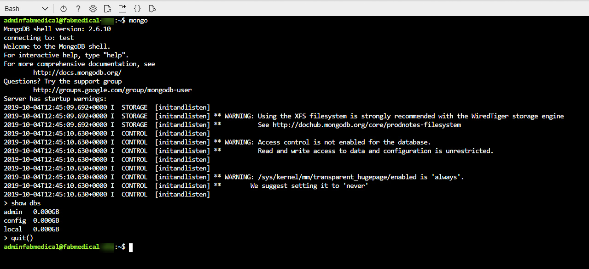
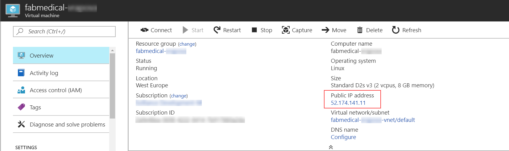
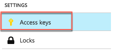
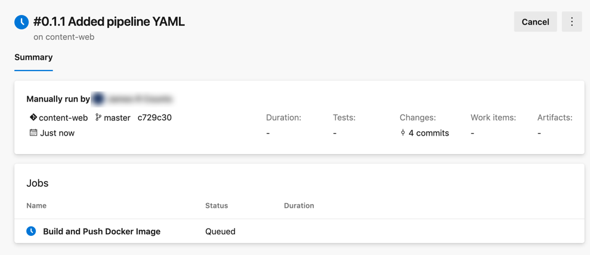
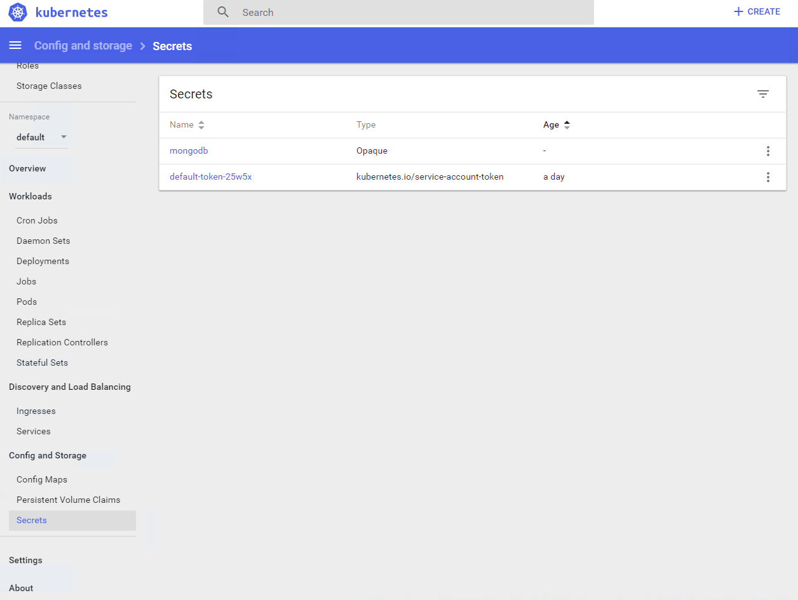
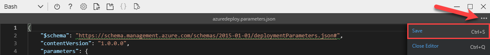
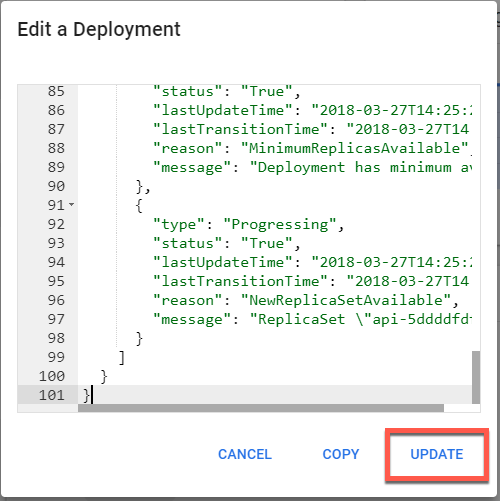
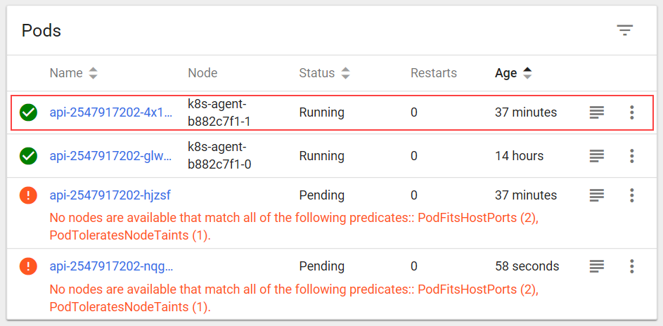

<!--
![Microsoft Cloud Workshops][logo]

<div class="MCWHeader1">
Cloud-native applications - Infrastructure edition
</div>

<div class="MCWHeader2">
Hands-on lab step-by-step
</div>

<div class="MCWHeader3">
February 2020
</div>

Information in this document, including URL and other Internet Web site references, is subject to change without notice. Unless otherwise noted, the example companies, organizations, products, domain names, e-mail addresses, logos, people, places, and events depicted herein are fictitious, and no association with any real company, organization, product, domain name, e-mail address, logo, person, place or event is intended or should be inferred. Complying with all applicable copyright laws is the responsibility of the user. Without limiting the rights under copyright, no part of this document may be reproduced, stored in or introduced into a retrieval system, or transmitted in any form or by any means (electronic, mechanical, photocopying, recording, or otherwise), or for any purpose, without the express written permission of Microsoft Corporation.

Microsoft may have patents, patent applications, trademarks, copyrights, or other intellectual property rights covering subject matter in this document. Except as expressly provided in any written license agreement from Microsoft, the furnishing of this document does not give you any license to these patents, trademarks, copyrights, or other intellectual property.

The names of manufacturers, products, or URLs are provided for informational purposes only and Microsoft makes no representations and warranties, either expressed, implied, or statutory, regarding these manufacturers or the use of the products with any Microsoft technologies. The inclusion of a manufacturer or product does not imply endorsement of Microsoft of the manufacturer or product. Links may be provided to third party sites. Such sites are not under the control of Microsoft and Microsoft is not responsible for the contents of any linked site or any link contained in a linked site, or any changes or updates to such sites. Microsoft is not responsible for webcasting or any other form of transmission received from any linked site. Microsoft is providing these links to you only as a convenience, and the inclusion of any link does not imply endorsement of Microsoft of the site or the products contained therein.

© 2020 Microsoft Corporation. All rights reserved.

Microsoft and the trademarks listed at https://www.microsoft.com/en-us/legal/intellectualproperty/Trademarks/Usage/General.aspx are trademarks of the Microsoft group of companies. All other trademarks are property of their respective owners.

**Contents**
-->

<!-- TOC -->
<!--
- [Cloud-native applications - Infrastructure edition hands-on lab step-by-step](#cloud-native-applications---infrastructure-edition-hands-on-lab-step-by-step)
    - [Abstract and learning objectives](#abstract-and-learning-objectives)
    - [Overview](#overview)
    - [Solution architecture](#solution-architecture)
    - [Requirements](#requirements)
    - [Exercise 1: Create and run a Docker application](#exercise-1-create-and-run-a-docker-application)
        - [Task 1: Test the application](#task-1-test-the-application)
        - [Task 2: Browsing to the web application](#task-2-browsing-to-the-web-application)
        - [Task 3: Create Docker images](#task-3-create-docker-images)
        - [Task 4: Run a containerized application](#task-4-run-a-containerized-application)
        - [Task 5: Setup environment variables](#task-5-setup-environment-variables)
        - [Task 6: Run several containers with Docker compose](#task-6-run-several-containers-with-docker-compose)
        - [Task 7: Push images to Azure Container Registry](#task-7-push-images-to-azure-container-registry)
        - [Task 8: Setup CI Pipeline to Push Images](#task-8-setup-ci-pipeline-to-push-images)
    - [Exercise 2: Deploy the solution to Azure Kubernetes Service](#exercise-2-deploy-the-solution-to-azure-kubernetes-service)
        - [Task 1: Tunnel into the Azure Kubernetes Service cluster](#task-1-tunnel-into-the-azure-kubernetes-service-cluster)
        - [Task 2: Deploy a service using the Kubernetes management dashboard](#task-2-deploy-a-service-using-the-kubernetes-management-dashboard)
        - [Task 3: Deploy a service using kubectl](#task-3-deploy-a-service-using-kubectl)
        - [Task 4: Deploy a service using a Helm chart](#task-4-deploy-a-service-using-a-helm-chart)
        - [Task 5: Initialize database with a Kubernetes Job](#task-5-initialize-database-with-a-kubernetes-job)
        - [Task 6: Test the application in a browser](#task-6-test-the-application-in-a-browser)
        - [Task 7: Configure Continuous Delivery to the Kubernetes Cluster](#task-7-configure-continuous-delivery-to-the-kubernetes-cluster)
        - [Task 8: Review Azure Monitor for Containers](#task-8-review-azure-monitor-for-containers)
    - [Exercise 3: Scale the application and test HA](#exercise-3-scale-the-application-and-test-ha)
        - [Task 1: Increase service instances from the Kubernetes dashboard](#task-1-increase-service-instances-from-the-kubernetes-dashboard)
        - [Task 2: Increase service instances beyond available resources](#task-2-increase-service-instances-beyond-available-resources)
        - [Task 3: Restart containers and test HA](#task-3-restart-containers-and-test-ha)
    - [Exercise 4: Working with services and routing application traffic](#exercise-4-working-with-services-and-routing-application-traffic)
        - [Task 1: Scale a service without port constraints](#task-1-scale-a-service-without-port-constraints)
        - [Task 2: Update an external service to support dynamic discovery with a load balancer](#task-2-update-an-external-service-to-support-dynamic-discovery-with-a-load-balancer)
        - [Task 3: Adjust CPU constraints to improve scale](#task-3-adjust-cpu-constraints-to-improve-scale)
        - [Task 4: Perform a rolling update](#task-4-perform-a-rolling-update)
        - [Task 5: Configure Kubernetes Ingress](#task-5-configure-kubernetes-ingress)
    - [After the hands-on lab](#after-the-hands-on-lab)
-->
<!-- /TOC -->
<!--
# Cloud-native applications - Infrastructure edition hands-on lab step-by-step

## Abstract and learning objectives

This hands-on lab is designed to guide you through the process of building and deploying Docker images to the Kubernetes platform hosted on Azure Kubernetes Services (AKS), in addition to learning how to work with dynamic service discovery, service scale-out, and high-availability.

At the end of this lab you will be better able to build and deploy containerized applications to Azure Kubernetes Service and perform common DevOps procedures.

## Overview

Fabrikam Medical Conferences (FabMedical) provides conference website services tailored to the medical community. They are refactoring their application code, based on node.js, so that it can run as a Docker application, and want to implement a POC that will help them get familiar with the development process, lifecycle of deployment, and critical aspects of the hosting environment. They will be deploying their applications to Azure Kubernetes Service and want to learn how to deploy containers in a dynamically load-balanced manner, discover containers, and scale them on demand.

In this hands-on lab, you will assist with completing this POC with a subset of the application codebase. You will create a build agent based on Linux, and an Azure Kubernetes Service cluster for running deployed applications. You will be helping them to complete the Docker setup for their application, test locally, push to an image repository, deploy to the cluster, and test load-balancing and scale.

> **Important**: Most Azure resources require unique names. Throughout these steps, you will see the word "SUFFIX" as part of resource names. You should replace this with a unique handle (like your Microsoft Account email prefix) to ensure unique names for resources.

## Solution architecture

Below is a diagram of the solution architecture you will build in this lab. Please study this carefully, so you understand the whole of the solution as you are working on the various components.

The solution will use Azure Kubernetes Service (AKS), which means that the container cluster topology is provisioned according to the number of requested nodes. The proposed containers deployed to the cluster are illustrated below with Cosmos DB as a managed service:


Each tenant will have the following containers:

- **Conference Web site**: The SPA application that will use configuration settings to handle custom styles for the tenant.

- **Admin Web site**: The SPA application that conference owners use to manage conference configuration details, manage attendee registrations, manage campaigns, and communicate with attendees.

- **Registration service**: The API that handles all registration activities creating new conference registrations with the appropriate package selections and associated cost.

- **Email service**: The API that handles email notifications to conference attendees during registration, or when the conference owners choose to engage the attendees through their admin site.

- **Config service**: The API that handles conference configuration settings such as dates, locations, pricing tables, early-bird specials, countdowns, and related.

- **Content service**: The API that handles content for the conference such as speakers, sessions, workshops, and sponsors.

## Requirements

1. Microsoft Azure subscription must be pay-as-you-go or MSDN.

   - Trial subscriptions will _not_ work.

   - To complete this lab, ensure your account has the following roles:

     - The [Owner](https://docs.microsoft.com/en-us/azure/role-based-access-control/built-in-roles#owner)
       built-in role for the subscription you will use.

     - Is a [Member](https://docs.microsoft.com/en-us/azure/active-directory/fundamentals/users-default-permissions#member-and-guest-users) user in the Azure AD tenant you will use. (Guest users will not have the necessary permissions).

     > **Note** If you do not meet these requirements, you may have to ask another member user with subscription owner rights to login to the portal and execute the create service principal step ahead of time.

   - You must have enough cores available in your subscription to create the
     build agent and Azure Kubernetes Service cluster in Before the Hands-on
     Lab. You will need eight cores if following the exact instructions in the
     lab, or more if you choose additional cluster nodes or larger VM sizes.
     If you execute the steps required before the lab, you will be able to
     see if you need to request more cores in your sub.

2. Local machine or a virtual machine configured with:

   - A browser, preferably Chrome for consistency with the lab implementation tests.

3. You will install other tools throughout the exercises.

> **Very important**: You should be typing all the commands as they appear in the guide. Do not try to copy and paste to your command windows or other documents when instructed to enter the information shown in this document, except where explicitly stated in this document. There can be issues with Copy and Paste that result in errors, execution of instructions, or creation of file content.

## Exercise 1: Create and run a Docker application

**Duration**: 40 minutes

In this exercise, you will take the starter files and run the node.js application as a Docker application. You will create a Dockerfile, build Docker images, and run containers to execute the application.

### Task 1: Test the application

The purpose of this task is to make sure you can run the application successfully before applying changes to run it as a Docker application.

1. From Azure Cloud Shell, connect to your build agent if you are not already
   connected. (If you need to reconnect, please review the instructions in the
   "Before the HOL" document.)

2. Type the following command to create a Docker network named "fabmedical":

   ```bash
   docker network create fabmedical
   ```

3. Run an instance of mongodb to use for local testing.

   ```bash
   docker container run --name mongo --net fabmedical -p 27017:27017 -d mongo
   ```

4. Confirm that the mongo container is running and ready.

   ```bash
   docker container list
   docker container logs mongo
   ```

   

5. Connect to the mongo instance using the mongo shell and test some basic commands:

   ```bash
   mongo
   ```

   ```text
   show dbs
   quit()
   ```

   

6. To initialize the local database with test content, first navigate to the content-init directory and run npm install.

   ```bash
   cd content-init
   npm install
   ```

   > **Note**: In some cases, the `root` user will be assigned ownership of your user's `.config` folder. If this happens, run the following command to return ownership to `adminfabmedical` and then try `npm install` again:

   ```bash
   sudo chown -R $USER:$(id -gn $USER) /home/adminfabmedical/.config
   ```

7. Initialize the database.

   ```bash
   nodejs server.js
   ```

   

8. Confirm that the database now contains test data.

   ```bash
   mongo
   ```

   ```text
   show dbs
   use contentdb
   show collections
   db.speakers.find()
   db.sessions.find()
   quit()
   ```

   This should produce output similar to the following:

   

9. Now navigate to the content-api directory and run npm install.

   ```bash
   cd ../content-api
   npm install
   ```

   > **Note**: In some cases, the `root` user will be assigned ownership of your user's `.config` folder. If this happens, run the following command to return ownership to `adminfabmedical` and then try `npm install` again:

   ```bash
   sudo chown -R $USER:$(id -gn $USER) /home/adminfabmedical/.config
   ```

10. Start the API as a background process.

    ```bash
    nodejs ./server.js &
    ```

    

11. Press ENTER again to get to a command prompt for the next step.

12. Test the API using curl. You will request the speaker's content, and this will return a JSON result.

    ```bash
    curl http://localhost:3001/speakers
    ```

    

13. Navigate to the web application directory, run npm install and ng build.

    ```bash
    cd ../content-web
    npm install
    ng build
    node ./app.js &
    ```

    

    > **Note**: In some cases, the `root` user will be assigned ownership of your user's `.config` folder. If this happens, run the following command to return ownership to `adminfabmedical` and then try `npm install` again:

    ```bash
    sudo chown -R $USER:$(id -gn $USER) /home/adminfabmedical/.config
    ```

14. Press ENTER again to get a command prompt for the next step.

15. Test the web application using curl. You will see HTML output returned without errors.

    ```bash
    curl http://localhost:3000
    ```

16. Leave the application running for the next task.

17. If you received a JSON response to the /speakers content request and an HTML response from the web application, your environment is working as expected.

### Task 2: Browsing to the web application

In this task, you will browse to the web application for testing.

1. From the Azure portal select the resource group you created named fabmedical-SUFFIX.

2. Select the build agent VM named fabmedical-SUFFIX from your list of available resources.

   

3. From the Virtual Machine blade overview, find the IP address of the VM.

   

4. Test the web application from a browser. Navigate to the web application using your build agent IP address at port 3000.

   ```text
   http://[BUILDAGENTIP]:3000

   EXAMPLE: http://13.68.113.176:3000
   ```

5. Select the Speakers and Sessions links in the header. You will see the pages display the HTML version of the JSON content you curled previously.

6. Once you have verified the application is accessible through a browser, go to your cloud shell window and stop the running node processes.

   ```bash
   killall nodejs
   killall node
   ```

### Task 3: Create Docker images

In this task, you will create Docker images for the application --- one for the API application and another for the web application. Each image will be created via Docker commands that rely on a Dockerfile.

1. From cloud shell connected to the build agent VM, type the following command
   to view any Docker images on the VM. The list will only contain the mongodb
   image downloaded earlier.

   ```bash
   docker image ls
   ```

2. From the content-api folder containing the API application files and the new Dockerfile you created, type the following command to create a Docker image for the API application. This command does the following:

   - Executes the Docker build command to produce the image

   - Tags the resulting image with the name content-api (-t)

   - The final dot (".") indicates to use the Dockerfile in this current directory context. By default, this file is expected to have the name "Dockerfile" (case sensitive).

   ```bash
   docker image build -t content-api .
   ```

3. Once the image is successfully built, run the Docker images listing command again. You will see several new images: the node images and your container image.

   ```bash
   docker image ls
   ```

   Notice the untagged image. This is the build stage which contains all the intermediate files not needed in your final image.

   

4. Navigate to the content-web folder again and list the files. Note that this folder has a Dockerfile.

   ```bash
   cd ../content-web
   ll
   ```

5. View the Dockerfile contents -- which are similar to the file in the API folder. Type the following command:

   ```bash
   cat Dockerfile
   ```

   Notice that the content-web Dockerfile build stage includes additional tools for a front-end Angular application in addition to installing npm packages.

6. Type the following command to create a Docker image for the web application.

   ```bash
   docker image build -t content-web .
   ```

7. When complete, you will see seven images now exist when you run the Docker images command.

   ```bash
   docker image ls
   ```

   

### Task 4: Run a containerized application

The web application container will be calling endpoints exposed by the API application container and the API application container will be communicating with mongodb. In this exercise, you will launch the images you created as containers on the same bridge network you created when starting mongodb.

1. Create and start the API application container with the following command. The command does the following:

   - Names the container "api" for later reference with Docker commands.

   - Instructs the Docker engine to use the "fabmedical" network.

   - Instructs the Docker engine to use port 3001 and map that to the internal container port 3001.

   - Creates a container from the specified image, by its tag, such as content-api.

   ```bash
   docker container run --name api --net fabmedical -p 3001:3001 content-api
   ```

2. The `docker container run` command has failed because it is configured to connect to mongodb using a localhost URL. However, now that content-api is isolated in a separate container, it cannot access mongodb via localhost even when running on the same docker host. Instead, the API must use the bridge network to connect to mongodb.

   ```text
   > content-api@0.0.0 start /usr/src/app
   > node ./server.js

   Listening on port 3001
   Could not connect to MongoDB!
   MongoTimeoutError: Server selection timed out after 30000 ms
   npm ERR! code ELIFECYCLE
   npm ERR! errno 255
   npm ERR! content-api@0.0.0 start: `node ./server.js`
   npm ERR! Exit status 255
   npm ERR!
   npm ERR! Failed at the content-api@0.0.0 start script.
   npm ERR! This is probably not a problem with npm. There is likely additional logging output above.

   npm ERR! A complete log of this run can be found in:
   npm ERR!     /root/.npm/_logs/2019-12-04T22_39_38_815Z-debug.log
   ```

3. The content-api application allows an environment variable to configure the mongodb connection string. Remove the existing container, and then instruct the docker engine to set the environment variable by adding the `-e` switch to the `docker container run` command. Also, use the `-d` switch to run the api as a daemon.

   ```bash
   docker container rm api
   docker container run --name api --net fabmedical -p 3001:3001 -e MONGODB_CONNECTION=mongodb://mongo:27017/contentdb -d content-api
   ```

4. Enter the command to show running containers. You will observe that the "api" container is in the list. Use the docker logs command to see that the API application has connected to mongodb.

   ```bash
   docker container ls
   docker container logs api
   ```

   

5. Test the API by curling the URL. You will see JSON output as you did when testing previously.

   ```bash
   curl http://localhost:3001/speakers
   ```

6. Create and start the web application container with a similar `docker container run` command -- instruct the docker engine to use any port with the `-P` command.

   ```bash
   docker container run --name web --net fabmedical -P -d content-web
   ```

7. Enter the command to show running containers again, and you will observe that both the API and web containers are in the list. The web container shows a dynamically assigned port mapping to its internal container port 3000.

   ```bash
   docker container ls
   ```

   

8. Test the web application by fetching the URL with curl. For the port, use the dynamically assigned port, which you can find in the output from the previous command. You will see HTML output, as you did when testing previously.

   ```bash
   curl http://localhost:[PORT]/speakers.html
   ```

### Task 5: Setup environment variables

In this task, you will configure the "web" container to communicate with the API container using an environment variable, similar to the way the mongodb connection string is provided to the api.

1. From cloud shell connected to the build agent VM, stop and remove the web container using the following commands.

   ```bash
   docker container stop web
   docker container rm web
   ```

2. Validate that the web container is no longer running or present by using the -a flag as shown in this command. You will see that the "web" container is no longer listed.

   ```bash
   docker container ls -a
   ```

3. Open the Dockerfile for editing using Vim and press the "i" key to go into edit mode.

   ```bash
   vi Dockerfile
   <i>
   ```

4. Locate the EXPOSE line shown below and add a line above it that sets the default value for the environment variable, as shown in the screenshot.

   ```Dockerfile
   ENV CONTENT_API_URL http://localhost:3001
   ```

   

5. Press the Escape key and type ":wq" and then press the Enter key to save and close the file.

   ```text
   <Esc>
   :wq
   <Enter>
   ```

6. Rebuild the web application Docker image using the same command as you did previously.

   ```bash
   docker image build -t content-web .
   ```

7. Create and start the image passing the correct URI to the API container as an environment variable. This variable will address the API application using its container name over the Docker network you created. After running the container, check to see the container is running and note the dynamic port assignment for the next step.

   ```bash
   docker container run --name web --net fabmedical -P -d -e CONTENT_API_URL=http://api:3001 content-web
   docker container ls
   ```

8. Curl the speakers path again, using the port assigned to the web container. Again, you will see HTML returned, but because curl does not process javascript, you cannot determine if the web application is communicating with the api application. You must verify this connection in a browser.

   ```bash
   curl http://localhost:[PORT]/speakers.html
   ```

9. You will not be able to browse to the web application on the ephemeral port because the VM only exposes a limited port range. Now you will stop the web container and restart it using port 3000 to test in the browser. Type the following commands to stop the container, remove it, and run it again using explicit settings for the port.

   ```bash
    docker container stop web
    docker container rm web
    docker container run --name web --net fabmedical -p 3000:3000 -d -e CONTENT_API_URL=http://api:3001 content-web
   ```

10. Curl the speaker path again, using port 3000. You will see the same HTML returned.

    ```bash
    curl http://localhost:3000/speakers.html
    ```

11. You can now use a web browser to navigate to the website and successfully view the application at port 3000. Replace [BUILDAGENTIP] with the IP address you used previously.

    ```bash
    http://[BUILDAGENTIP]:3000

    EXAMPLE: http://13.68.113.176:3000
    ```

12. Commit your changes and push to the repository.

    ```bash
    git add .
    git commit -m "Setup Environment Variables"
    git push
    ```

    Enter credentials if prompted.

### Task 6: Run several containers with Docker compose

Managing several containers with all their command line options can become
difficult as the solution grows. `docker-compose` allows us to declare options
for several containers and run them together.

1. First, cleanup the existing containers.

   ```bash
   docker container stop web && docker container rm web
   docker container stop api && docker container rm api
   docker container stop mongo && docker container rm mongo
   ```

2. Navigate to your home directory (where you checked out the content repositories) and create a docker compose file.

   ```bash
   cd ~
   vi docker-compose.yml
   <i>
   ```

   Type the following as the contents of `docker-compose.yml`:

   ```yaml
   version: "3.4"

   services:
     mongo:
       image: mongo
       restart: always

     api:
       build: ./content-api
       image: content-api
       depends_on:
         - mongo
       environment:
         MONGODB_CONNECTION: mongodb://mongo:27017/contentdb

     web:
       build: ./content-web
       image: content-web
       depends_on:
         - api
       environment:
         CONTENT_API_URL: http://api:3001
       ports:
         - "3000:3000"
   ```

   Press the Escape key and type ":wq" and then press the Enter key to save and close the file.

   ```text
   <Esc>
   :wq
   <Enter>
   ```

3. Start the applications with the `up` command.

   ```bash
   docker-compose -f docker-compose.yml -p fabmedical up -d
   ```

   

4. Visit the website in the browser; notice that we no longer have any data on the speakers or sessions pages.

   

5. We stopped and removed our previous mongodb container; all the data contained in it has been removed. Docker compose has created a new, empty mongodb instance that must be reinitialized. If we care to persist our data between container instances, docker has several mechanisms to do so. First, we will update our compose file to persist mongodb data to a directory on the build agent.

   ```bash
   mkdir data
   vi docker-compose.yml
   ```

   Update the mongo service to mount the local data directory onto to the `/data/db` volume in the docker container.

   ```yaml
   mongo:
     image: mongo
     restart: always
     volumes:
       - ./data:/data/db
   ```

   The result should look similar to the following screenshot:

   

6. Next, we will add a second file to our composition so that we can initialize the mongodb data when needed.

   ```bash
   vi docker-compose.init.yml
   ```

   Add the following as the content:

   ```yaml
   version: "3.4"

   services:
     init:
       build: ./content-init
       image: content-init
       depends_on:
         - mongo
       environment:
         MONGODB_CONNECTION: mongodb://mongo:27017/contentdb
   ```

7. To reconfigure the mongodb volume, we need to bring down the mongodb service first.

   ```bash
   docker-compose -f docker-compose.yml -p fabmedical down
   ```

   

8. Now run `up` again with both files to update the mongodb configuration and run the initialization script.

   ```bash
   docker-compose -f docker-compose.yml -f docker-compose.init.yml -p fabmedical up -d
   ```

9. Check the data folder to see that mongodb is now writing data files to the host.

   ```bash
   ls ./data/
   ```

   

10. Check the results in the browser. The speaker and session data are now available.

    

### Task 7: Push images to Azure Container Registry

To run containers in a remote environment, you will typically push images to a Docker registry, where you can store and distribute images. Each service will have a repository that can be pushed to and pulled from with Docker commands. Azure Container Registry (ACR) is a managed private Docker registry service based on Docker Registry v2.

In this task, you will push images to your ACR account, version images with tagging, and setup continuous integration (CI) to build future versions of your containers and push them to ACR automatically.

1. In the [Azure Portal](https://portal.azure.com/), navigate to the ACR you created in Before the hands-on lab.

2. Select Access keys under Settings on the left-hand menu.

   

3. The Access keys blade displays the Login server, username, and password that will be required for the next step. Keep this handy as you perform actions on the build VM.

   > **Note**: If the username and password do not appear, select Enable on the Admin user option.

4. From the cloud shell session connected to your build VM, login to your ACR account by typing the following command. Follow the instructions to complete the login.

   ```bash
   docker login [LOGINSERVER] -u [USERNAME] -p [PASSWORD]
   ```

   For example:

   ```bash
   docker login fabmedicalsoll.azurecr.io -u fabmedicalsoll -p +W/j=l+Fcze=n07SchxvGSlvsLRh/7ga
   ```

   

   **Tip: Make sure to specify the fully qualified registry login server (all lowercase).**

5. Run the following commands to properly tag your images to match your ACR account name.

   ```bash
   docker image tag content-web [LOGINSERVER]/content-web
   docker image tag content-api [LOGINSERVER]/content-api
   ```

6. List your docker images and look at the repository and tag. Note that the repository is prefixed with your ACR login server name, such as the sample shown in the screenshot below.

   ```bash
   docker image ls
   ```

   

7. Push the images to your ACR account with the following command:

   ```bash
   docker image push [LOGINSERVER]/content-web
   docker image push [LOGINSERVER]/content-api
   ```

   ![In this screenshot of the console window, an example of images being pushed to an ACR account results from typing and running the following at the command prompt: docker push [LOGINSERVER]/content-web.](media/image67.png)

8. In the Azure Portal, navigate to your ACR account, and select Repositories under Services on the left-hand menu. You will now see two, one for each image.

   

9. Select content-api. You will see the latest tag is assigned.

   

10. From the cloud shell session attached to the VM, assign the v1 tag to each image with the following commands. Then list the Docker images to note that there are now two entries for each image: showing the latest tag and the v1 tag. Also note that the image ID is the same for the two entries, as there is only one copy of the image.

    ```bash
    docker image tag [LOGINSERVER]/content-web:latest [LOGINSERVER]/content-web:v1
    docker image tag [LOGINSERVER]/content-api:latest [LOGINSERVER]/content-api:v1
    docker image ls
    ```

    

11. Repeat Step 7 to push the images to ACR again so that the newly tagged v1 images are pushed. Then refresh one of the repositories to see the two versions of the image now appear.

    

12. Run the following commands to pull an image from the repository. Note that the default behavior is to pull images tagged with "latest." You can pull a specific version using the version tag. Also, note that since the images already exist on the build agent, nothing is downloaded.

    ```bash
    docker image pull [LOGINSERVER]/content-web
    docker image pull [LOGINSERVER]/content-web:v1
    ```

### Task 8: Setup CI Pipeline to Push Images

In this task, you will use YAML to define a pipeline that builds your Docker
image and pushes it to your ACR instance automatically.

1. In your cloud shell session connected to the build agent VM, navigate to the
   `content-web` directory:

   ```bash
   cd ~/content-web
   ```

2. Next create the pipeline YAML file.

   ```bash
   vi azure-pipelines.yml
   ```

   Add the following as the content (replacing SHORT_SUFFIX with your short
   suffix such as SOL):

   ```yaml
   name: 0.1.$(Rev:r)

   trigger:
     - master

   resources:
     - repo: self

   variables:
     dockerRegistryServiceConnection: "Fabmedical ACR"
     imageRepository: "content-web"
     containerRegistry: "$(containerRegistryName).azurecr.io"
     containerRegistryName: "fabmedical[SHORT_SUFFIX]"
     dockerfilePath: "$(Build.SourcesDirectory)/Dockerfile"
     tag: "$(Build.BuildNumber)"
     vmImageName: "ubuntu-latest"

   stages:
     - stage: Build
       displayName: Build and Push
       jobs:
         - job: Docker
           displayName: Build and Push Docker Image
           pool:
             vmImage: $(vmImageName)
           steps:
             - checkout: self
               fetchDepth: 1

             - task: Docker@2
               displayName: Build and push an image to container registry
               inputs:
                 command: buildAndPush
                 repository: $(imageRepository)
                 dockerfile: $(dockerfilePath)
                 containerRegistry: $(dockerRegistryServiceConnection)
                 tags: |
                   $(tag)
                   latest
   ```

3. Save the pipeline YAML, then commit and push it to the Azure DevOps
   repository:

   ```bash
   git add azure-pipelines.yml
   git commit -m "Added pipeline YAML"
   git push
   ```

4. Now login to Azure DevOps to create your first build. Navigate to the
   `content-web` repository and choose 'Set up Build'.

   

5. Azure DevOps will automatically detect the pipeline YAML you added. You can
   make additional edits here if needed. Select `Run` when you are ready to
   execute the pipeline.

   

6. Azure DevOps will queue your first build and execute the pipeline when an
   agent becomes available.

   

7. The build should take about five minutes to complete.

   

   > **Note**: The build may fail due to an authorization error related to the
   > Docker Registry Service connection. If this is the case, then select
   > "Authorize Resources" and run the build again.
   > 

8. Next, create the `content-api` build. Select the `content-api` repository.
   This repository already includes `azure-pipelines.yaml`. Choose 'Set up
   Build'.

9. In the "Review your pipeline YAML" step, edit the `containerRegistryName` value to replace `[SHORT_SUFFIX]` with your own three-letter suffix so that it matches your container registry's name.

   

10. When you are finished editing, select `Run` to execute the pipeline.

11. While the `content-api` build runs, setup one last build for `content-init` by following the same steps as the previous `content-api` build, remembering to update the `[SHORT_SUFFIX]` value on the "Review your pipeline YAML" step.

12. Visit your ACR instance in the Azure portal, you should see new containers
    tagged with the Azure DevOps build number.

    

## Exercise 2: Deploy the solution to Azure Kubernetes Service

**Duration**: 30 minutes

In this exercise, you will connect to the Azure Kubernetes Service cluster you created before the hands-on lab and deploy the Docker application to the cluster using Kubernetes.

### Task 1: Tunnel into the Azure Kubernetes Service cluster

In this task, you will gather the information you need about your Azure Kubernetes Service cluster to connect to the cluster and execute commands to connect to the Kubernetes management dashboard from cloud shell.

> **Note**: The following tasks should be executed in cloud shell and not the build machine, so disconnect from build machine if still connected

1. Verify that you are connected to the correct subscription with the following command to show your default subscription:

   ```bash
   az account show
   ```

   - If you are not connected to the correct subscription, list your subscriptions and then set the subscription by its id with the following commands (similar to what you did in cloud shell before the lab):

   ```bash
   az account list
   az account set --subscription {id}
   ```

2. Configure kubectl to connect to the Kubernetes cluster:

   ```bash
   az aks get-credentials --name fabmedical-SUFFIX --resource-group fabmedical-SUFFIX
   ```

3. Test that the configuration is correct by running a simple kubectl command to produce a list of nodes:

   ```bash
   kubectl get nodes
   ```

   

4. Since the AKS cluster uses RBAC, a ClusterRoleBinding must be created before you can correctly access the dashboard. To create the required binding, execute the command below:

   ```bash
   kubectl create clusterrolebinding kubernetes-dashboard --clusterrole=cluster-admin --serviceaccount=kube-system:kubernetes-dashboard
   ```

5. Create an SSH tunnel linking a local port (8001) on your cloud shell host to port 443 on the management node of the cluster. Cloud shell will then use the web preview feature to give you remote access to the Kubernetes dashboard. Execute the command below replacing the values as follows:

   > **Note**: After you run this command, it may work at first and later lose its connection, so you may have to run this again to reestablish the connection. If the Kubernetes dashboard becomes unresponsive in the browser this is an indication to return here and check your tunnel or rerun the command.

   ```bash
   az aks browse --name fabmedical-SUFFIX --resource-group fabmedical-SUFFIX
   ```

   

6. If the tunnel is successful, you will see the Kubernetes management dashboard.

   

   > **Note**: If the tunnel is not successful (if a JSON output is displayed), execute the command below and then return to task 5 above:
   >
   > ```bash
   > az extension add --name aks-preview
   > ```

### Task 2: Deploy a service using the Kubernetes management dashboard

In this task, you will deploy the API application to the Azure Kubernetes Service cluster using the Kubernetes dashboard.

1. From the Kubernetes dashboard, select Create in the top right corner.

2. From the Resource creation view, select Create an App.

   

   - Enter "api" for the App name.

   - Enter [LOGINSERVER]/content-api for the Container Image, replacing [LOGINSERVER] with your ACR login server, such as fabmedicalsol.azurecr.io.

   - Set Number of pods to 1.

   - Set Service to "Internal".

   - Use 3001 for Port and 3001 for Target port.

3. Select **SHOW ADVANCED OPTIONS**

   - Enter 0.125 for the CPU requirement.

   - Enter 128 for the Memory requirement.

   

4. Select Deploy to initiate the service deployment based on the image. This can take a few minutes. In the meantime, you will be redirected to the Overview dashboard. Select the API deployment from the Overview dashboard to see the deployment in progress.

   

5. Kubernetes indicates a problem with the api Replica Set after some seconds. Select the log icon to investigate.

   

6. The log indicates that the content-api application is once again failing because it cannot find a mongodb instance to communicate with. You will resolve this issue by migrating your data workload to Cosmos DB.

   

7. Open the Azure portal in your browser and navigate to your resource group and find your Cosmos DB resource. Select the Cosmos DB resource to view details.

   

8. Under "Quick Start" select the "Node.js" tab and copy the Node 3.0 connection string.

   

9. Update the provided connection string with a database "contentdb" and a replica set "globaldb".

   > **Note**: Username and password redacted for brevity.

   ```text
   mongodb://<USERNAME>:<PASSWORD>@fabmedical-<SUFFIX>.documents.azure.com:10255/contentdb?ssl=true&replicaSet=globaldb
   ```

10. To avoid disconnecting from the Kubernetes dashboard, open a **new** Azure Cloud Shell console.

    

11. You will setup a Kubernetes secret to store the connection string and configure the content-api application to access the secret. First, you must base64 encode the secret value. Open your Azure Cloud Shell window and use the following command to encode the connection string and then, copy the output.

    > **Note**: Double quote marks surrounding the connection string are required to successfully produce the required output.

    ```bash
    echo -n "[CONNECTION STRING VALUE]" | base64 -w 0 - | echo $(</dev/stdin)
    ```

    

12. Return to the Kubernetes UI in your browser and select "+ Create". Update the following YAML with the encoded connection string from your clipboard, paste the YAML data into the create dialog, and choose "Upload".

    ```yaml
    apiVersion: v1
    kind: Secret
    metadata:
      name: mongodb
    type: Opaque
    data:
      db: <base64 encoded value>
    ```

    

13. Scroll down in the Kubernetes dashboard until you can see "Secrets" in the left-hand menu. Select it.

    

14. View the details for the "mongodb" secret. Select the eyeball icon to show the secret.

    

15. Next, download the api deployment configuration using the following command in your Azure Cloud Shell window:

    ```bash
    kubectl get -o=yaml --export=true deployment api > api.deployment.yml
    ```

16. Edit the downloaded file using cloud shell code editor:

    ```bash
    code api.deployment.yml
    ```

    Add the following environment configuration to the container spec, below the "image" property:

    ```yaml
      env:
        - name: MONGODB_CONNECTION
          valueFrom:
            secretKeyRef:
              name: mongodb
              key: db
    ```

    

17. Save your changes and close the editor.

    

18. Update the api deployment by using `kubectl` to apply the new configuration.

    ```bash
    kubectl apply -f api.deployment.yml
    ```

19. Select "Deployments" then "api" to view the api deployment. It now has a healthy instance and the logs indicate it has connected to mongodb.

    

### Task 3: Deploy a service using kubectl

In this task, deploy the web service using `kubectl`.

1. Open a **new** Azure Cloud Shell console.

2. Create a text file called web.deployment.yml using the Azure Cloud Shell
   Editor.

   ```bash
   code web.deployment.yml
   ```

3. Copy and paste the following text into the editor:

   > **Note**: Be sure to copy and paste only the contents of the code block carefully to avoid introducing any special characters.

   ```yaml
   apiVersion: extensions/v1beta1
   kind: Deployment
   metadata:
     labels:
         app: web
     name: web
   spec:
     replicas: 1
     selector:
         matchLabels:
           app: web
     strategy:
         rollingUpdate:
           maxSurge: 1
           maxUnavailable: 1
         type: RollingUpdate
     template:
         metadata:
           labels:
               app: web
           name: web
         spec:
           containers:
           - image: [LOGINSERVER].azurecr.io/content-web
             env:
               - name: CONTENT_API_URL
                 value: http://api:3001
             livenessProbe:
               httpGet:
                   path: /
                   port: 3000
               initialDelaySeconds: 30
               periodSeconds: 20
               timeoutSeconds: 10
               failureThreshold: 3
             imagePullPolicy: Always
             name: web
             ports:
               - containerPort: 3000
                 hostPort: 80
                 protocol: TCP
             resources:
               requests:
                   cpu: 1000m
                   memory: 128Mi
             securityContext:
               privileged: false
             terminationMessagePath: /dev/termination-log
             terminationMessagePolicy: File
           dnsPolicy: ClusterFirst
           restartPolicy: Always
           schedulerName: default-scheduler
           securityContext: {}
           terminationGracePeriodSeconds: 30
   ```

4. Update the [LOGINSERVER] entry to match the name of your ACR login server.

5. Select the **...** button and choose **Save**.

   

6. Select the **...** button again and choose **Close Editor**.

   

7. Create a text file called web.service.yml using the Azure Cloud Shell
   Editor.

   ```bash
   code web.service.yml
   ```

8. Copy and paste the following text into the editor:

   > **Note**: Be sure to copy and paste only the contents of the code block carefully to avoid introducing any special characters.

   ```yaml
   apiVersion: v1
   kind: Service
   metadata:
     labels:
       app: web
     name: web
   spec:
     ports:
       - name: web-traffic
         port: 80
         protocol: TCP
         targetPort: 3000
     selector:
       app: web
     sessionAffinity: None
     type: LoadBalancer
   ```

9. Save changes and close the editor.

10. Type the following command to deploy the application described by the YAML
    files. You will receive a message indicating the items kubectl has created a
    web deployment and a web service.

    ```bash
    kubectl create --save-config=true -f web.deployment.yml -f web.service.yml
    ```

    

11. Return to the browser where you have the Kubernetes management dashboard open. From the navigation menu, select Services view under Discovery and Load Balancing. From the Services view, select the web service, and from this view, you will see the web service deploying. This deployment can take a few minutes. When it completes, you should be able to access the website via an external endpoint.

    

12. Select the speakers and sessions links. Note that no data is displayed, although we have connected to our Cosmos DB instance, there is no data loaded. You will resolve this by running the content-init application as a Kubernetes Job in Task 5.

    

### Task 4: Deploy a service using a Helm chart

In this task, deploy the web service using a helm chart.

1. From the Kubernetes dashboard, under "Workloads", select "Deployments".

2. Select the triple vertical dots on the right of the "web" deployment and then choose "Delete". When prompted, select "Delete" again.

   

3. From the Kubernetes dashboard, under "Discovery and Load Balancing", select "Services".

4. Select the triple vertical dots on the right of the "web" service and then choose "Delete". When prompted, select "Delete" again.

   

5. Open a **new** Azure Cloud Shell console.

6. Update your starter files by pulling the latest changes from Azure DevOps

   ```bash
    cd ~/MCW-Cloud-native-applications/Hands-on\ lab/lab-files/developer/content-web
    git pull
   ```

7. We will use the chart scaffold implementation that we have available in the source code. Use the following commands to access the chart folder:

    ```bash
    cd ~/MCW-Cloud-native-applications/Hands-on\ lab/lab-files/infrastructure/content-web/charts
    ```

8. We now need to update the generated scaffold to match our requirements. We will first update the file named `values.yaml`.

    ```bash
    cd web
    code values.yaml
    ```

9. Search for the `image` definition and update the values so that they match the following:

    ```yaml
    image:
      repository: [LOGINSERVER].azurecr.io/content-web
      pullPolicy: Always
    ```

10. Search for `nameOverride` and `fullnameOverride` entries and update the values so that they match the following:

    ```yaml
    nameOverride: "web"
    fullnameOverride: "web"
    ```

11. Search for the `service` definition and update the values so that they match the following:

    ```yaml
    service:
      type: LoadBalancer
      port: 80
    ```

12. Search for the `resources` definition and update the values so that they match the following:

    ```yaml
    resources:
      # We usually recommend not to specify default resources and to leave this as a conscious
      # choice for the user. This also increases chances charts run on environments with little
      # resources, such as Minikube. If you do want to specify resources, uncomment the following
      # lines, adjust them as necessary, and remove the curly braces after 'resources:'.
      # limits:
      #  cpu: 100m
      #  memory: 128Mi
      requests:
        cpu: 1000m
        memory: 128Mi
    ```

13. Save changes and close the editor.

14. We will now update the file named `Chart.yaml`.

    ```bash
    code Chart.yaml
    ```

15. Search for the `appVersion` entry and update the value so that it matches the following:

    ```yaml
    appVersion: latest
    ```

16. We will now update the file named `deployment.yaml`.

    ```bash
    cd templates
    code deployment.yaml
    ```

17. Search for the `metadata` definition and update the values so that they match the following:

    ```yaml
    apiVersion: apps/v1
    kind: Deployment
    metadata:
      (...)
    spec:
      (...)
      template:
        metadata:
          (...)
          annotations:
            rollme: {{ randAlphaNum 5 | quote }}
    ```

18. Search for the `containers` definition and update the values so that they match the following:

    ```yaml
    containers:
      - name: {{ .Chart.Name }}
        securityContext:
          {{- toYaml .Values.securityContext | nindent 12 }}
        image: "{{ .Values.image.repository }}:{{ .Chart.AppVersion }}"
        imagePullPolicy: {{ .Values.image.pullPolicy }}
        ports:
          - name: http
            containerPort: 3000
            protocol: TCP
        env:
          - name: CONTENT_API_URL
            value: http://api:3001
        livenessProbe:
          httpGet:
            path: /
            port: 3000
    ```

19. Save changes and close the editor.

20. We will now update the file named `service.yaml`.

    ```bash
    code service.yaml
    ```

21. Search for the `ports` definition and update the values so that they match the following:

    ```yaml
    ports:
      - port: {{ .Values.service.port }}
        targetPort: 3000
        protocol: TCP
        name: http
    ```

22. Save changes and close the editor.

23. The chart is now setup to run our web container. Type the following command to deploy the application described by the YAML files. You will receive a message indicating that helm has created a web deployment and a web service.

    ```bash
    cd ../..
    helm install web ./web
    ```

    

24. Return to the browser where you have the Kubernetes management dashboard open. From the navigation menu, select Services view under Discovery and Load Balancing. From the Services view, select the web service, and from this view, you will see the web service deploying. This deployment can take a few minutes. When it completes, you should be able to access the website via an external endpoint.

    

25. Select the speakers and sessions links. Note that no data is displayed, although we have connected to our Cosmos DB instance, there is no data loaded. You will resolve this by running the content-init application as a Kubernetes Job.

    

26. We will now persist the changes into the repository. Execute the following commands:

    ```bash
    cd ..
    git pull
    git add charts/
    git commit -m "Helm chart update."
    git push
    ```

### Task 5: Initialize database with a Kubernetes Job

In this task, you will use a Kubernetes Job to run a container that is meant to execute a task and terminate, rather than run all the time.

1. Create a text file called init.job.yml using the Azure Cloud Shell Editor.

   ```bash
   code init.job.yml
   ```

2. Copy and paste the following text into the editor:

   > **Note**: Be sure to copy and paste only the contents of the code block carefully to avoid introducing any special characters.

   ```yaml
   apiVersion: batch/v1
   kind: Job
   metadata:
     name: init
   spec:
     template:
       spec:
         containers:
         - name: init
           image: [LOGINSERVER]/content-init
           env:
             - name: MONGODB_CONNECTION
               valueFrom:
                 secretKeyRef:
                   name: mongodb
                   key: db
         restartPolicy: Never
     backoffLimit: 4
   ```

3. Edit this file and update the [LOGINSERVER] entry to match the name of your ACR login server.

4. Save changes and close the editor.

5. Type the following command to deploy the job described by the YAML. You will receive a message indicating the kubectl has created an init "job.batch".

   ```bash
   kubectl create --save-config=true -f init.job.yml
   ```

6. View the Job by selecting "Jobs" under "Workloads" in the Kubernetes UI.

   

7. Select the log icon to view the logs.

   

8. Next view your Cosmos DB instance in the Azure portal and see that it now contains two collections.

   

### Task 6: Test the application in a browser

In this task, you will verify that you can browse to the web service you have deployed and view the speaker and content information exposed by the API service.

1. From the Kubernetes management dashboard, in the navigation menu, select the Services view under Discovery and Load Balancing.

2. In the list of services, locate the external endpoint for the web service and select this hyperlink to launch the application.

   

3. You will see the web application in your browser and be able to select the Speakers and Sessions links to view those pages without errors. The lack of errors means that the web application is correctly calling the API service to show the details on each of those pages.

   

   

### Task 7: Configure Continuous Delivery to the Kubernetes Cluster

In this task, you will use Azure DevOps to automate the process for deploying the web image to the AKS cluster. You will update the DevOps Pipeline and configure a deployment stage so that when new images are pushed to the ACR, the pipeline deploys the image to the AKS cluster.

1. Login to your Azure DevOps account, access the `fabmedical` project you created earlier, then select "Pipelines".

2. From the pipelines list, select the `content-web` pipeline and select `Edit.`

   

3. You will add a second job to the `Build and Push` stage, below the existing `Docker` job. Paste the following into the pipeline editor:

   > **Note**: Be careful to check your indenting when pasting. The `job` node should be indented with 2 spaces and line up with the `job` node for the `Docker` job.

   ```yaml
   - job: Helm
    displayName: Build and Push Helm Chart
    pool:
      vmImage: $(vmImageName)
    steps:
      - checkout: self
        fetchDepth: 1

      - task: HelmInstaller@1
        inputs:
          helmVersionToInstall: 'latest'
        displayName: 'Helm Install'

      - task: HelmDeploy@0
        inputs:
          connectionType: 'None'
          command: 'package'
          chartPath: 'charts/web'
          chartVersion: '$(Build.BuildNumber)'
          save: false
        displayName: 'Helm Package'

      - task: AzureCLI@1
        inputs:
          azureSubscription: 'azurecloud'
          scriptLocation: 'inlineScript'
          inlineScript: |
            set -euo pipefail

            az acr helm push \
              --name $(containerRegistryName) \
              $(Build.ArtifactStagingDirectory)/web-$(Build.BuildNumber).tgz

          failOnStandardError: true
        displayName: 'Helm Push'
   ```

   

4. Choose "Save" and commit the changes directly to the master branch. A new build will start automatically. The two jobs are independent and will run in parallel if there are enough available build agents.

   

5. Now return to the pipeline editor to create a deployment stage. Paste the following into the pipeline editor and update the SUFFIX values:

   > **Note**: Be careful to check your indenting when pasting. The `stage` node should be indented with 0 spaces and line up with the `stage` node for the `Build` stage.

   ```yaml
   - stage:
     displayName: AKS Deployment
     jobs:
       - deployment: DeployAKS
         displayName: "Deployment to AKS"
         pool:
           vmImage: $(vmImageName)
         environment: "aks"
         strategy:
           runOnce:
             deploy:
               steps:
                 - checkout: none

                 - task: HelmInstaller@1
                   inputs:
                     helmVersionToInstall: "latest"
                   displayName: "Helm Install"

                 - task: AzureCLI@1
                   inputs:
                     azureSubscription: "azurecloud"
                     scriptLocation: "inlineScript"
                     inlineScript: |
                       set -euo pipefail

                       az acr helm repo add --name $(containerRegistryName)

                     failOnStandardError: true
                   displayName: "Helm repo update"

                 - task: HelmDeploy@0
                   inputs:
                     connectionType: "Azure Resource Manager"
                     azureSubscription: "azurecloud"
                     azureResourceGroup: "fabmedical-[SUFFIX]"
                     kubernetesCluster: "fabmedical-[SUFFIX]"
                     command: "upgrade"
                     chartType: "Name"
                     chartName: "$(containerRegistryName)/web"
                     releaseName: "web"
                     overrideValues: "image.tag=$(Build.BuildNumber),image.repository=$(containerRegistry)/content-web"
                   displayName: "Helm Upgrade"
   ```

   

6. Select "Save" and commit the changes directly to the master branch. A new build will start automatically. The two jobs are independent and will run in parallel if there are enough available build agents. However, the deployment depends on the jobs and will wait for them to complete before starting.

   

### Task 8: Review Azure Monitor for Containers

In this task, you will access and review the various logs and dashboards made available by Azure Monitor for Containers.

1. From the Azure Portal, select the resource group you created named fabmedical-SUFFIX, and then select your AKS cluster.

   

2. From the Monitoring blade, select **Insights**.

   

3. Review the various available dashboards and a deeper look at the various metrics and logs available on the Cluster, Cluster Nodes, Cluster Controllers, and deployed Containers.

   

4. To review the Containers dashboards and see more detailed information about each container, select the containers tab.

   

5. Now filter by container name and search for the web containers, you will see all the containers created in the Kubernetes cluster with the pod names. You can compare the names with those in the kubernetes dashboard.

   

6. By default, the CPU Usage metric will be selected displaying all cpu information for the selected container, to switch to another metric open the metric dropdown list and select a different metric.

   

7. Upon selecting any pod, all the information related to the selected metric will be displayed on the right panel, and that would be the case when selecting any other metric, the details will be displayed on the right panel for the selected pod.

   

8. To display the logs for any container simply select it and view the right panel and you will find "View container logs" option which will list all logs for this specific container.

   

   

9. For each log entry you can display more information by expanding the log entry to view the below details.

   

## Exercise 3: Scale the application and test HA

**Duration**: 20 minutes

At this point, you have deployed a single instance of the web and API service containers. In this exercise, you will increase the number of container instances for the web service and scale the front-end on the existing cluster.

### Task 1: Increase service instances from the Kubernetes dashboard

In this task, you will increase the number of instances for the API deployment in the Kubernetes management dashboard. While it is deploying, you will observe the changing status.

1. From the navigation menu, select Workloads\>Deployments, and then select the API deployment.

2. Select SCALE.

   

3. Change the number of pods to 2, and then select **OK**.

   

   > **Note**: If the deployment completes quickly, you may not see the deployment Waiting states in the dashboard, as described in the following steps.

4. From the Replica Set view for the API, you will see it is now deploying and that there is one healthy instance and one pending instance.

   

5. From the navigation menu, select Deployments from the list. Note that the api service has a pending status indicated by the grey timer icon, and it shows a pod count 1 of 2 instances (shown as "1/2").

   

6. From the Navigation menu, select Workloads. From this view, note that the health overview in the right panel of this view. You will see the following:

   - One deployment and one replica set are each healthy for the api service.

   - One replica set is healthy for the web service.

   - Three pods are healthy.

7. Navigate to the web application from the browser again. The application should still work without errors as you navigate to Speakers and Sessions pages

   - Navigate to the /stats page. You will see information about the environment including:

     - **webTaskId:** The task identifier for the web service instance.

     - **taskId:** The task identifier for the API service instance.

     - **hostName:** The hostname identifier for the API service instance.

     - **pid:** The process id for the API service instance.

     - **mem:** Some memory indicators returned from the API service instance.

     - **counters:** Counters for the service itself, as returned by the API service instance.

     - **uptime:** The up time for the API service.

   - Refresh the page in the browser, and you can see the hostName change between the two API service instances. The letters after "api-{number}-" in the hostname will change.

### Task 2: Increase service instances beyond available resources

In this task, you will try to increase the number of instances for the API service container beyond available resources in the cluster. You will observe how Kubernetes handles this condition and correct the problem.

1. From the navigation menu, select Deployments. From this view, select the API deployment.

2. Configure the deployment to use a fixed host port for initial testing. Select Edit.

   

3. In the Edit a Deployment dialog, you will see a list of settings shown in JSON format. Use the copy button to copy the text to your clipboard.

   

4. Paste the contents into the text editor of your choice (notepad is shown here, MacOS users can use TextEdit).

   

5. Scroll down about halfway to find the node "\$.spec.template.spec.containers[0]", as shown in the screenshot below.

   ![Screenshot of the deployment JSON code, with the $.spec.template.spec.containers[0] section highlighted.](media/image84.png)

6. The containers spec has a single entry for the API container at the moment. You will see that the name of the container is "api" - this is how you know you are looking at the correct container spec.

   - Add the following JSON snippet below the "name" property in the container spec:

   ```json
   "ports": [
       {
       "containerPort": 3001,
       "hostPort": 3001
       }
   ],
   ```

   - Your container spec should now look like this:

   ![Screenshot of the deployment JSON code, with the $.spec.template.spec.containers[0] section highlighted, showing the updated values for containerPort and hostPort, both set to port 3001.](media/image85.png)

7. Copy the updated JSON document from notepad into the clipboard. Return to the Kubernetes dashboard, which should still be viewing the "api" deployment.

   - Select Edit.

   

   - Paste the updated JSON document.

   - Select Update.

   

8. From the API deployment view, select **Scale**.

   

9. Change the number of pods to 4 and select **OK**.

   

10. From the navigation menu, select Services view under Discovery and Load Balancing. Select the api service from the Services list. From the api service view, you will see it has two healthy instances and two unhealthy (or possibly pending depending on timing) instances.

    

11. After a few minutes, select Workloads from the navigation menu. From this view, you should see an alert reported for the api deployment.

    

    > **Note**: This message indicates that there were not enough available resources to match the requirements for a new pod instance. In this case, this is because the instance requires port 3001, and since there are only 2 nodes available in the cluster, only two api instances can be scheduled. The third and fourth pod instances will wait for a new node to be available that can run another instance using that port.

12. Reduce the number of requested pods to 2 using the Scale button.

13. Almost immediately, the warning message from the Workloads dashboard should disappear, and the API deployment will show 2/2 pods are running.

    

### Task 3: Restart containers and test HA

In this task, you will restart containers and validate that the restart does not impact the running service.

1. From the navigation menu on the left, select Services view under Discovery and Load Balancing. From the Services list, select the external endpoint hyperlink for the web service, and visit the stats page by adding /stats to the URL. Keep this open and handy to be refreshed as you complete the steps that follow.

   

   

2. From the navigation menu, select Workloads>Deployments. From Deployments list, select the API deployment.

   

3. From the API deployment view, select **Scale** and from the dialog presented, and enter 4 for the desired number of pods. Select **OK**.

4. From the navigation menu, select Workloads>Replica Sets. Select the api replica set, and from the Replica Set view, you will see that two pods cannot deploy.

   

5. Return to the browser tab with the web application stats page loaded. Refresh the page over and over. You will not see any errors, but you will see the api host name change between the two api pod instances periodically. The task id and pid might also change between the two api pod instances.

   

6. After refreshing enough times to see that the hostName value is changing, and the service remains healthy, return to the Replica Sets view for the API. From the navigation menu, select Replica Sets under Workloads and select the API replica set.

7. From this view, take note that the hostName value shown in the web application stats page matches the pod names for the pods that are running.

   

8. Note the remaining pods are still pending, since there are not enough port resources available to launch another instance. Make some room by deleting a running instance. Select the context menu and choose Delete for one of the healthy pods.

   

9. Once the running instance is gone, Kubernetes will be able to launch one of the pending instances. However, because you set the desired size of the deploy to 4, Kubernetes will add a new pending instance. Removing a running instance allowed a pending instance to start, but in the end, the number of pending and running instances is unchanged.

   

10. From the navigation menu, select Deployments under Workloads. From the view's Deployments list, select the API deployment.

11. From the API Deployment view, select Scale and enter 1 as the desired number of pods. Select OK.

    

12. Return to the web site's stats page in the browser and refresh while this is scaling down. You will notice that only one API host name shows up, even though you may still see several running pods in the API replica set view. Even though several pods are running, Kubernetes will no longer send traffic to the pods it has selected to scale down. In a few moments, only one pod will show in the API replica set view.

    

13. From the navigation menu, select Workloads. From this view, note that there is only one API pod now.

    

## Exercise 4: Working with services and routing application traffic

**Duration**: 45 minutes

In the previous exercise, we introduced a restriction to the scale properties of the service. In this exercise, you will configure the api deployments to create pods that use dynamic port mappings to eliminate the port resource constraint during scale activities.

Kubernetes services can discover the ports assigned to each pod, allowing you to run multiple instances of the pod on the same agent node --- something that is not possible when you configure a specific static port (such as 3001 for the API service).

### Task 1: Scale a service without port constraints

In this task, we will reconfigure the API deployment so that it will produce pods that choose a dynamic hostPort for improved scalability.

1. From the navigation menu select Deployments under Workloads. From the view's Deployments list, select the API deployment.

2. Select Edit.

3. From the Edit a Deployment dialog, do the following:

   - Scroll to the first spec node that describes replicas as shown in the screenshot. Set the value for replicas to 4.

   - Within the replicas spec, beneath the template node, find the "api" containers spec. Remove the hostPort entry for the API container's port mapping.  The screenshot below shows the desired configuration after editing.

     

4. Select **Update**. New pods will now choose a dynamic port.

5. The API service can now scale to 4 pods since it is no longer constrained to an instance per node -- a previous limitation while using port 3001.

   

6. Return to the browser and refresh the stats page. You should see all 4 pods serve responses as you refresh.

### Task 2: Update an external service to support dynamic discovery with a load balancer

In this task, you will update the web service so that it supports dynamic discovery through the Azure load balancer.

1. From the navigation menu, select Deployments under Workloads. From the view's Deployments list, select the web deployment.

2. Select **Edit**.

3. From the Edit a Deployment dialog, scroll to the web containers spec as shown in the screenshot. Remove the hostPort entry for the web container's port mapping.

   

4. Select **Update**.

5. From the web Deployments view, select **Scale**. From the dialog presented enter 4 as the desired number of pods and select **OK**.

6. Check the status of the scale out by refreshing the web deployment's view. From the navigation menu, select Deployments from under Workloads. Select the web deployment. From this view, you should see an error like that shown in the following screenshot.

   

Like the API deployment, the web deployment used a fixed _hostPort_, and your ability to scale was limited by the number of available agent nodes. However, after resolving this issue for the web service by removing the _hostPort_ setting, the web deployment is still unable to scale past two pods due to CPU constraints. The deployment is requesting more CPU than the web application needs, so you will fix this constraint in the next task.

### Task 3: Adjust CPU constraints to improve scale

In this task, you will modify the CPU requirements for the web service so that it can scale out to more instances.

1. From the navigation menu, select Deployments under Workloads. From the view's Deployments list, select the web deployment.

2. Select **Edit**.

3. From the Edit a Deployment dialog, find the _cpu_ resource requirements for the web container. Change this value to "125m".

   

4. Select **Update** to save the changes and update the deployment.

5. From the navigation menu, select Replica Sets under Workloads. From the view's Replica Sets list select the web replica set.

6. When the deployment update completes, four web pods should be shown in running state.

   

7. Return to the browser tab with the web application loaded. Refresh the stats page at /stats to watch the display update to reflect the different api pods by observing the host name refresh.

### Task 4: Perform a rolling update

In this task, you will edit the web application source code to add Application Insights and update the Docker image used by the deployment. Then you will perform a rolling update to demonstrate how to deploy a code change.

1. Execute this command in Azure Cloud Shell to retrieve the instrumentation key for the `content-web` Application Insights resource:

   ```bash
   az resource show -g fabmedical-[SUFFIX] -n content-web --resource-type "Microsoft.Insights/components" --query properties.InstrumentationKey -o tsv
   ```

   Copy this value. You will use it later.

2. Update your starter files by pulling the latest changes from Azure DevOps.

   ```bash
   cd ~/MCW-Cloud-native-applications/Hands-on\ lab/lab-files/developer/content-web
   git pull
   ```

3. Install support for Application Insights.

   ```bash
   npm install applicationinsights --save
   ```

4. Open the app.js file:

   ```bash
   code app.js
   ```

5. Add the following lines immediately after `express` is instantiated:

   ```javascript
   const appInsights = require("applicationinsights");
   appInsights.setup("[YOUR APPINSIGHTS KEY]");
   appInsights.start();
   ```

   

6. Save changes and close the editor.

7. Push these changes to your repository so that Azure DevOps CI will build and deploy a new image.

   ```bash
   git add .
   git commit -m "Added Application Insights"
   git push
   ```

8. Visit your Azure DevOps pipeline for the `content-web` application and see the new image being deployed into your Kubernetes cluster.

9. While this update runs, return the Kubernetes management dashboard in the browser.

10. From the navigation menu, select Replica Sets under Workloads. From this view, you will see a new replica set for the web, which may still be in the process of deploying (as shown below) or already fully deployed.

    

11. While the deployment is in progress, you can navigate to the web application and visit the stats page at /stats. Refresh the page as the rolling update executes. Observe that the service is running normally, and tasks continue to be load balanced.

    

### Task 5: Configure Kubernetes Ingress

In this task you will setup a Kubernetes Ingress to take advantage of path-based routing and TLS termination.

1. Update your helm package list.

   ```bash
   helm repo update
   ```

2. Install the ingress controller resource to handle ingress requests as they come in. The ingress controller will receive a public IP of its own on the Azure Load Balancer and be able to handle requests for multiple services over port 80 and 443.

   ```bash
   helm install stable/nginx-ingress --namespace kube-system --set controller.replicaCount=2
   ```

3. Set a DNS prefix on the IP address allocated to the ingress controller. Visit the `kube-system` namespace in your Kubernetes dashboard to find the IP. Append the following path after the `#!/` marker in the URL:

   ```text
   service?namespace=kube-system
   ```

   

    > **Note**: Alternately, you can find the IP using the following command in Azure Cloud Shell.
    >
    > ```bash
    > kubectl get svc --namespace kube-system
    > ```
    >
    > 

4. Create a script to update the public DNS name for the IP.

   ```bash
   code update-ip.sh
   ```

   Paste the following as the contents and update the IP and SUFFIX values:

   ```bash
   #!/bin/bash

   # Public IP address
   IP="[INGRESS PUBLIC IP]"

   # Name to associate with public IP address
   DNSNAME="fabmedical-[SUFFIX]-ingress"

   # Get the resource-id of the public ip
   PUBLICIPID=$(az network public-ip list --query "[?ipAddress!=null]|[?contains(ipAddress, '$IP')].[id]" --output tsv)

   # Update public ip address with dns name
   az network public-ip update --ids $PUBLICIPID --dns-name $DNSNAME
   ```

   

5. Save changes and close the editor.

6. Run the update script.

   ```bash
   bash ./update-ip.sh
   ```

7. Verify the IP update by visiting the URL in your browser.

   > **Note**: It is normal to receive a 404 message at this time.

   ```text
   http://fabmedical-[SUFFIX]-ingress.[AZURE-REGION].cloudapp.azure.com/
   ```

   

8. Use helm to install `cert-manager`, a tool that can provision SSL certificates automatically from letsencrypt.org.

   ```bash
   kubectl create namespace cert-manager

   kubectl label namespace cert-manager certmanager.k8s.io/disable-validation=true

   kubectl apply --validate=false -f https://github.com/jetstack/cert-manager/releases/download/v0.8.1/cert-manager.yaml
   ```

9. Cert manager will need a custom ClusterIssuer resource to handle requesting SSL certificates.

   ```bash
   code clusterissuer.yml
   ```

   The following resource configuration should work as is:

   ```yaml
   apiVersion: certmanager.k8s.io/v1alpha1
   kind: ClusterIssuer
   metadata:
     name: letsencrypt-prod
   spec:
     acme:
       # The ACME server URL
       server: https://acme-v02.api.letsencrypt.org/directory
       # Email address used for ACME registration
       email: user@fabmedical.com
       # Name of a secret used to store the ACME account private key
       privateKeySecretRef:
         name: letsencrypt-prod
       # Enable HTTP01 validations
       http01: {}
   ```

10. Save changes and close the editor.

11. Create the issuer using kubectl.

    ```bash
    kubectl create --save-config=true -f clusterissuer.yml
    ```

12. Now you can create a certificate object.

    > **Note**:
    >
    > Cert-manager might have already created a certificate object for you using ingress-shim.
    >
    > To verify that the certificate was created successfully, use the `kubectl describe certificate tls-secret` command.
    >
    > If a certificate is already available, skip to step 16.

    ```bash
    code certificate.yml
    ```

    Use the following as the contents and update the [SUFFIX] and [AZURE-REGION] to match your ingress DNS name:

    ```yaml
    apiVersion: certmanager.k8s.io/v1alpha1
    kind: Certificate
    metadata:
      name: tls-secret
    spec:
      secretName: tls-secret
      dnsNames:
        - fabmedical-[SUFFIX]-ingress.[AZURE-REGION].cloudapp.azure.com
      acme:
        config:
          - http01:
              ingressClass: nginx
            domains:
              - fabmedical-[SUFFIX]-ingress.[AZURE-REGION].cloudapp.azure.com
      issuerRef:
        name: letsencrypt-prod
        kind: ClusterIssuer
    ```

13. Save changes and close the editor.

14. Create the certificate using kubectl.

    ```bash
    kubectl create --save-config=true -f certificate.yml
    ```

    > **Note**: To check the status of the certificate issuance, use the `kubectl describe certificate tls-secret` command and look for an _Events_ output similar to the following:
    >
    > ```text
    > Type    Reason         Age   From          Message
    > ----    ------         ----  ----          -------
    > Normal  Generated           38s   cert-manager  Generated new private key
    > Normal  GenerateSelfSigned  38s   cert-manager  Generated temporary self signed certificate
    > Normal  OrderCreated        38s   cert-manager  Created Order resource "tls-secret-3254248695"
    > Normal  OrderComplete       12s   cert-manager  Order "tls-secret-3254248695" completed successfully
    > Normal  CertIssued          12s   cert-manager  Certificate issued successfully
    > ```

    > It can take between 5 and 30 minutes before the tls-secret becomes available. This is due to the delay involved with provisioning a TLS cert from letsencrypt.

15. Now you can create an ingress resource for the content applications.

    ```bash
    code content.ingress.yml
    ```

    Use the following as the contents and update the [SUFFIX] and [AZURE-REGION] to match your ingress DNS name:

    ```yaml
    apiVersion: extensions/v1beta1
    kind: Ingress
    metadata:
      name: content-ingress
      annotations:
        kubernetes.io/ingress.class: nginx
        certmanager.k8s.io/cluster-issuer: letsencrypt-prod
        nginx.ingress.kubernetes.io/rewrite-target: /$1
    spec:
      tls:
        - hosts:
            - fabmedical-[SUFFIX]-ingress.[AZURE-REGION].cloudapp.azure.com
          secretName: tls-secret
      rules:
        - host: fabmedical-[SUFFIX]-ingress.[AZURE-REGION].cloudapp.azure.com
          http:
            paths:
              - path: /(.*)
                backend:
                  serviceName: web
                  servicePort: 80
              - path: /content-api/(.*)
                backend:
                  serviceName: api
                  servicePort: 3001
    ```

16. Save changes and close the editor.

17. Create the ingress using kubectl.

    ```bash
    kubectl create --save-config=true -f content.ingress.yml
    ```

18. Refresh the ingress endpoint in your browser. You should be able to visit the speakers and sessions pages and see all the content.

19. Visit the api directly, by navigating to `/content-api/sessions` at the ingress endpoint.

    

20. Test TLS termination by visiting both services again using `https`.

    > It can take between 5 and 30 minutes before the SSL site becomes available. This is due to the delay involved with provisioning a TLS cert from letsencrypt.

## After the hands-on lab

**Duration**: 10 mins

In this exercise, you will de-provision any Azure resources created in support of this lab.

1. Delete the Resource Groups in which you placed all your Azure resources.

   - From the Portal, navigate to the blade of your Resource Group and then select Delete in the command bar at the top.

   - Confirm the deletion by re-typing the resource group name and selecting Delete.

2. Delete the Service Principal created on Task 3: Create a Service Principal before the hands-on lab.

   ```bash
   az ad sp delete --id "Fabmedical-sp"
   ```

You should follow all steps provided _after_ attending the Hands-on lab.

[logo]: https://github.com/Microsoft/MCW-Template-Cloud-Workshop/raw/master/Media/ms-cloud-workshop.png
[portal]: https://portal.azure.com
-->
![Microsoft Cloud Workshops][logo]

<div class="MCWHeader1">
クラウド ネイティブのアプリケーション (Infrastructure Edition)
</div>

<div class="MCWHeader2">
ステップバイステップ式ハンズオン ラボ
</div>

<div class="MCWHeader3">
2020 年 2 月
</div>

このドキュメントに記載されている情報 (URL や他のインターネット Web サイト参照を含む) は、将来予告なしに変更することがあります。別途記載されていない場合、このソフトウェアおよび関連するドキュメントで使用している会社、組織、製品、ドメイン名、電子メール アドレス、ロゴ、人物、場所、出来事などの名称は架空のものです。実在する商品名、団体名、個人名などとは一切関係ありません。お客様ご自身の責任において、適用されるすべての著作権関連法規に従ったご使用をお願いいたします。著作権法による制限に関係なく、マイクロソフトの書面による許可なしに、このドキュメントの一部または全部を複製したり、検索システムに保存または登録したり、別の形式に変換したりすることは、手段、目的を問わず禁じられています。ここでいう手段とは、複写や記録など、電子的、または物理的なすべての手段を含みます。

マイクロソフトは、このドキュメントに記載されている内容に関し、特許、特許申請、商標、著作権、またはその他の無体財産権を有する場合があります。別途マイクロソフトのライセンス契約上に明示の規定のない限り、このドキュメントはこれらの特許、商標、著作権、またはその他の知的財産権に関する権利をお客様に許諾するものではありません。

製造元名、製品名、URL は、情報提供のみを目的としており、これらの製造元またはマイクロソフトのテクノロジを搭載した製品の使用について、マイクロソフトは、明示的、黙示的、または法令によるいかなる表明も保証もいたしません。製造元または製品に対する言及は、マイクロソフトが当該製造元または製品を推奨していることを示唆するものではありません。掲載されているリンクは、外部サイトへのものである場合があります。これらのサイトはマイクロソフトの管理下にあるものではなく、リンク先のサイトのコンテンツ、リンク先のサイトに含まれているリンク、または当該サイトの変更や更新について、マイクロソフトは一切責任を負いません。リンク先のサイトから受信した Web キャストまたはその他の形式での通信について、マイクロソフトは責任を負いません。マイクロソフトは受講者の便宜を図る目的でのみ、これらのリンクを提供します。また、リンクの掲載は、マイクロソフトが当該サイトまたは当該サイトに掲載されている製品を推奨していることを示唆するものではありません。

© 2020 Microsoft Corporation. All rights reserved.

Microsoft および https://www.microsoft.com/en-us/legal/intellectualproperty/Trademarks/Usage/General.aspx (英語) に掲載されているその他の商標は、マイクロソフト グループ各社の商標です。その他すべての商標は、その所有者に帰属します。

**このドキュメントの内容**

<!-- TOC -->

- [クラウド ネイティブのアプリケーション - Infrastructure Edition に関するステップバイステップ式ハンズオン ラボ](#クラウド-ネイティブのアプリケーション---infrastructure-edition-に関するステップバイステップ式ハンズオン-ラボ)
  - [要約と学習目標](#要約と学習目標)
  - [概要](#概要)
  - [ソリューションのアーキテクチャ](#ソリューションのアーキテクチャ)
  - [前提条件](#前提条件)
  - [演習 1: Docker アプリケーションの作成と実行](#演習-1-docker-アプリケーションの作成と実行)
    - [タスク 1: アプリケーションのテスト](#タスク-1-アプリケーションのテスト)
    - [タスク 2: Web アプリケーションのブラウジング](#タスク-2-web-アプリケーションのブラウジング)
    - [タスク 3: Docker イメージの作成](#タスク-3-docker-イメージの作成)
    - [タスク 4: コンテナー化されたアプリケーションの実行](#タスク-4-コンテナー化されたアプリケーションの実行)
    - [タスク 5: 環境変数のセットアップ](#タスク-5-環境変数のセットアップ)
    - [タスク 6: Docker Compose での複数のコンテナーの実行](#タスク-6-docker-compose-での複数のコンテナーの実行)
    - [タスク 7: Azure Container Registry へのイメージのプッシュ](#タスク-7-azure-container-registry-へのイメージのプッシュ)
    - [タスク 8: CI パイプラインをセットアップしてイメージをプッシュ](#タスク-8-ci-パイプラインをセットアップしてイメージをプッシュ)
  - [演習 2: Azure Kubernetes Service へのソリューションの展開](#演習-2-azure-kubernetes-service-へのソリューションの展開)
    - [タスク 1: Azure Kubernetes Service クラスターへのトンネリング](#タスク-1-azure-kubernetes-service-クラスターへのトンネリング)
    - [タスク 2: Kubernetes 管理ダッシュボードでのサービスの展開](#タスク-2-kubernetes-管理ダッシュボードでのサービスの展開)
    - [タスク 3: kubectl でのサービスの展開](#タスク-3-kubectl-でのサービスの展開)
    - [タスク 4: Helm チャートでのサービスの展開](#タスク-4-helm-チャートでのサービスの展開)
    - [タスク 5: Kubernetes Job でのデータベースの初期化](#タスク-5-kubernetes-job-でのデータベースの初期化)
    - [タスク 6: ブラウザーでのアプリケーションのテスト](#タスク-6-ブラウザーでのアプリケーションのテスト)
    - [タスク 7: Kubernetes のクラスターへの継続的な配信の構成](#タスク-7-kubernetes-のクラスターへの継続的な配信の構成)
    - [タスク 8: Azure Monitor for Containers の確認](#タスク-8-azure-monitor-for-containers-の確認)
  - [演習 3: アプリケーションのスケーリングと HA のテスト](#演習-3-アプリケーションのスケーリングと-ha-のテスト)
    - [タスク 1: Kubernetes ダッシュボードでサービス インスタンスの数を増やす](#タスク-1-kubernetes-ダッシュボードでサービス-インスタンスの数を増やす)
    - [タスク 2: 利用できるリソースの枠を超えてサービス インスタンスの数を増やす](#タスク-2-利用できるリソースの枠を超えてサービス-インスタンスの数を増やす)
    - [タスク 3: コンテナーの再起動と HA のテスト](#タスク-3-コンテナーの再起動と-ha-のテスト)
  - [演習 4: 各種サービスでの作業とアプリケーション トラフィックのルーティング](#演習-4-各種サービスでの作業とアプリケーション-トラフィックのルーティング)
    - [タスク 1: ポートの制約を受けずにサービスをスケーリング](#タスク-1-ポートの制約を受けずにサービスをスケーリング)
    - [タスク 2: 外部サービスをアップデートして、ロード バランサーでの動的な検出を実現](#タスク-2-外部サービスをアップデートして、ロード-バランサーでの動的な検出を実現)
    - [タスク 3: CPU 制限の調整によるスケーリングの向上](#タスク-3-cpu-制限の調整によるスケーリングの向上)
    - [タスク 4: ローリング アップデートの実行](#タスク-4-ローリング-アップデートの実行)
    - [タスク 5: Kubernetes イングレスの構成](#タスク-5-kubernetes-イングレスの構成)
  - [ハンズオン ラボの後に](#ハンズオン-ラボの後に)

<!-- /TOC -->

# クラウド ネイティブのアプリケーション - Infrastructure Edition に関するステップバイステップ式ハンズオン ラボ　<a name="クラウド-ネイティブのアプリケーション---infrastructure-edition-に関するステップバイステップ式ハンズオン-ラボ"></a>

## 要約と学習目標 <a name="要約と学習目標"></a>

このハンズオン ラボの目的は、Azure Kubernetes Service (AKS) にホストされた Kubernetes プラットフォームに Docker イメージをビルドおよび展開する手順を説明することや、サービスの動的な検出、サービスのスケールアウト、高可用性の実現方法を順を追って解説することにあります。

このラボを修了すると、コンテナー化されたアプリケーションを Azure Kubernetes Service にビルドおよび展開することや、一般的な DevOps の手順を実行することができるようになります。

## 概要 <a name="概要"></a>

Fabrikam Medical Conferences (FabMedical) は、医療コミュニティに特化したカンファレンス Web サイト サービスを提供している会社です。同社では、アプリケーション コードを Docker アプリケーションとして実行できるよう、node.js に基づくコードのリファクタリングを進めているほか、開発プロセスや展開のライフサイクルや、ホスティング環境に関する重要事項について理解を深める目的で概念実証 (PoC) を実施したいと考えています。また、アプリケーションを Azure Kubernetes Service へ展開することを予定しており、動的な負荷分散の手法でコンテナーを展開する方法や、コンテナーの検出方法、必要に応じてコンテナーをスケーリングする方法について理解を深めようとしています。

このハンズオン ラボでは、アプリケーション コードベースのサブセットを使用して、PoC の完了を支援します。Linux ベースのビルド エージェントや Azure Kubernetes Service クラスターを作成し、これらの環境を使用して、展開済のアプリケーションを実行するほか、アプリケーション用の Docker のセットアップ、ローカルでのテスト、イメージ リポジトリへのプッシュ、クラスターへのデプロイ、負荷分散とスケーリングのテストに関して支援を行います。

> **重要**: ほとんどの Azure リソースでは、一意の名前が必要です。このハンズオン ラボでは、手順全体を通じて、リソース名の 1 つに「SUFFIX (サフィックス)」という言葉を使用します。このリソース名は一意のハンドル (例: Microsoft アカウントのメール アドレスのプレフィックス) に置き換え、個々のリソースの名前が独自のものになるようにします。

## ソリューションのアーキテクチャ <a name="ソリューションのアーキテクチャ"></a>

以下の図に、このラボで構築するソリューションのアーキテクチャを示します。この図の内容をよくご確認ください。ソリューションの全体像を把握しながらさまざまなコンポーネントで作業を進められるようになります。

このソリューションでは、Azure Kubernetes Service (AKS) を使用するので、リクエストするノードの数に応じてコンテナー クラスター テクノロジをプロビジョニングできます。使用するコンテナーはクラスターに展開します。以下の図にその内容を示します。Cosmos DB は、マネージド サービスとして提供されるものを利用します。


各テナントには、以下のコンテナーがあります。

- **カンファレンス Web サイト**: 構成設定を使用してテナントのカスタムのスタイルを処理する SPA アプリケーション。

- **管理 Web サイト**: カンファレンスの構成の詳細や、カンファレンスの参加者の登録情報、キャンペーンを管理するために、あるいは、参加者とコミュニケーション行う目的で、カンファレンスのオーナーが使用する SPA アプリケーション。

- **登録サービス**: 新たなカンファレンスの登録を行うための登録手続きに関するすべての処理を担う API。適切なパッケージを選択し、関連するコストを計算します。

- **メール サービス**: カンファレンスの参加者へ発信するメール通知を処理する API。登録の手続きをしたときや、カンファレンスのオーナーが管理サイトを通じて参加者に接触しようとしたときに、メール通知が発信されます。

- **構成サービス**: 日付やロケーション、料金表、早朝割引、カウントダウン、その他関連情報をはじめとするカンファレンスの構成設定を処理する API。

- **コンテンツ サービス**: スピーカー、セッション、ワークショップ、スポンサーなど、カンファレンスのコンテンツを処理する API。

## 前提条件 <a name="前提条件"></a>

1. Microsoft Azure サブスクリプションが従量課金制または MSDN であること。

   - 試用版のサブスクリプションは使用_できない。_

   - このラボを完了するには、お使いのアカウントがロールとユーザーの下記の要件を満たしている必要があります。

     - 使用するサブスクリプションの組み込みの[所有者](https://docs.microsoft.com/ja-jp/azure/role-based-access-control/built-in-roles#owner)のロールを持っていること。

     - 使用する Azure AD テナントの[メンバー](https://docs.microsoft.com/ja-jp/azure/active-directory/fundamentals/users-default-permissions#member-and-guest-users) ユーザーであること  (ゲスト ユーザーには、必要な権限がありません)。

     > **注:** これらの要件を満たしていない場合、ポータルにログインしてサービス プリンシパルを作成する作業は、サブスクリプション オーナーの権限を持つ他のメンバー ユーザーに事前に依頼する必要があります。

   - ハンズオン ラボを開始する前に、
     ビルド エージェントや Azure Kubernetes Service クラスターを作成するにあたり、サブスクリプションに十分な数のコアを用意する必要が
     あります。ラボの指示に正確に従えば、必要なコアの数は 8 つですが、
     クラスターの数を増やす場合や、VM のサイズを大きくするときには、さらにコアが必要になります。
     ラボの開始前に必要な手順を実行すれば、
     追加コアの要求申請が必要ないか確認できます。

2. 以下のソフトを備えたローカル マシンまたは仮想マシン

   - 任意のブラウザ。ラボの実装テストの一貫性を保つうえで Chrome が望ましい。

3. 演習を通じて、他のツールもインストールします。

> **きわめて重要**: このガイドのコマンドはすべて直接入力する必要があります。明示的に指示がある場合を除き、このドキュメントで入力を求められた情報を、コマンド ウィンドウや他のドキュメントにコピー アンド ペーストしないでください。コピー アンド ペーストをすると、エラーが発生したり、命令が実行されたり、ファイル コンテンツが作成されたりするなどの問題が発生する可能性があります。

## 演習 1: Docker アプリケーションの作成と実行 <a name="演習-1-docker-アプリケーションの作成と実行"></a>

**所要時間**: 40 分

この演習では、スターター ファイルを取得し、Docker アプリケーションとして node.js アプリケーションを実行します。さらに、Dockerfile と Docker イメージを作成し、コンテナーを起動して、アプリケーションを実行します。

### タスク 1: アプリケーションのテスト <a name="タスク-1-アプリケーションのテスト"></a>

このタスクの目的は、アプリケーションを Docker アプリケーションとして実行するための変更を適用する前に、アプリケーションが正常に実行されていることを確認することにあります。

1. ビルド エージェントにまだ接続していない場合は、Azure Cloud Shell から
   接続します。(再接続が必要になった場合は、「ハンズオン ラボを開始する前の作業」に関する
   ドキュメントの内容を確認してください)。

2. 以下のコマンドを入力して、「fabmedical」という名前の Docker ネットワークを作成します。

   ```bash
   docker network create fabmedical
   ```

3. mongodb インスタンスを実行して、ローカルのテスト機能を使用します。

   ```bash
   docker container run --name mongo --net fabmedical -p 27017:27017 -d mongo
   ```

4. Mongo コンテナーが起動しており、その準備ができていることを確認します。

   ```bash
   docker container list
   docker container logs mongo
   ```

   

5. Mongo シェルを使用して Mongo インスタンスに接続し、いくつかの基本的なコマンドをテストします。

   ```bash
   mongo
   ```

   ```text
   show dbs
   quit()
   ```

   

6. テスト コンテンツでローカルのデータベースを初期化するには、まず、content-init ディレクトリに移動し、npm install を実行します。

   ```bash
   cd content-init
   npm install
   ```

   > **注**: ユーザーの `.config` フォルダーの所有権が`ルート` ユーザーに割り当てられることがあります。その場合は、以下のコマンドで所有権を `adminfabmedical` に戻し、再度、`npm install` を実行します。

   ```bash
   sudo chown -R $USER:$(id -gn $USER) /home/adminfabmedical/.config
   ```

7. データベースを初期化します。

   ```bash
   nodejs server.js
   ```

   

8. データベースにテスト データが格納されていることを確認します。

   ```bash
   mongo
   ```

   ```text
   show dbs
   use contentdb
   show collections
   db.speakers.find()
   db.sessions.find()
   quit()
   ```

   これらのコマンドを実行すると、以下のような内容が出力されます。

   

9. content-api ディレクトリに移動し、npm install を実行します。

   ```bash
   cd ../content-api
   npm install
   ```

   > **注**: ユーザーの `.config` フォルダーの所有権が`ルート` ユーザーに割り当てられることがあります。その場合は、以下のコマンドで所有権を `adminfabmedical` に戻し、再度、`npm install` を実行します。

   ```bash
   sudo chown -R $USER:$(id -gn $USER) /home/adminfabmedical/.config
   ```

10. バックグラウンド プロセスとして API を起動します。

    ```bash
    nodejs ./server.js &
    ```

    

11. 再度 Enter キーを押し、コマンド プロンプトを表示して、次のステップの作業を行います。

12. cURL を使用して、API をテストします。スピーカーのコンテンツをリクエストします。この結果、JSON が返されます。

    ```bash
    curl http://localhost:3001/speakers
    ```

    

13. Web アプリケーションのディレクトリに移動し、npm install と ng build を実行します。

    ```bash
    cd ../content-web
    npm install
    ng build
    node ./app.js &
    ```

    

    > **注**: ユーザーの `.config` フォルダーの所有権が`ルート` ユーザーに割り当てられることがあります。その場合は、以下のコマンドで所有権を `adminfabmedical` に戻し、再度、`npm install` を実行します。

    ```bash
    sudo chown -R $USER:$(id -gn $USER) /home/adminfabmedical/.config
    ```

14. 再度 Enter キーを押し、コマンド プロンプトを表示して、次のステップの作業を行います。

15. cURL を使用して、Web アプリケーションをテストします。エラーが発生することなく、HTML の出力が表示されます。

    ```bash
    curl http://localhost:3000
    ```

16. アプリケーションを実行したままにして、次のタスクに移ります。

17. スピーカーのコンテンツのリクエストに対する JSON レスポンスと、HTML レスポンスが Web アプリケーションから返っていれば、環境は正常に動作しています。

### タスク 2: Web アプリケーションのブラウジング <a name="タスク-2-web-アプリケーションのブラウジング"></a>

このタスクでは、テストの目的で、Web アプリケーションのブラウジングを行います。

1. 既に作成済の「fabmedical-SUFFIX」という名前のリソース グループを Azure ポータルから選択します。

2. 利用できるリソースの一覧から「fabmedical-SUFFIX」という名前のビルド エージェント VM を選択します。

   

3. [Virtual machine (仮想マシン)] ブレードの [Overview (概要)] で VM の IP アドレスを探します。

   ![[Virtual machine (仮想マシン)] ブレードの左にある [Overview (概要)] が選択されており、右側で、[Public IP address (パブリック IP アドレス)] の「52.174.141.11」が枠で囲われています。](media/image26.png)

4. ブラウザーで Web アプリケーションをテストします。ビルド エージェントの IP アドレスを使用し、ポート 3000 で Web アプリケーションへ移動します。

   ```text
   http://[BUILDAGENTIP]:3000

   例: http://13.68.113.176:3000
   ```

5. ヘッダーにあるスピーカーとセッションのリンクを選択します。前に cURL でテストした JSON コンテンツの HTML バージョンがページに表示されます。

6. ブラウザーからアプリケーションにアクセスできることが確認できたら、Azure Cloud Shell ウィンドウに移動し、実行しているノード プロセスを停止します。

   ```bash
   killall nodejs
   killall node
   ```

### タスク 3: Docker イメージの作成 <a name="タスク-3-docker-イメージの作成"></a>

このタスクでは、API アプリケーションの Docker イメージと Web アプリケーションの Docker イメージを作成します。それぞれのイメージは、Dockerfile を利用し、Docker コマンドで作成します。

1. ビルド エージェント VM に接続された Azure Cloud Shell で、以下のコマンドを入力し、
   VM の Docker イメージを表示します。前にダウンロードした MongoDB のイメージだけが
   一覧表示されます。

   ```bash
   docker image ls
   ```

2. API アプリケーションのファイルと前に作成した新規の Dockerfile が格納されている content-api フォルダーで、以下のコマンドを入力し、API アプリケーションの Docker イメージを作成します。このコマンドでは、次の処理を行います。

   - Docker のビルド コマンドを実行してイメージを作成します。

   - 作成されたイメージに content-api (-t) の名前でタグを付けます。

   - コマンドの最後のドット (".") は、現在のディレクトリで Dockerfile を使用することを意味します。既定では、このファイルの名前は「Dockerfile」(大文字、小文字の区別あり) になります。

   ```bash
   docker image build -t content-api .
   ```

3. イメージの生成が正常に完了したら、Docker イメージを一覧表示するコマンドを再度実行します。ノードのイメージやコンテナーのイメージをはじめとするいくつかの新しいイメージが表示されます。

   ```bash
   docker image ls
   ```

   イメージにタグが付いていない点に注意します。このビルド ステージには、最終のイメージには必要のない中間ファイルもすべて含まれています。

   

4. content-web フォルダーに再度移動し、ファイルを一覧表示します。このフォルダーには Dockerfile が存在します。この点に注意してください。

   ```bash
   cd ../content-web
   ll
   ```

5. Dockerfile の内容を表示します。前に API フォルダーに作成したファイルに類似した内容が表示されます。以下のコマンドを入力します。

   ```bash
   cat Dockerfile
   ```

   content-web の Dockerfile ビルド ステージでは、npm パッケージがインストールされるほか、フロントエンドの Angular アプリケーション用のツールも用意されます。この点に注意してください。

6. 以下のコマンドを入力して、Web アプリケーションの Docker イメージを作成します。

   ```bash
   docker image build -t content-web .
   ```

7. 処理が完了した後に Docker イメージのコマンドを実行すると、いくつかのイメージの存在を確認できます。

   ```bash
   docker image ls
   ```

   

### タスク 4: コンテナー化されたアプリケーションの実行 <a name="タスク-4-コンテナー化されたアプリケーションの実行"></a>

Web アプリケーション コンテナーは、API アプリケーション コンテナーが公開したエンドポイントにコールし、API アプリケーション コンテナーは、MongoDB とやり取りをします。この演習では、MongoDB を起動したときに作成したブリッジ ネットワーク上にコンテナーとして作成したイメージを起動します。

1. 以下のコマンドを使用して、API アプリケーション コンテナーを作成および起動します。このコマンドでは、次の処理を行います。

   - 後で Docker コマンドで参照できるようにコンテナーに「api」という名前を付けます。

   - Docker エンジンに「fabmedical」ネットワークの使用を指示します。

   - ポート 3001 を使用するよう、また、そのポートをコンテナーの内部ポート 3001 にマッピングするよう、Docker エンジンに指示します。

   - 指定したイメージから content-api などのタグでコンテナーを作成します。

   ```bash
   docker container run --name api --net fabmedical -p 3001:3001 content-api
   ```

2. `Docker コンテナーの実行`コマンドが失敗しました。これは、localhost URL で MongoDB に接続するようコマンドを構成していたためです。ただし、content-api は別のコンテナーに分離されているので、たとえ同じ Docker のホストで実行されていても localhost 経由では MongoDB にアクセスできません。MongoDB との接続にあたり、API では今の方法に代わり、ブリッジ ネットワークを使用する必要があります。

   ```text
   > content-api@0.0.0 start /usr/src/app
   > node ./server.js

   Listening on port 3001
   Could not connect to MongoDB!
   MongoTimeoutError: Server selection timed out after 30000 ms
   npm ERR! code ELIFECYCLE
   npm ERR! errno 255
   npm ERR! content-api@0.0.0 start: `node ./server.js`
   npm ERR! Exit status 255
   npm ERR!
   npm ERR! Failed at the content-api@0.0.0 start script.
   npm ERR! This is probably not a problem with npm.There is likely additional logging output above.

   npm ERR! A complete log of this run can be found in:
   npm ERR!     /root/.npm/_logs/2019-12-04T22_39_38_815Z-debug.log
   ```

3. content-api アプリケーションでは、環境変数で MongoDB の接続文字列を構成できます。まず、既存のコンテナーを削除します。次に、`-e` スイッチを `Docker コンテナーの実行`コマンドに追加して環境変数を設定するよう、Docker エンジンに指示します。さらに、`-d` スイッチで、デーモンとして API を実行します。

   ```bash
   docker container rm api
   docker container run --name api --net fabmedical -p 3001:3001 -e MONGODB_CONNECTION=mongodb://mongo:27017/contentdb -d content-api
   ```

4. 実行しているコンテナーを表示するコマンドを入力します。表示されるコンテナーの一覧に、「api」コンテナーを確認できます。API アプリケーションが MongoDB に接続していることを確認します。確認には、Docker ログ コマンドを使用します。

   ```bash
   docker container ls
   docker container logs api
   ```

   

5. cURL を使用して、API をテストします。前にテストをしたときのように、JSON の出力が表示されます。

   ```bash
   curl http://localhost:3001/speakers
   ```

6. 類似の `Docker コンテナーの実行`コマンドで、Web アプリケーション コンテナーを作成、起動します。Docker エンジンには、`-P` コマンドで任意のポートを使用するよう指示します。

   ```bash
   docker container run --name web --net fabmedical -P -d content-web
   ```

7. 実行しているコンテナーを表示するコマンドを再度入力します。表示されるコンテナーの一覧に、API と Web の両方のコンテナーを確認できます。Web のコンテナーには、動的に割り当てられたポートがあり、このポートが内部コンテナーのポート 3000 にマッピングされています。

   ```bash
   docker container ls
   ```

   ![コンソール ウィンドウのこのスクリーンショットでは、docker container ls が再度入力され、コマンド プロンプトで実行されており、[PORTS (ポート)] の下の 0.0.0.0:32768->3000/tcp が枠で囲われています。](media/image62.png)

8. cURL で URL をフェッチして、Web アプリケーションをテストします。コマンドのポートの箇所には、動的に割り当てられたポートを指定します。このポートは前に実行したコマンドの出力結果で確認できます。前にテストをしたときのように、HTML の出力が表示されます。

   ```bash
   curl http://localhost:[PORT]/speakers.html
   ```

### タスク 5: 環境変数のセットアップ <a name="タスク-5-環境変数のセットアップ"></a>

このタスクでは、「Web」のコンテナーを構成します。MongoDB のコネクション文字列を API に提供するのと同じように、このコンテナーは環境変数を使用して API のコンテナーと通信します。

1. ビルド エージェント VM に接続された Azure Cloud Shell で、以下のコマンドを使用し、Web のコンテナーを停止、削除します。

   ```bash
   docker container stop web
   docker container rm web
   ```

2. Web のコンテナーが実行されておらず、存在しないことを確認します。ここで使用するコマンドでは、以下のようにフラグの -a を使用します。コンテナーの一覧に「Web」のコンテナーが表示されていないことがわかります。

   ```bash
   docker container ls -a
   ```

3. Dockerfile を開き、Vim で編集を行います。「i」キーを押して編集モードに入ります。

   ```bash
   vi Dockerfile
   <i>
   ```

4. EXPOSE の行を見つけます (以下の画面を参照)。環境変数の既定の値を設定する行を以下の例のように、EXPOSE の行の上に追加します。

   ```Dockerfile
   ENV CONTENT_API_URL http://localhost:3001
   ```

   

5. Esc キーを押して、「:wq」と入力してから Enter キーを押し、編集内容を保存してファイルを閉じます。

   ```text
   <Esc>
   :wq
   <Enter>
   ```

6. 前に使用したのと同じコマンドで、Web アプリケーションの Docker イメージを再度作成します。

   ```bash
   docker image build -t content-web .
   ```

7. 環境変数として適切な URL を API のコンテナーに受け渡すイメージを作成、起動します。この変数は、コンテナーの名前を使用し、作成済の Docker ネットワーク上で API アプリケーションのアドレスを指定します。コンテナーを起動したら、コンテナーが実行されていることを確認します。動的にポートが割り当てられているので、その内容をメモします。この情報は次の手順で使用します。

   ```bash
   docker container run --name web --net fabmedical -P -d -e CONTENT_API_URL=http://api:3001 content-web
   docker container ls
   ```

8. Web のコンテナーに割り当てられたポートを使用し、cURL でもう一度スピーカーのパスをテストします。再度、HTML が返されますが、cURL は JavaScript を処理しないので、Web アプリケーションが API アプリケーションとやり取りをしているかどうかを判断できません。ブラウザーで、このコネクションを確認する必要があります。

    ```bash
    curl http://localhost:[PORT]/speakers.html
    ```

9. 一時ポートの Web アプリケーションをブラウジングすることはできません。これは、VM だけが一定のポート範囲を公開しているためです。Web のコンテナーをポート 3000 で停止および再起動して、ブラウザーでテストを行います。以下のコマンドを入力してコンテナーを停止、削除し、ポートの明示的な設定を使用して再度実行します。

    ```bash
    docker container stop web
    docker container rm web
    docker container run --name web --net fabmedical -p 3000:3000 -d -e CONTENT_API_URL=http://api:3001 content-web
    ```

10. ポート 3000 を使用し、cURL で再度、スピーカーのパスをテストします。同じ HTML が返されます。

    ```bash
    curl http://localhost:3000/speakers.html
    ```

11. Web ブラウザーで Web サイトにアクセスします。ポート 3000 でアプリケーションが正常に表示されます。[BUILDAGENTIP] を、前に使用した IP アドレスに置き換えます。

    ```bash
    http://[BUILDAGENTIP]:3000

    例: http://13.68.113.176:3000
    ```

12. 変更をコミットし、リポジトリにプッシュします。

    ```bash
    git add .
    git commit -m "Setup Environment Variables"
    git push
    ```

    画面の指示に従い、認証情報を入力します。

### タスク 6: Docker Compose での複数のコンテナーの実行 <a name="タスク-6-docker-compose-での複数のコンテナーの実行"></a>

コマンド ライン オプションだけで複数のコンテナーを管理する方法は、
ソリューションの規模が大きくなると、作業が難しくなります。`docker-compose` を使用すると、複数のコンテナーに対応した
オプションを宣言し、コンテナーを同時に実行することができます。

1. まず、既存のコンテナーをクリーンアップします。

   ```bash
   docker container stop web && docker container rm web
   docker container stop api && docker container rm api
   docker container stop mongo && docker container rm mongo
   ```

2. コンテンツ リポジトリをチェックアウトしたホーム ディレクトリに移動し、Docker Compose ファイルを作成します。

   ```bash
   cd ~
   vi docker-compose.yml
   <i>
   ```

   `docker-compose.yml` の内容として以下を入力します。

   ```yaml
   version: "3.4"

   services:
     mongo:
       image: mongo
       restart: always

     api:
       build: ./content-api
       image: content-api
       depends_on:
         - mongo
       environment:
         MONGODB_CONNECTION: mongodb://mongo:27017/contentdb

     web:
       build: ./content-web
       image: content-web
       depends_on:
         - api
       environment:
         CONTENT_API_URL: http://api:3001
       ports:
         - "3000:3000"
   ```

   Esc キーを押して、「:wq」と入力してから Enter キーを押し、編集内容を保存してファイルを閉じます。

   ```text
   <Esc>
   :wq
   <Enter>
   ```

3. `up` コマンドでアプリケーションを起動します。

   ```bash
   docker-compose -f docker-compose.yml -p fabmedical up -d
   ```

   

4. ブラウザーで Web サイトに接続します。スピーカーやセッションのページのデータが一切なくなっている点に注意してください。

   

5. 前の MongoDB コンテナーは停止して削除したので、コンテナーに格納されていたデータもすべて削除されました。Docker Compose により、新しい空の MongoDB インスタンスが作成されています。このインスタンスは再度初期化する必要があります。複数のコンテナーのインスタンスにまたがってデータを保持する必要がある場合、Docker には、これを実現する仕組みが複数あります。まず、Compose ファイルを更新して、MongoDB のデータをビルド エージェントのディレクトリに保持します。

   ```bash
   mkdir data
   vi docker-compose.yml
   ```

   mongo サービスを更新して、ローカルのデータ ディレクトリを Docker コンテナーの `/data/db` ボリュームにマウントします。

   ```yaml
   mongo:
     image: mongo
     restart: always
     volumes:
       - ./data:/data/db
   ```

   コマンドの実行結果は、以下のスクリーンショットのようになります。

   

6. 必要に応じて MongoDB のデータを初期化できるよう、次に、構成に 2 つ目のファイルを追加します。

   ```bash
   vi docker-compose.init.yml
   ```

   コンテンツとして以下を追加します。

   ```yaml
   version: "3.4"

   services:
     init:
       build: ./content-init
       image: content-init
       depends_on:
         - mongo
       environment:
         MONGODB_CONNECTION: mongodb://mongo:27017/contentdb
   ```

7. MongoDB のボリュームを再度構成するには、まず、MongoDB のサービスを停止する必要があります。

   ```bash
   docker-compose -f docker-compose.yml -p fabmedical down
   ```

   

8. 両方のファイルを再度`起動`して、MongoDB の構成を更新し、初期化のスクリプトを実行します。

   ```bash
   docker-compose -f docker-compose.yml -f docker-compose.init.yml -p fabmedical up -d
   ```

9. MongoDB がデータ ファイルをホストに書き込んでいることを、データ フォルダーをチェックして確認します。

   ```bash
   ls ./data/
   ```

   

10. ブラウザーで結果を確認します。スピーカーとセッションのデータが利用可能になっています。

    

### タスク 7: Azure Container Registry へのイメージのプッシュ <a name="タスク-7-azure-container-registry-へのイメージのプッシュ"></a>
 
リモート環境でコンテナーを実行する場合、イメージを保管、配布できる Docker レジストリにイメージをプッシュする方法が一般的です。個々のサービスには、Docker コマンドでプッシュおよびプルができるリポジトリが存在します。Azure Container Registry (ACR) は、Docker レジストリ v2 をベースにしたマネージド プライベート Docker レジストリ サービスです。

このタスクでは、ACR アカウントへのイメージのプッシュ、タグ付けによるイメージのバージョン管理を行います。また、最新バージョンのコンテナーを作成し、ACR に自動でプッシュできるよう、継続的な統合 (CI) もセットアップします。

1. [Azure ポータル](https://portal.azure.com/)で、ハンズオン ラボを開始する前に作成した ACR に移動します。

2. 画面左のメニューにある [SETTINGS (設定)] で [Access keys (アクセス キー)] を選択します。

   ![画面左にあるメニューの、このスクリーンショットでは、[SETTINGS (設定)] の下にある [Access keys (アクセス キー)] が枠で囲われています。](media/image64.png)

3. [Access keys (アクセス キー)] ブレードには、次のステップで必要になるログイン サーバー、ユーザー名、パスワードが表示されます。ビルド VM で作業をする際に、これらの情報をお手元に準備してください。

   > **注**: ユーザー名やパスワードが表示されない場合は、[Admin user (管理ユーザー)] オプションの [Enable (有効)] を選択します。

4. ビルド VM に接続された Azure Cloud Shell セッションで、以下のコマンドを入力し、ACR アカウントにログインします。指示に従い、ログインを完了します。

   ```bash
   docker login [LOGINSERVER] -u [USERNAME] -p [PASSWORD]
   ```

   例

   ```bash
   docker login fabmedicalsoll.azurecr.io -u fabmedicalsoll -p +W/j=l+Fcze=n07SchxvGSlvsLRh/7ga
   ```

   

   **ヒント: レジストリ ログイン サーバーは、必ず、完全修飾のかたち (すべて小文字) で指定してください。**

5. 以下のコマンドを実行し、ACR アカウントの名前と一致するよう適切にイメージにタグを付けます。

   ```bash
   docker image tag content-web [LOGINSERVER]/content-web
   docker image tag content-api [LOGINSERVER]/content-api
   ```

6. Docker イメージを一覧表示し、リポジトリとタグを確認します。レジストリには ACR ログイン サーバーの名前 (以下のスクリーンショットの例を参照) でプレフィックスが付けられている点に注意してください。

   ```bash
   docker image ls
   ```

   

7. 以下のコマンドで、ACR アカウントにイメージをプッシュします。

   ```bash
   docker image push [LOGINSERVER]/content-web
   docker image push [LOGINSERVER]/content-api
   ```

   ![コンソール ウィンドウのこのスクリーンショットには、ACR アカウントにイメージをプッシュした場合の例が示されています。ここでは、docker push [LOGINSERVER]/content-web のコマンドが入力され、コマンド プロンプトで実行されています。](media/image67.png)

8. Azure ポータルで ACR アカウントに移動し、画面左のメニューにある [Services (サービス)] の [REPOSITORIES (リポジトリ)] を選択します。2 つの情報があります。イメージごとに情報が表示されています。

   ![このスクリーンショットでは、[REPOSITORIES (リポジトリ)] の下にあるそれぞれの行に、content-api と content-web が表示されています。](media/image68.png)

9. content-api を選択します。割り当てられている最新のタグが表示されます。

   ![このスクリーンショットでは、[REPOSITORIES (リポジトリ)] で content-api が選択されており、右側に [Tags (タグ)] ブレードが表示されています。](media/image69.png)

10. VM に接続された Azure Cloud Shell セッションで、以下のコマンドを入力し、個々のイメージに v1 タグを割り当てます。次に、Docker イメージを一覧表示します。個々のイメージには最新のタグと v1 のタグの 2 つのエントリがある点に注意してください。また、イメージのコピーが 1 つしか存在しないため、どちらのエントリもイメージ ID が同じです。この点にも注意してください。

    ```bash
    docker image tag [LOGINSERVER]/content-web:latest [LOGINSERVER]/content-web:v1
    docker image tag [LOGINSERVER]/content-api:latest [LOGINSERVER]/content-api:v1
    docker image ls
    ```

    

11. 新たにタグを付けた v1 イメージをプッシュするために、手順 7 を繰り返し、再度、ACR にイメージをプッシュします。次に、リポジトリの 1 つを更新します。イメージのバージョンが 2 つ表示されます。

    ![このスクリーンショットでは、[REPOSITORIES (リポジトリ)] で content-api が選択されており、右側に [Tags (タグ)] ブレードが表示されています。[Tags (タグ)] ブレードの [TAGS (タグ)] には、latest (最新) と v1 のタグが表示されています。](media/image71.png)

12. 以下のコマンドを実行し、リポジトリからイメージを取得します。既定では「最新」のタグが付いたイメージがプルされる点に注意してください。特定のバージョンのタグが付いたイメージをプルするには、バージョン タグを使用します。ビルド エージェントにはすでに複数のイメージが存在するため、何もダウンロードされていません。この点に注意してください。

    ```bash
    docker image pull [LOGINSERVER]/content-web
    docker image pull [LOGINSERVER]/content-web:v1
    ```

### タスク 8: CI パイプラインをセットアップしてイメージをプッシュ <a name="タスク-8-ci-パイプラインをセットアップしてイメージをプッシュ"></a>

このタスクでは、Docker イメージを構成し ACR インスタンスに自動でプッシュするパイプラインを、
YAML を使用して定義します。

1. ビルド エージェント VM に接続された Azure Cloud Shell セッションで、以下のコマンドを入力し、
   `content-web` ディレクトリに移動します。

   ```bash
   cd ~/content-web
   ```

2. 次に、パイプライン YAML のファイルを作成します。

   ```bash
   vi azure-pipelines.yml
   ```

   コンテンツとして以下を追加します (SHORT_SUFFIX は、
   SOL などのショート サフィックスに置き換えます)。

   ```yaml
   name: 0.1.$(Rev:r)

   trigger:
     - master

   resources:
     - repo: self

   variables:
     dockerRegistryServiceConnection: "Fabmedical ACR"
     imageRepository: "content-web"
     containerRegistry: "$(containerRegistryName).azurecr.io"
     containerRegistryName: "fabmedical[SHORT_SUFFIX]"
     dockerfilePath: "$(Build.SourcesDirectory)/Dockerfile"
     tag: "$(Build.BuildNumber)"
     vmImageName: "ubuntu-latest"

   stages:
     - stage: Build
       displayName: Build and Push
       jobs:
         - job: Docker
           displayName: Build and Push Docker Image
           pool:
             vmImage: $(vmImageName)
           steps:
             - checkout: self
               fetchDepth: 1

             - task: Docker@2
               displayName: Build and push an image to container registry
               inputs:
                 command: buildAndPush
                 repository: $(imageRepository)
                 dockerfile: $(dockerfilePath)
                 containerRegistry: $(dockerRegistryServiceConnection)
                 tags: |
                   $(tag)
                   latest
   ```

3. 以下のように、パイプライン YAML を保存してコミットし Azure DevOps のリポジトリに
   プッシュします。

   ```bash
   git add azure-pipelines.yml
   git commit -m "Added pipeline YAML"
   git push
   ```

4. Azure DevOps にログインして 1 つ目のビルドを作成します。`content-web` リポジトリに移動し、
   ['Set up build (ビルドをセットアップ)'] を選択します。

   ![content-web リポジトリのスクリーンショット。[Set up build (ビルドをセットアップ)] ボタンが矢印で示されています。](media/hol-2019-10-01_19-50-16.png)

5. 追加したパイプライン YAML を、Azure DevOps が自動的に検出します。必要に応じて、
   さらに編集をすることもできます。パイプラインを実行する準備ができたら、
   [`Run (実行)`] を選択します。

   ![[Review your pipeline YAML (パイプライン YAML を確認する)] ページのスクリーンショット。[Run (実行)] ボタンが矢印で示されています。](media/hol-2019-10-02_07-33-16.png)

6. Azure DevOps が 1 番目のビルドをキューイングし、
   エージェントの準備ができたら、パイプラインを実行します。

   

7. ビルドの処理が完了するまでに約 5 分かかります。

   

   > **注**: Docker Registry サービスのコネクションに関係した承認エラーが原因で、
   > ビルドの処理に失敗することがあります。この場合は、
   >["Authorize resources (リソースを承認)"] を選択し、ビルドを再度実行します。
   > ![認証エラーのスクリーンショット。[Authorize resources (リソースを承認)] ボタンが矢印で示されています。](media/hol-2019-10-02_07-30-37.png)

8. 次に、`content-api` ビルドを作成します。`content-api` リポジトリを選択します。
   このリポジトリには、すでに `azure-pipelines.yaml` が存在します。['Set up Build (ビルドをセットアップ)'] 
   を選択します。

9. [Review your pipeline YAML (パイプライン YAML を確認する)] ステップで、`containerRegistryName` の値を編集し、`[SHORT_SUFFIX]` は、コンテナーのレジストリの名前と一致するよう、固有の 3 文字のサフィックスに置き換えます。

   

10. 編集が完了したら、[`Run (実行)`] を選択してパイプラインを実行します。

11. `content-api` のビルドを実行している間に、`content-api` のビルドと同じ手順で最後のビルドをセットアップします。このビルドは `content-init` のビルドになります。[Review your pipeline YAML (パイプライン YAML を確認する)] ステップの際に `[SHORT_SUFFIX]` の値を置き換える作業を忘れないようにしてください。

12. Azure ポータルの ACR インスタンスにアクセスすると、Azure DevOps のビルド番号がタグ付けされた
    新しいコンテナーが表示されます。

    

## 演習 2: Azure Kubernetes Service へのソリューションの展開 <a name="演習-2-azure-kubernetes-service-へのソリューションの展開"></a>

**所要時間**: 30 分

この演習では、ハンズオン ラボを開始する前に作成した Azure Kubernetes Service クラスターに接続し、Kubernetes を使用して Docker アプリケーションをクラスターに展開します。

### タスク 1: Azure Kubernetes Service クラスターへのトンネリング <a name="タスク-1-azure-kubernetes-service-クラスターへのトンネリング"></a>

このタスクでは、Azure Kubernetes Service クラスターに関する情報を収集します。ここで収集するのは、クラスターへ接続する際や、Azure Cloud Shell から Kubernetes 管理ダッシュボードに接続するコマンドを実行する際に必要な情報です。

> **注**: 以下の作業は、ビルド マシンではなく Azure Cloud Shell で行う必要があります。そのため、ビルド マシンとまだ接続している場合は、コネクションを切断してください。

1. 以下のコマンドを実行して既定のサブスクリプションを表示し、適切なサブスクリプションに接続していることを確認します。

   ```bash
   az account show
   ```

   - 接続しているサブスクリプションが正しくない場合は、サブスクリプションの一覧を表示し、サブスクリプションの ID でサブスクリプションを設定します。作業には以下のコマンドを使用します。前に Azure Cloud Shell で設定をしたときと同じように作業します。

   ```bash
   az account list
   az account set --subscription {id}
   ```

2. 以下のコマンドにより、Kubernetes クラスターに接続するための kubectl を構成します。

   ```bash
   az aks get-credentials --name fabmedical-SUFFIX --resource-group fabmedical-SUFFIX
   ```

3. 簡単な kubectl コマンドを実行してノードの一覧を生成し、構成が正しいことを確認します。

   ```bash
   kubectl get nodes
   ```

   

4. AKS クラスターは RBAC を使用するので、ダッシュボードに正しくアクセスするためには、事前に ClusterRoleBinding を作成する必要があります。必要なバインドを作成するには、以下のコマンドを実行します。

   ```bash
   kubectl create clusterrolebinding kubernetes-dashboard --clusterrole=cluster-admin --serviceaccount=kube-system:kubernetes-dashboard
   ```

5. Azure Cloud Shell ホストのローカル ポート (8001) をクラスターの管理ノードのポート 443 と結ぶ SSH トンネルを作成します。Azure Cloud Shell は Web のプレビュー機能を使用し、リモートで Kubernetes ダッシュボードに接続します。次のコマンドを実行します。以下のように値を置き換えます。

   > **注**: このコマンドを実行すると、コマンドが機能した後にコネクションが切断されることがあります。この場合は、再度コマンドを実行してコネクションを確立し直す必要があります。ブラウザーで Kubernetes ダッシュボードが反応しなくなったときは、この手順に戻ってトンネルをチェックし、コマンドを再度実行してください。

   ```bash
   az aks browse --name fabmedical-SUFFIX --resource-group fabmedical-SUFFIX
   ```

   

6. トンネルが正常に作成されると、Kubernetes 管理ダッシュボードが表示されます。

   

   > **注**: トンネルの処理に失敗し、JSON の出力が表示されない場合は、以下のコマンドを実行し、タスク 5 に戻ります。
   >
   > ```bash
   > az extension add --name aks-preview
   > ```

### タスク 2: Kubernetes 管理ダッシュボードでのサービスの展開 <a name="タスク-2-kubernetes-管理ダッシュボードでのサービスの展開"></a>

このタスクでは、Kubernetes ダッシュボードで、API アプリケーションを Azure Kubernetes Service クラスターに展開します。

1. Kubernetes ダッシュボードで、右上の [CREATE (作成)] を選択します。

2. [Resource creation (リソースの作成)] ビューで、[CREATE AN APP (アプリの作成)] を選択します。

   ![[Deploy a Containerized App (コンテナー化されたアプリの展開)] ダイアログ ボックスのスクリーンショット。[Specify app details below (アプリの詳細情報を以下に指定)] が選択されており、フィールドには以下に示す情報が入力されています。ダイアログ ボックスの下には、[SHOW ADVANCED OPTIONS (詳細オプションを表示)] リンクがあります。](media/image78.png)

   - [App name (アプリ名)] に「api」と入力します。

   - [Container Image (コンテナーのイメージ)] には、[LOGINSERVER]/content-api と入力します。[LOGINSERVER] は ACR ログイン サーバーの名前 (例: fabmedicalsol.azurecr.io) と置き換えます。

   - [Number of pods (ポッドの数)] を 1 に設定します。

   - [Service (サービス)] を 「Internal (内部)」に設定します。

   - [Port (ポート)] と [Target port (ターゲット ポート)] には 3001 を使用します。

3. [**SHOW ADVANCED OPTIONS (詳細オプションを表示)**] をクリックします。

   - [CPU requirement (CPU の要件)] に、0.125 を入力します。

   - [Memory requirement (メモリの要件)] に、128 を入力します。

   ![[Advanced options (詳細オプション)] ダイアログ ボックスに上記の情報が入力されています。ダイアログ ボックスの下には[DEPLOY (展開)] ボタンがあります。](media/image79.png)

4. [DEPLOY (展開)] ボタンを選択し、イメージごとにサービスを展開します。この処理が完了するまでに数分かかります。この間に、[Overview (概要)] ダッシュボードにリダイレクトされます。[Overview (概要)] ダッシュボードから API デプロイメントを選択し、展開の進捗状況を確認します。

   ![Kubernetes 管理ダッシュボードのスクリーンショット。画面左の [Overview (概要)] が強調表示されており、画面右では、API デプロイメントが赤の矢印で示されています。](media/image80.png)

5. 数秒が経過すると、Kubernetes の画面で、API の [Replica Sets (レプリカ セット)] にエラーが表示されます。ログのアイコンを選択して、調査します。

   ![Kubernetes の管理ダッシュボードのこのスクリーンショットでは、[Replica Sets (レプリカ セット)] のエラーが表示されています。](media/Ex2-Task1.5.png)

6. 表示されたログを見ると、content-api アプリケーションが再度処理に失敗したことがわかります。通信の相手先の MongoDB インスタンスが見つからないことが失敗の原因です。この問題を解決するには、データ ワークロードを Cosmos DB に移行する必要があります。

   

7. ブラウザーで Azure ポータルを開き、リソース グループに移動して、Cosmos DB のリソースを探します。Cosmos DB のリソースを選択し、詳細を表示します。

   

8. [Quick start (クイック スタート)] で [Node.js] タブを選択し、Node 3.0 コネクションの文字列をコピーします。

   

9. データベースの「contentdb」とレプリカ セットの「globaldb」で、入力済のコネクション文字列を更新します。

   > **注**: ユーザー名とパスワードは簡潔なものにします。

   ```text
   mongodb://<USERNAME>:<PASSWORD>@fabmedical-<SUFFIX>.documents.azure.com:10255/contentdb?ssl=true&replicaSet=globaldb
   ```

10. Kubernetes ダッシュボードとの接続が切断されないようにするため、**新規の** Azure Cloud Shell コンソールを起動します。

    ![Azure Cloud Shell ウィンドウのスクリーンショット。ツールバーの [Open new session (新規のセッションを開く)] ボタンが赤の矢印で示されています。](media/hol-2019-10-19_06-13-34.png)

11. Kubernetes シークレットをセットアップして、コネクション文字列を保存し、シークレットにアクセスする content-api アプリケーションを構成します。まず、base64 で、シークレットの値をエンコードする必要があります。Azure Cloud Shell ウィンドウを開き、以下のコマンドを使用してコネクション文字列をエンコードし、その出力をコピーします。

    > **注**: 必要とする情報が出力されるよう、コネクション文字列は二重引用符で囲む必要があります。

    ```bash
    echo -n "[CONNECTION STRING VALUE]" | base64 -w 0 - | echo $(</dev/stdin)
    ```

    

12. ブラウザーで Kubernetes の UI に戻り、[+ Create (+ 作成)] を選択します。クリップボードにあるエンコードされたコネクション文字列を使用し、以下の YAML を更新します。作成ダイアログに YAML データを貼り付け、[UPLOAD (アップロード)] を選択します。

    ```yaml
    apiVersion: v1
    kind: Secret
    metadata:
      name: mongodb
    type: Opaque
    data:
      db: <base64 encoded value>
    ```

    

13. Kubernetes ダッシュボードで画面左のメニューに [Secrets (シークレット)] が表示されるまで下にスクロールし、[Secrets (シークレット)] を選択します。

    

14. 「mongodb」のシークレットの詳細情報を表示します。目玉のアイコンを選択し、シークレットを表示します。

    

15. 次に、Azure Cloud Shell ウィンドウで以下のコマンドを使用して、API デプロイメントの構成をダウンロードします。

    ```bash
    kubectl get -o=yaml --export=true deployment api > api.deployment.yml
    ```

16. ダウンロードしたファイルを Azure Cloud Shell コード エディターで編集します。

    ```bash
    code api.deployment.yml
    ```

    「image」プロパティの下にあるコンテナーのスペックに、以下の環境構成を追加します。

    ```yaml
      env:
        - name: MONGODB_CONNECTION
          valueFrom:
            secretKeyRef:
              name: mongodb
              key: db
    ```

    

17. 変更を保存し、エディターを閉じます。

    

18. `kubectl` で新しい構成を適用し、API デプロイメントを更新します。

    ```bash
    kubectl apply -f api.deployment.yml
    ```

19. [Deployments (展開)]、「api」の順に選択し、API デプロイメントを表示します。これで、インスタンスが正常な状態になりました。ログを見ると、インスタンスが MongoDB に接続されていることがわかります。

    

### タスク 3: kubectl でのサービスの展開 <a name="タスク-3-kubectl-でのサービスの展開"></a>

このタスクでは、`kubectl` で Web サービスを展開します。

1. **新しい** Azure Cloud Shell コンソールを開きます。

2. Azure Cloud Shell エディターで、「web.deployment.yml」という名前のテキスト ファイルを
   作成します。

   ```bash
   code web.deployment.yml
   ```

3. 以下のテキストをコピーしてエディターに貼り付けます。

   > **注**: コード ブロックの内容だけをコピー アンド ペーストします。特殊文字をコピーしないよう慎重に作業してください。

   ```yaml
   apiVersion: extensions/v1beta1
   kind: Deployment
   metadata:
     labels:
         app: web
     name: web
   spec:
     replicas: 1
     selector:
         matchLabels:
           app: web
     strategy:
         rollingUpdate:
           maxSurge: 1
           maxUnavailable: 1
         type: RollingUpdate
     template:
         metadata:
           labels:
               app: web
           name: web
         spec:
           containers:
           - image: [LOGINSERVER].azurecr.io/content-web
             env:
               - name: CONTENT_API_URL
                 value: http://api:3001
             livenessProbe:
               httpGet:
                   path: /
                   port: 3000
               initialDelaySeconds: 30
               periodSeconds: 20
               timeoutSeconds: 10
               failureThreshold: 3
             imagePullPolicy: Always
             name: web
             ports:
               - containerPort: 3000
                 hostPort: 80
                 protocol: TCP
             resources:
               requests:
                   cpu: 1000m
                   memory: 128Mi
             securityContext:
               privileged: false
             terminationMessagePath: /dev/termination-log
             terminationMessagePolicy: File
           dnsPolicy: ClusterFirst
           restartPolicy: Always
           schedulerName: default-scheduler
           securityContext: {}
           terminationGracePeriodSeconds: 30
   ```

4. [LOGINSERVER] エントリを更新して、ACR ログイン サーバーの名前と一致するようにします。

5. [**...**] ボタン、[**Save (保存)**] の順に選択します。

   ![Azure Cloud Shell エディターのウィンドウのスクリーンショット。ここでは、[...] ボタンが選択されており、[Save (保存)] のオプションが枠で囲われています。](media/b4-image62.png)

6. 再度、[**...**] ボタンを選択し、[**Close Editor (エディターを閉じる)**] を選択します。

   ![Azure Cloud Shell エディターのウィンドウのスクリーンショット。ここでは、[...] ボタンが選択されており、[Close Editor (エディターを閉じる)] のオプションが枠で囲われています。](media/b4-image63.png)

7. Azure Cloud Shell エディターで、「web.service.yml」という名前のテキスト ファイルを
   作成します。

   ```bash
   code web.service.yml
   ```

8. 以下のテキストをコピーしてエディターに貼り付けます。

   > **注**: コード ブロックの内容だけをコピー アンド ペーストします。特殊文字をコピーしないよう慎重に作業してください。

   ```yaml
   apiVersion: v1
   kind: Service
   metadata:
     labels:
       app: web
     name: web
   spec:
     ports:
       - name: web-traffic
         port: 80
         protocol: TCP
         targetPort: 3000
     selector:
       app: web
     sessionAffinity: None
     type: LoadBalancer
   ```

9. 変更を保存し、エディターを閉じます。

10. 以下のコマンドを入力し、YAML ファイルで記述されたアプリケーションを展開
    します。アイテムの kubectl が Web の展開と Web のサービスを作成したことを示す
    メッセージが表示されます。

    ```bash
    kubectl create --save-config=true -f web.deployment.yml -f web.service.yml
    ```

    

11. Kubernetes 管理ダッシュボードを起動したブラウザーに戻ります。ナビゲーション メニューで、[Discovery and Load Balancing (検出と負荷分散)] の [Services (サービス)] ビューを選択します。[Services (サービス)] ビューで [web] サービスを選択し、このビューで Web サービスを展開します。この展開の処理には数分かかることがあります。処理が完了すると、外部のエンドポイントから Web サイトにアクセスできるようになります。

    ![Kubernetes 管理ダッシュボードのナビゲーション メニューで、[Discovery and Load Balancing (検出と負荷分散)] の下にある [Services (サービス)] が選択されています。画面の右には、[Details (詳細)]、[Endpoints (エンドポイント)]、[Pods (ポッド)] の 3 つのボックスがあり、Web サービスの展開に関するさまざまな情報が表示されています。現時点では、まだキャプチャできていない情報があります。この点はこのコースの今後のバージョンで改善する予定です。](media/image94.png)

12. スピーカーとセッションのリンクを選択します。Cosmos DB のインスタンスとの接続は完了していますが、データがロードされていないので、データが表示されません。この点に注意してください。タスク 5 で content-init アプリケーションを Kubernetes Job として実行すると、この問題が解決します。

    

### タスク 4: Helm チャートでのサービスの展開 <a name="タスク-4-helm-チャートでのサービスの展開"></a>

このタスクでは、Helm チャートで Web サービスを展開します。

1. Kubernetes ダッシュボードで、[Workloads (ワークロード)] の [Deployments (展開)] を選択します。

2. 「web」の展開の右にある 3 つの垂直のドットを選択して、[Delete (削除)] を選択します。画面の指示に従い、再度、[Delete (削除)] を選択します。

   

3. Kubernetes ダッシュボードで、[Discovery and Load Balancing (検出と負荷分散)] の [Services (サービス)] を選択します。

4. 「web」のサービスの右にある 3 つの垂直のドットを選択して、[Delete (削除)] を選択します。画面の指示に従い、再度、[Delete (削除)] を選択します。

   

5. **新しい** Azure Cloud Shell コンソールを開きます。

6. Azure DevOps から最新の変更を取得してスターター ファイルを更新します。

    ```bash
    cd ~/MCW-Cloud-native-applications/Hands-on\ lab/lab-files/infrastructure/content-web
    git pull
    ```

7. ソース コードで利用するチャートの実装環境をスキャフォールディングします。以下のコマンドを使用してチャートフォルダーにアクセスします。

    ```bash
    cd ~/MCW-Cloud-native-applications/Hands-on\ lab/lab-files/infrastructure/content-web/charts
    ```

8. 生成したスキャフォールディングを要件に合致するよう更新する必要があります。まず、「`values.yaml`」という名前のファイルを更新します。

    ```bash
    cd web
    code values.yaml
    ```

9. `イメージ`の定義を探します。値を更新して以下の内容と同じにします。

    ```yaml
    image:
      repository: [LOGINSERVER].azurecr.io/content-web
      pullPolicy: Always
    ```

10. `nameOverride` エントリと `fullnameOverride` エントリを探します。値を更新して以下の内容と同じにします。

    ```yaml
    nameOverride: "web"
    fullnameOverride: "web"
    ```

11. `サービス`の定義を探します。値を更新して以下の内容と同じにします。

    ```yaml
    service:
      type: LoadBalancer
      port: 80
    ```

12. `リソース`の定義を探します。値を更新して以下の内容と同じにします。

    ```yaml
    resources:
      # 既定のリソースは指定せず、リソースの選択をユーザーに委ねる方法を
      # 通常はお勧めしています。この方法なら、Minikube のようなリソースがほとんどない環境でも
      # チャートを実行できる可能性が高くなります。それでもリソースを指定する場合は、以下の行の
      # コメントを削除し、必要に応じて内容を変更します。「resources:」の後の中括弧は削除します。
      # limits:
      #  cpu: 100m
      #  memory: 128Mi
      requests:
        cpu: 1000m
        memory: 128Mi
    ```

13. 変更を保存し、エディターを閉じます。

14. 「`Chart.yaml`」という名前のファイルを更新します。

    ```bash
    code Chart.yaml
    ```

15. `appVersion` エントリを探します。値を更新して以下の内容と同じにします。

    ```yaml
    appVersion: latest
    ```

16. 「`deployment.yaml`」という名前のファイルを更新します。

    ```bash
    cd templates
    code deployment.yaml
    ```

17. `メタデータ`の定義を探します。値を更新して以下の内容と同じにします。

    ```yaml
    apiVersion: apps/v1
    kind: Deployment
    metadata:
      (...)
    spec:
      (...)
      template:
        metadata:
          (...)
          annotations:
            rollme: {{ randAlphaNum 5 | quote }}
    ```

18. `コンテナー`の定義を探します。値を更新して以下の内容と同じにします。

    ```yaml
    containers:
      - name: {{ .Chart.Name }}
        securityContext:
          {{- toYaml .Values.securityContext | nindent 12 }}
        image: "{{ .Values.image.repository }}:{{ .Chart.AppVersion }}"
        imagePullPolicy: {{ .Values.image.pullPolicy }}
        ports:
          - name: http
            containerPort: 3000
            protocol: TCP
        env:
          - name: CONTENT_API_URL
            value: http://api:3001
        livenessProbe:
          httpGet:
            path: /
            port: 3000
    ```

19. 変更を保存し、エディターを閉じます。

20. 「`service.yaml`」という名前のファイルを更新します。

    ```bash
    code service.yaml
    ```

21. `ポート`の定義を探します。値を更新して以下の内容と同じにします。

    ```yaml
    ports:
      - port: {{ .Values.service.port }}
        targetPort: 3000
        protocol: TCP
        name: http
    ```

22. 変更を保存し、エディターを閉じます。

23. チャートのセットアップが完了し、Web コンテナーを実行できるようになりました。以下のコマンドを入力し、YAML ファイルで記述されたアプリケーションを展開します。helm が Web の展開と Web のサービスを作成したことを示すメッセージが表示されます。

    ```bash
    cd ../..
    helm install web ./web
    ```

    

24. Kubernetes 管理ダッシュボードを起動したブラウザーに戻ります。ナビゲーション メニューで、[Discovery and Load Balancing (検出と負荷分散)] の [Services (サービス)] ビューを選択します。[Services (サービス)] ビューで [web] サービスを選択し、このビューで Web サービスを展開します。この展開の処理には数分かかることがあります。処理が完了すると、外部のエンドポイントから Web サイトにアクセスできるようになります。

    ![Kubernetes 管理ダッシュボードのナビゲーション メニューで、[Discovery and Load Balancing (検出と負荷分散)] の下にある [Services (サービス)] が選択されています。画面の右には、[Details (詳細)]、[Endpoints (エンドポイント)]、[Pods (ポッド)] の 3 つのボックスがあり、Web サービスの展開に関するさまざまな情報が表示されています。外部のエンドポイントが作成されたことを示す [External endpoints (外部エンドポイント)] が枠で囲われています。](media/image94.png)

25. スピーカーとセッションのリンクを選択します。Cosmos DB のインスタンスとの接続は完了していますが、データがロードされていないので、データが表示されません。この点に注意してください。content-init アプリケーションを Kubernetes Job として実行すると、この問題が解決します。

    

26. 変更内容をリポジトリに保存します。以下のコマンドを実行します。

    ```bash
    cd ..
    git pull
    git add charts/
    git commit -m "Helm chart update."
    git push
    ```

### タスク 5: Kubernetes Job でのデータベースの初期化 <a name="タスク-5-kubernetes-job-でのデータベースの初期化"></a>

このタスクでは、Kubernetes Job でコンテナーを実行します。この場合、タスクを実行したままにするのではなく、実行したタスクはその都度終了するようにします。

1. Azure Cloud Shell エディターで、「init.job.yml」という名前のテキスト ファイルを作成します。

   ```bash
   code init.job.yml
   ```

2. 以下のテキストをコピーしてエディターに貼り付けます。

   > **注**: コード ブロックの内容だけをコピー アンド ペーストします。特殊文字をコピーしないよう慎重に作業してください。

   ```yaml
   apiVersion: batch/v1
   kind: Job
   metadata:
     name: init
   spec:
     template:
       spec:
         containers:
         - name: init
           image: [LOGINSERVER]/content-init
           env:
             - name: MONGODB_CONNECTION
               valueFrom:
                 secretKeyRef:
                   name: mongodb
                   key: db
         restartPolicy: Never
     backoffLimit: 4
   ```

3. このファイルを編集し、[LOGINSERVER] エントリを更新して、ACR ログイン サーバーの名前と一致するようにします。

4. 変更を保存し、エディターを閉じます。

5. 以下のコマンドを入力し、YAML で記述されたジョブを展開します。kubectl が init 「job.batch」 を作成したことを示すメッセージが表示されます。

   ```bash
   kubectl create --save-config=true -f init.job.yml
   ```

6. Kubernetes の UI で、[Workloads (ワークロード)] の [Jobs (ジョブ)] を選択し、ジョブを表示します。

   

7. ログ アイコンを選択して、ログを表示します。

   

8. 次に、Azure ポータルで Cosmos DB のインスタンスを表示します。このインスタンスに 2 つのコレクションがあることがわかります。

   

### タスク 6: ブラウザーでのアプリケーションのテスト <a name="タスク-6-ブラウザーでのアプリケーションのテスト"></a>

このタスクでは、展開した Web サービスが閲覧できることを確認します。API サービスが公開している、スピーカーとコンテンツの情報を表示します。

1. Kubernetes 管理ダッシュボードのナビゲーション メニューで、[Discovery and Load Balancing (検出と負荷分散)] の [Services (サービス)] ビューを選択します。

2. サービスの一覧で、Web サービスの外部エンドポイントを探し、そのハイパーリンクをクリックして、アプリケーションを起動します。

   ![この [Services (サービス)] ボックスでは、Web サービスの外部エンドポイントのハイパーリンクがハイライトで示されています。](media/image112.png)

3. ブラウザーで Web アプリケーションを表示します。スピーカーのリンクやセッションのリンクをクリックすると、それらのページが正常に開きます。エラーが発生していないので、個々のページの詳細情報を表示する際に Web アプリケーションは API サービスを正しくコールしていると判断できます。

   

   

### タスク 7: Kubernetes のクラスターへの継続的な配信の構成 <a name="タスク-7-kubernetes-のクラスターへの継続的な配信の構成"></a>

このタスクでは、AKS クラスターへ Web イメージを展開するプロセスを Azure DevOps で自動化します。新規のイメージを ACR にプッシュするときに、パイプラインでイメージを AKS クラスターに展開できるよう、Azure DevOps パイプラインをアップデートし、展開ステージ構成します。

1. Azure DevOps アカウントにログインし、前に作成した `fabmedical` プロジェクトにアクセスして、[Pipelines (パイプライン)] を選択します。

2. パイプラインの一覧から、`content-web` パイプラインを選択して、[`Edit (編集)`] を選択します。

   ![このスクリーンショットでは、`content-web` パイプラインが選択されており、[`Edit (編集)`] ボタンが枠で囲われています。](media/hol-2019-10-02_10-06-57.png)

3. 既存の `Docker` ジョブの下で、`ビルドとプッシュのステージ`に 2 つ目のジョブを追加します。以下の内容をパイプライン エディターに貼り付けます。

   > **注**: 貼り付けの際は、インデントに気を付けて作業してください。`ジョブ` ノードは、スペースを 2 つ入れてインデントし、`Docker` ジョブの`ジョブ` ノードの記述に合わせます。

   ```yaml
   - job: Helm
    displayName: Build and Push Helm Chart
    pool:
      vmImage: $(vmImageName)
    steps:
      - checkout: self
        fetchDepth: 1

      - task: HelmInstaller@1
        inputs:
          helmVersionToInstall: 'latest'
        displayName: 'Helm Install'

      - task: HelmDeploy@0
        inputs:
          connectionType: 'None'
          command: 'package'
          chartPath: 'charts/web'
          chartVersion: '$(Build.BuildNumber)'
          save: false
        displayName: 'Helm Package'

      - task: AzureCLI@1
        inputs:
          azureSubscription: 'azurecloud'
          scriptLocation: 'inlineScript'
          inlineScript: |
            set -euo pipefail

            az acr helm push \
              --name $(containerRegistryName) \
              $(Build.ArtifactStagingDirectory)/web-$(Build.BuildNumber).tgz

          failOnStandardError: true
        displayName: 'Helm Push'
   ```

   

4. [Save (保存)] を選択し、変更を直接マスター ブランチにコミットします。新規のビルドが自動的に起動します。2 つのジョブは独立しており、ビルド エージェントが十分に用意されていれば、平行して実行されます。

   

5. パイプライン エディターに戻り、展開ステージを作成します。以下の内容をパイプライン エディターに貼り付け、サフィックスの値を更新します。

   > **注**: 貼り付けの際は、インデントに気を付けて作業してください。`ステージ` ノードは、スペースを入れずにインデントし、`ビルド` ステージの`ステージ` ノードの記述に合わせます。

   ```yaml
   - stage:
     displayName: AKS Deployment
     jobs:
       - deployment: DeployAKS
         displayName: "Deployment to AKS"
         pool:
           vmImage: $(vmImageName)
         environment: "aks"
         strategy:
           runOnce:
             deploy:
               steps:
                 - checkout: none

                 - task: HelmInstaller@1
                   inputs:
                     helmVersionToInstall: "latest"
                   displayName: "Helm Install"

                 - task: AzureCLI@1
                   inputs:
                     azureSubscription: "azurecloud"
                     scriptLocation: "inlineScript"
                     inlineScript: |
                       set -euo pipefail

                       az acr helm repo add --name $(containerRegistryName)

                     failOnStandardError: true
                   displayName: "Helm repo update"

                 - task: HelmDeploy@0
                   inputs:
                     connectionType: "Azure Resource Manager"
                     azureSubscription: "azurecloud"
                     azureResourceGroup: "fabmedical-[SUFFIX]"
                     kubernetesCluster: "fabmedical-[SUFFIX]"
                     command: "upgrade"
                     chartType: "Name"
                     chartName: "$(containerRegistryName)/web"
                     releaseName: "web"
                     overrideValues: "image.tag=$(Build.BuildNumber),image.repository=$(containerRegistry)/content-web"
                   displayName: "Helm Upgrade"
   ```

   

6. [Save (保存)] を選択し、変更を直接マスター ブランチにコミットします。新規のビルドが自動的に起動します。2 つのジョブは独立しており、ビルド エージェントが十分に用意されていれば、平行して実行されます。ただし、デプロイメントはジョブに依存しており、ジョブが完了してか起動されます。

   

### タスク 8: Azure Monitor for Containers の確認 <a name="タスク-8-azure-monitor-for-containers-の確認"></a>

このタスクでは、Azure Monitor for Containers で利用できるさまざまなログやダッシュボードにアクセスして、その内容を確認します。

1. 既に作成済の「fabmedical-SUFFIX」という名前のリソース グループを Azure ポータルから選択し、AKS クラスターを選択します。

   

2. [Monitoring (監視)] ブレードで [**Insights (インサイト)**] を選択します。

   ![この [Monitoring (監視)] ブレードでは、[Insights (インサイト)] が枠で囲われています。](media/Ex2-Task8.2.png)

3. 利用可能な各種のダッシュボードをレビューします。また、クラスター、クラスター ノード、クラスター コントローラー、展開済みのコンテナーで利用できるさまざまなメトリックやログを詳しく確認していきます。

   

4. コンテナーのダッシュボードを確認し、個々のコンテナーの詳細情報を表示するには、[Containers (コンテナー)] タブを選択します。

   

5. コンテナー名でフィルタリングを行い、Web コンテナーを検索します。Kubernetes クラスターに作成されたすべてのコンテナーがポッドの名前とともに表示されます。これらの名前を、Kubernetes ダッシュボードの表示内容と比較します。

   

6. 既定では、CPU 使用率のメトリックが選択されており、選択したコンテナーの CPU の情報がすべて表示されます。別のメトリックに切り替えるには、メトリックのドロップダウン リストを開き、別のメトリックを選択します。

   

7. 任意のポッドを選択すると、指定したメトリックに関するすべての情報が右のパネルに表示されます。メトリックを変更すると、同じポッドについて、そのメトリックの情報が右のパネルに表示されます。

   

8. コンテナーのログの内容を表示する場合は、ログを選択し、右のパネルで [View container logs (コンテナーのログを表示)] を探します。このオプションを使用すると、任意のコンテナーに関するすべてのログを一覧表示できます。

   ![[View in analytics (アナリティクスのビュー)] ドロップダウンで、[View container logs (コンテナーのログを表示)] アイテムが選択されています。](media/monitor_5.png)

   

9. ログ エントリを展開すると、個々のログ エントリについて、以下のようなさらに詳しい情報を表示することができます。

   

## 演習 3: アプリケーションのスケーリングと HA のテスト <a name="演習-3-アプリケーションのスケーリングと-ha-のテスト"></a>

**所要時間**: 20 分

現時点ではすでに、Web サービス コンテナーと API サービス コンテナーの単一のインスタンスを展開済みです。この演習では、Web サービスに関してコンテナーのインスタンスの数を増やし、既存のクラスターのフロントエンドを拡張します。

### タスク 1: Kubernetes ダッシュボードでサービス インスタンスの数を増やす <a name="タスク-1-kubernetes-ダッシュボードでサービス-インスタンスの数を増やす"></a>

このタスクでは、API デプロイメントのインスタンスの数を、Kubernetes 管理ダッシュボードで増やします。展開中には、ステータスの変化を確認します。

1. ナビゲーション メニューで [Workloads (ワークロード)]、[Deployments (展開)]、API デプロイメントの順に選択します。

2. [SCALE (拡張)] を選択します。

   ![[Workloads (ワークロード)]、[Deployments (展開)]、[api] バーの順に選択が行われており、[SCALE (拡張)] アイコンが枠で囲われています。](media/image89.png)

3. ポッドの数に 2 に変更して、[**OK**] を選択します。

   ![[Scale a Deployment (デプロイメントを拡張)] ダイアログ ボックスで、[Desired number of pods (必要なポッドの数)] ボックスに 2 が入力されています。](media/image116.png)

   > **注**: 展開がすぐに完了してしまった場合は、次の手順で説明するような展開の待機ステータスがダッシュボードに表示されないことがあります。

4. API の [Replica Sets (レプリカ セット)] ビューを見ると、展開の状況がわかります。正常なインスタンスが 1 つと保留になっているインスタンスが 1 つ表示されています。

   ![画面左のナビゲーション メニューで [Workloads (ワークロード)] の下にある [Replica Sets (レプリカ セット)] が選択されています。画面右では、[Pods status (ポッドのステータス)]: 1 pending, 1 running (1 実行中、1 保留) が枠で囲われています。その下では、[Pods (ポッド)] ボックスの　API デプロイメントが赤の矢印で示されています。](media/image117.png)

5. ナビゲーション メニューで、一覧から [Deployments (展開)] を選択します。グレーのタイマー アイコンが表示され、API サービスが保留中になっている点に注意してください。また、インスタンスが 2 つあるなかで、ポッドが 1 つだけカウント (1/2) されています。

   ![[Deployments (展開)] ボックスで、API サービスが枠で囲われています。左側にグレーのタイマー アイコンが表示されており、右側のポッドのカウントが 1/2 になっています。](media/image118.png)

6. ナビゲーション メニューで、[Workloads (ワークロード)] を選択します。このビューの右パネルには、正常性に関する概要情報が表示されます。この情報から以下のようなことがわかります。

   - API サービスでは、1 つのデプロイメントと 1 つのレプリカ セットがどちらも正常に機能しています。

   - Ｗeb サービスでは、1 つのレプリカ セットが正常に機能しています。

   - 3 つのポッドが正常に機能しています。

7. ブラウザーで再度、Web アプリケーションに移動します。スピーカーのページやセッションのページに関しては、アプリケーションはまだ、正常に動作しています。

   - /stats のページに移動します。環境に関する以下のような情報が表示されます。

     - **webTaskId:** Web サービス インスタンスのタスク ID。

     - **taskId:** API サービス インスタンスのタスク ID。

     - **hostName:** API サービス インスタンスのホストネーム ID。

     - **pid:** API サービス インスタンスのプロセス ID。

     - **mem:** API サービス インスタンスから返されるいくつかのメモリ インジケーター。

     - **counters:** API サービス インスタンスから返される、サービス自体のカウンター。

     - **uptime:** API サービスのアップタイム。

   - ブラウザーでページを更新します。2 つの API サービス インスタンスの間で hostName の値が変わります。hostName の 「api-{number}-」の後にある文字が変更されます。

### タスク 2: 利用できるリソースの枠を超えてサービス インスタンスの数を増やす <a name="タスク-2-利用できるリソースの枠を超えてサービス-インスタンスの数を増やす"></a>

このタスクでは、API サービス コンテナーのインスタンスの数を、クラスターで利用できる数よりも多く増やします。Kubernetes がこの状態をどのように扱い、問題を解決するかを確認します。

1. ナビゲーション メニューで、[Deployments (展開)] を選択します。このビューで、API デプロイメントを選択します。

2. 最初のテストでは、固定されたホスト ポートを使用するデプロイメントを構成します。[EDIT (編集)] を選択します。

   ![[Workloads (ワークロード)]、[Deployments (展開)]、[api] バーの順に選択が行われており、[Edit (編集)] アイコンが枠で囲われています。](media/image81.png)

3. JSON 形式で表示された設定の一覧を、[Edit a Deployment (デプロイメントの編集)] ダイアログで表示します。[COPY (コピー)] ボタンを使用し、テキストをクリップボードにコピーします。

   ![[Edit a Deployment (デプロイメントの編集)] ダイアログ ボックスのスクリーンショット。JSON のデータが表示されています。](media/image82.png)

4. コピーした内容をお好みのテキスト エディターに貼り付けます。この例では、メモ帳を使用しています。MacOS の場合は、TextEdit が使えます。

   ![メモ帳のスクリーンショット。[Edit a Deployment (デプロイメントの編集)] で貼り付けた内容が表示されています。](media/image83.png)

5. 全体の半分ぐらいのところまで下にスクロールして、ノードの「$.spec.template.spec.containers[0]」を見つけます (以下のスクリーンショットを参照)。

   ![デプロイメントの JSON コードのスクリーンショット。$.spec.template.spec.containers[0] のセクションが枠で囲われています。](media/image84.png)

6. この時点では、コンテナー スペックには、1 つだけ API コンテナーのエントリがあります。コンテナーの名前は「api」であることがわかります。コンテナーの名前が「api」であるということは、正しいコンテナー スペックを見ているということになります。

   - 以下の JSON スニペットを、コンテナー スペックの「name」プロパティの下に追加します。

   ```json
   "ports": [
       {
       "containerPort": 3001,
       "hostPort": 3001
       }
   ],
   ```

   - コンテナー スペックは以下のようになります。

   ![デプロイメントの JSON コードのスクリーンショット。$.spec.template.spec.containers[0] のセクションが枠で囲われています。containerPort と hostPort の値が更新されており、どちらもポート 3001 に設定されています。](media/image85.png)

7. 更新した JSON ドキュメントを、メモ帳からクリップボードにコピーします。Kubernetes ダッシュボードに戻ります。ダッシュボードにはまだ「api」デプロイメントが表示されています。

   - [EDIT (編集)] を選択します。

   ![[Workloads (ワークロード)]、[Deployments (展開)]、[api] バーの順に選択が行われており、[Edit (編集)] アイコンが枠で囲われています。](media/image87.png)

   - 更新した JSON ドキュメントを貼り付けます。

   - [UPDATE (更新)] を選択します。

   ![[Edit a Deployment (デプロイメントを編集)] ダイアログ ボックスで、[UPDATE (更新)] が枠で囲われています。](media/image88.png)

8. API デプロイメントのビューで、[**SCALE (拡張)**] を選択します。

   ![[Workloads (ワークロード)]、[Deployments (展開)]、[api] バーの順に選択が行われており、[SCALE (拡張)] アイコンが枠で囲われています。](media/image89.png)

9. ポッドの数を 4 に変更して、[**OK**] を選択します。

   ![[Scale a Deployment (デプロイメントを拡張)] ダイアログ ボックスで、[Desired number of pods (必要なポッドの数)] ボックスに 4 が入力されています。](media/image119.png)

10. ナビゲーション メニューで、[Discovery and Load Balancing (検出と負荷分散)] の [Services (サービス)] ビューを選択します。サービスの一覧から API サービスを選択します。API サービスのビューに、正常なインスタンスが 2 つと正常でない (保留の) インスタンスが 2 つ表示されています。(インスタンスが正常になっていない原因としては処理のタイミングの問題が考えられます)。

    ![API サービスのビューの [Details (詳細)] ボックスと [Pods (ポッド)] ボックスに、さまざまな情報が表示されています。](media/image120.png)

11. 数分したら、ナビゲーション メニューの [Workloads (ワークロード)] を選択します。このビューには、API デプロイメントに関するアラートが表示されます。

    ![ナビゲーション メニューで [Workloads (ワークロード)] が選択されています。画面の右では、[Deployments (展開)] ボックスにある API デプロイメントの一覧の横に、感嘆符 (!) が表示されています。](media/image121.png)

    > **注**: 新しいポッド インスタンスの要件を満たすにはリソースが不足していることを、このメッセージは示しています。このケースでは、インスタンスがポート 3001 を必要としていますが、クラスターにはノードが 2 つしかないので、スケジューリングできる API は 2 つだけになり、問題が発生しています。3 つ目と 4 つ目のポッド インスタンスは、ポート 3001 で新たにインスタンスを実行できる新しいノードが用意されるのを待っています。

12. 要求するポッドの数を [SCALE (拡張)] ボタンで 2 に減らします。

13. [Workloads (ワークロード)] ダッシュボードから警告メッセージがほぼ瞬時に消えます。API デプロイメントを見ると、2/2 でポッドが実行されていることがわかります。

    ![ナビゲーション メニューで [Workloads (ワークロード)] が選択されています。画面の右では、[Deployments (展開)] ボックスにある API デプロイメントの一覧の横に、緑のチェック マークが表示されています。](media/image122.png)

### タスク 3: コンテナーの再起動と HA のテスト <a name="タスク-3-コンテナーの再起動と-ha-のテスト"></a>

このタスクでは、コンテナーを再起動し、再起動が現在実行中のサービスに影響を与えないことを確認します。

1. 画面左のナビゲーション メニューで、[Discovery and Load Balancing (検出と負荷分散)] の [Services (サービス)] ビューを選択します。サービスの一覧から Web サービスの外部エンドポイントのハイパーリンクを選択し、/stats を URL　に追加して統計情報のページにアクセスします。以下の手順の完了後にすぐに更新ができるよう、このページは開いたままにしておきます。

   ![この [Services (サービス)] ボックスでは、Web サービスの外部エンドポイントのハイパーリンクが赤の矢印で示されています。](media/image112.png)

   

2. ナビゲーション メニューで、[Workloads (ワークロード)]、[Deployments (展開)] の順に選択します。デプロイメントの一覧から、API デプロイメントを選択します。

   ![左側のメニューで、[Deployments (展開)] アイテムが選択されています。また、[Deployments (展開)] リスト ボックスでは、API デプロイメントが枠で囲われています。](media/image124.png)

3. API デプロイメントのビューで [**SCALE (拡張)**] を選択し、表示されるダイアログで、必要なポッドの数として 4 を入力します。[**OK**] を選択します。

4. ナビゲーション メニューで、[Workloads (ワークロード)]、[Replica Sets (レプリカ セット)] の順に選択します。API レプリカ セットを選択します。レプリカ セットのビューを見ると、2 つのポッドが展開できていないことがわかります。

   ![画面左のナビゲーション メニューで [Workloads (ワークロード)] の下にある [Replica Sets (レプリカ セット)] が選択されています。画面右には、[Details (詳細)] と　[Pods (ポッド)] のボックスが表示されています。[Pods (ポッド)] ボックスでは、2 つのポッドに感嘆符 (!) のアラートとメッセージが表示されています。これらは、ポッドが展開されていないことを意味します。](media/image125.png)

5. ロードした Web アプリケーションの統計情報のページで、ブラウザーのタブに戻ります。何回か繰り返しページを更新します。何もエラーは表示されませんが、2 つの API ポッド インスタンスの間で API のホスト名が何度も変わっていることがわかります。また、taskId と pid も 2 つの API ポッド インスタンスの間で変化する場合があります。

   

6. 十分な時間をかけて更新を繰り返します。hostName の値が変化した後に、サービスが正常な状態に落ち着いたら、API の [Replica Sets (レプリカ セット)] ビューに戻ります。ナビゲーション メニューで [Workloads (ワークロード)] から [Replica Sets (レプリカ セット)] を選択し、API のレプリカ セットを選択します。

7. Web アプリケーションの統計情報ページに表示される hostName の値が、実行されているポッドのポッド名と一致していることが、このビューでわかります。

   ![[Pods (ポッド)] ボックスで、異なる 2 つのポッド名が枠で囲われています。これらの名前は、前の統計情報のページのスクリーンショットで示した hostName の値と同じになっています。](media/image127.png)

8. 残りのポッドがまだ保留状態になっている点に注意してください。これは、別のインスタンスを起動するだけの十分なポート リソースがないことによるものです。起動しているインスタンスを 1 つ削除すれば、ある程度のリソースの空きができます。コンテキスト メニューで [Delete (削除)] を選択し、正常に動作しているポッドを 1 つ削除します。

   ![コンテキスト メニューのポッドの一覧で、ポッドの 1 つを展開しています。[Delete (削除)] アイテムが選択されています。](media/image128.png)

9. 削除が完了すると、Kubernetes は保留中のインスタンスの 1 つを実行できるようになります。ただし、必要なポッドの数が 4 に設定されているので、Kubernetes は保留中のインスタンスを新たに 1 つ加えます。起動中のインスタンスを 1 つ削除すると保留中のインスタンスを 1 つ起動できますが、最終的には、保留中のインスタンスの数と起動中のインスタンスの数は変わりません。

   ![[Pods (ポッド)] ボックスの 1 列目が枠で囲われています。このポッドには緑のチェック マークが付いており、ポッドの状態は実行中です。](media/image129.png)

10. ナビゲーション メニューで [Workloads (ワークロード)] から [Deployments (展開)] を選択します。ビューのデプロイメントの一覧から、API デプロイメントを選択します。

11. API デプロイメントのビューで [SCALE (拡張)] を選択し、表示されるダイアログで、必要なポッドの数として 1 を入力します。[OK] を選択します。

    ![[Scale a Deployment (デプロイメントを拡張)] ダイアログ ボックスで、[Desired number of pods (必要なポッドの数)] ボックスに 1 が入力されています。](media/image130.png)

12. ブラウザーで、Web サイトの統計情報のページに戻ります。スケール ダウンの処理中にサイトを更新します。API のレプリカ セットのビューではまだ複数のポッドが実行されていますが、API のホストの名前は 1 つしか表示されていないことがわかります。複数のポッドが実行されていても、Kubernetes は、スケール ダウンの対象にしたポッドにはトラフィックを送りません。数分すると、API のレプリカ セットのビューでも、表示されるポッドは 1 つだけになります。

    ![画面左のナビゲーション メニューで [Workloads (ワークロード)] の下にある [Replica Sets (レプリカ セット)] が選択されています。画面右には、[Details (詳細)] と　[Pods (ポッド)] のボックスが表示されています。[Pods (ポッド)] ボックスには、API のホストの名前は 1 つしか表示されておらず、このポッドには緑のチェック マークが付いています。また、ポッドの状態は実行中になっています。](media/image131.png)

13. ナビゲーション メニューで、[Workloads (ワークロード)] を選択します。このビューには、API のポッドが 1 つだけ表示されています。

    ![画面左のナビゲーション メニューで [Workloads (ワークロード)] が選択されています。画面右には、[Deployments (展開)]、[Pods (ポッド)]、[Replica Sets (レプリカ セット)] のボックスが表示されています。](media/image132.png)

## 演習 4: 各種サービスでの作業とアプリケーション トラフィックのルーティング <a name="演習-4-各種サービスでの作業とアプリケーション-トラフィックのルーティング"></a>

**所要時間**: 45 分

前の演習では、サービスのスケーリングのプロパティに制限をかけました。この演習では、スケーリング時に動的なポートのマッピングでポート リソースの制約を解消する複数のポッドを、API デプロイメントを構成して作成します。

Kubernetes サービスを使用すると、個々のポッドに割り当てられたポートを検出でき、同じエージェント ノードにある複数のポッド インスタンスを実行することが可能です。API サービス用の 3001 ポートのような、固有の静的なポートでは、このようなことは不可能です。

### タスク 1: ポートの制約を受けずにサービスをスケーリング <a name="タスク-1-ポートの制約を受けずにサービスをスケーリング"></a>

このタスクでは、動的な hostPort を選択できるポッドを作成してスケーラビリティを強化します。そしてそのために、API デプロイを再度構成し直します。

1. ナビゲーション メニューで [Workloads (ワークロード)] から [Deployments (展開)] を選択します。ビューのデプロイメントの一覧から、API デプロイメントを選択します。

2. [EDIT (編集)] を選択します。

3. [Edit a Deployment (デプロイを編集)] ダイアログで以下の作業を行います。

   - レプリカについての記述がある 1 番目のスペック ノードまでスクロールします (スクリーンショットを参照)。レプリカの値を 4 に設定します。

   - レプリカのスペックにあるテンプレート ノードで、「api」コンテナー スペックを探します。API のコンテナーのポートをマッピングするための hostPort エントリを削除します。以下のスクリーンショットに示すように構成を編集します。

     ![[Edit a Deployment (デプロイを編集)] ダイアログ ボックスのこのスクリーンショットでは、スペック、セレクター、テンプレートについてのさまざまな情報が表示されています。スペックノードでは、レプリカの 4 が枠で囲われています。スクリーンショットのさらに下の部分では、ポートについての記述が枠で囲われています。](media/image137.png)

4. [**UPDATE (更新)**] を選択します。これで新規のポッドでは、動的ポートが選択されます。

5. ポート 3001 の使用時においてこれまで制約となっていた、ノード当たりのインスタンスの数の制限がなくなったため、API サービスは、ポッドの数を 4 に増やすことができるようになりました。

   ![画面左のナビゲーション メニューで [Workloads (ワークロード)] の下にある [Replica Sets (レプリカ セット)] が選択されています。画面右では、[Pods (ポッド)] ボックスに 4 つの Web ポッドが表示されており、それらのすべてに緑のチェック マークが付いています。Web ポッドのステータスはすべて「Running (実行中)」になっています。](media/image138.png)

6. ブラウザーに戻り、統計情報のページを更新します。更新をすると、4 つのポッドすべてが応答します。

### タスク 2: 外部サービスをアップデートして、ロード バランサーでの動的な検出を実現 <a name="タスク-2-外部サービスをアップデートして、ロード-バランサーでの動的な検出を実現"></a>

このタスクでは、Web サービスをアップデートして、Azure Load Balancer での動的な検出ができるようにします。

1. ナビゲーション メニューで [Workloads (ワークロード)] から [Deployments (展開)] を選択します。ビューのデプロイメントの一覧から、Web デプロイメントを選択します。

2. [**EDIT (編集)**] を選択します。

3. [Edit a Deployment (デプロイメントの編集)] ダイアログで、Web コンテナーのスペックまでスクロールします (以下のスクリーンショットを参照)。Web コンテナーのポート マッピングの hostPort エントリを削除します。

   ![[Edit a Deployment (デプロイメントの編集)] ダイアログ ボックスのこのスクリーンショットには、スペック、コンテナー、ポート、env に関するさまざまな情報が表示されています。ポートのノード、containerPort: 3001、protocol: TCP が枠で囲われています。](media/image140.png)

4. [**UPDATE (更新)**] を選択します。

5. Web デプロイメントのビューで、[**SCALE (拡張)**] を選択します。表示されるダイアログで必要なポッドの数として 4 を入力し、[**OK**] を選択します。

6. Web デプロイメントのビューを更新し、スケール アウトの状態を確認します。ナビゲーション メニューで [Workloads (ワークロード)] から [Deployments (展開)] を選択します。Web デプロイメントを選択します。このビューには、以下のスクリーンショットに示すようなエラーが表示されます。

   ![画面左のナビゲーション メニューで [Workloads (ワークロード)] の下にある [Deployments (展開)] が選択されています。画面右には、[Details (詳細)] と　[New Replica Set (新しいレプリカ セット)] のボックスが表示されています。また、[New Replica Set (新しいレプリカ セット)] ボックスでは、Web デプロイメントが枠で囲われています。Web デプロイメントにはエラーが表示されています。](media/image141.png)

API デプロイメントと同様に Web デプロイメントでは、固定された _hostPort_ を使用するため、利用可能なエージェント ノードの数によってスケーリングの能力が制約を受けます。ただし、_hostPort_ の設定を削除して Web サービスのこの問題を解決しても、CPU の制限があるために、3 つ以上ポッドを増やすことはできません。展開では、Web アプリケーションが要求するよりも多くの CPU が必要になるので、次のタスクではこの制約を解消します。

### タスク 3: CPU 制限の調整によるスケーリングの向上 <a name="タスク-3-cpu-制限の調整によるスケーリングの向上"></a>

このタスクでは、Web サービスの CPU の要件を変更し、より多くのインスタンスをスケール アウトできるようにします。

1. ナビゲーション メニューで [Workloads (ワークロード)] から [Deployments (展開)] を選択します。ビューのデプロイメントの一覧から、Web デプロイメントを選択します。

2. [**EDIT (編集)**] を選択します。

3. [Edit a Deployment (デプロイを編集)] ダイアログで、Web コンテナーの _cpu_ resource 要件を探します。この値を "125m" に変更します。

   ![[Edit a Deployment (デプロイを編集)] ダイアログ ボックスのこのスクリーンショットでは、ポート、env、リソースについてのさまざまな情報が表示されています。リソースのノードが枠で囲われており、cpu が 125m に設定されています。](media/image142.png)

4. [**UPDATE (更新)**] を選択して変更を保存し、デプロイメントを更新します。

5. ナビゲーション メニューで [Workloads (ワークロード)] から [Replica Sets (レプリカ セット)] を選択します。ビューの [Replica Sets (レプリカ セット)] リストで、Web レプリカ セットを選択します。

6. デプロイメントの更新が完了すると、4 つの Web ポッドのステータスが「実行中」になります。

   ![[Pods (ポッド)] ボックスに 4 つの Web ポッドが表示されており、それらのすべてに緑のチェック マークが付いています。Web ポッドのステータスはすべて「Running (実行中)」になっています。](media/image143.png)

7. ロードした Web アプリケーションで、ブラウザーのタブに戻ります。/stats で統計情報のページを更新し、ホスト名の更新を確認して、別の API ポッドが画面に表示されるようになったかどうかを確認します。

### タスク 4: ローリング アップデートの実行 <a name="タスク-4-ローリング-アップデートの実行"></a>

このタスクでは、Web アプリケーションのソース コードを編集して、Application Insights の追加と、デプロイメントが使用する Docker イメージの更新を行います。そして、コードの変更を展開する方法を、ローリング アップデートを実行して示します。

1. Azure Cloud Shell で以下のコマンドを実行し、`content-web` の Application Insights のリソースに対応するインストルメンテーション キーを抽出します。

   ```bash
   az resource show -g fabmedical-[SUFFIX] -n content-web --resource-type "Microsoft.Insights/components" --query properties.InstrumentationKey -o tsv
   ```

   この値をコピーします。これは後で使用します。

2. Azure DevOps から最新の変更を取得してスターター ファイルを更新します。

   ```bash
   cd ~/MCW-Cloud-native-applications/Hands-on\ lab/lab-files/infrastructure/content-web
   git pull
   ```

3. Application Insights のサポートをインストールします。

   ```bash
   npm install applicationinsights --save
   ```

4. 以下のコマンドで app.js ファイルを開きます。

   ```bash
   code app.js
   ```

5. `express` がインスタンス化されたらすぐに、以下の行を追加します。 `[YOUR APPINSIGHTS KEY]` は 1 で取得した値で置き換えてください。

   ```javascript
   const appInsights = require("applicationinsights");
   appInsights.setup("[YOUR APPINSIGHTS KEY]");
   appInsights.start();
   ```

   

6. 変更を保存し、エディターを閉じます。

7. これの変更をリポジトリにプッシュして、Azure DevOps CI で新規のイメージを構成、展開できるようにします。

   ```bash
   git add .
   git commit -m "Added Application Insights"
   git push
   ```

8. `content-web` アプリケーションの Azure DevOps パイプラインにアクセスし、新規のイメージが Kubernetes クラスターに展開されていることを確認します。

9. この更新を実行している間に、ブラウザーで Kubernetes 管理ダッシュボードに戻ります。

10. ナビゲーション メニューで [Workloads (ワークロード)] から [Replica Sets (レプリカ セット)] を選択します。このビューで、Web の新規のレプリカ セットを表示します。このレプリカ セットは現在展開中 (以下を参照) であるか、すでに完全に展開が終わっています。

    ![[Replica Sets (レプリカ セット)] ボックスの一覧の一番上に、Web の新規のレプリカ セットが表示されています。このレプリカ セットは展開が保留されています。](media/image144.png)

11. 展開の処理が行われている間に、Web アプリケーションに移動し、/stats から、統計情報のページにアクセスします。ローリング アップデートを実行したら、ページを更新します。サービスが正常に機能し、タスクの負荷分散が継続的に行われていることを確認します。

    

### タスク 5: Kubernetes イングレスの構成 <a name="タスク-5-kubernetes-イングレスの構成"></a>

このタスクでは、Kubernetes イングレスをセットアップして、パスベースのルーティングと TLS の終端処理を利用します。

1. helm パッケージの一覧を更新します。

   ```bash
   helm repo add stable https://kubernetes-charts.storage.googleapis.com/
   helm repo update
   ```
   see also for helm 2: https://docs.microsoft.com/ja-jp/azure/aks/kubernetes-helm

2. 受信したイングレス リクエストを処理する、イングレス コントローラーのリソースをインストールします。イングレス コントローラーは、Azure Load Balancer の独自のパブリック IP を受け取り、ポート 80 とポート 443 で複数のサービスに対するリクエストを処理できます。

   helm 3 の場合 
   ```bash
   helm install my-nginx-ingress stable/nginx-ingress --namespace kube-system --set controller.replicaCount=2
   ```

   Info: helm 2 の場合 (https://docs.microsoft.com/ja-jp/azure/aks/kubernetes-helm)
   ```bash
   helm install stable/nginx-ingress --namespace kube-system --set controller.replicaCount=2
   ```

3. イングレス コントローラーに割り当てられた IP アドレスに、DNS のプレフィックスを設定します。Kubernetes ダッシュボードで `kube-system` の名前空間にアクセスし、IP を探します。URL の `#!/` マーカーの後に以下のパスを追加します。

   ```text
   service?namespace=kube-system
   ```

   

    > **注**: IP を探す場合、Azure Cloud Shell で以下のコマンドを使用する方法もあります。
    >
    > ```bash
    > kubectl get svc --namespace kube-system
    > ```
    >
    > 

4. IP のパブリック DNS 名を更新するスクリプトを作成します。

   ```bash
   code update-ip.sh
   ```

   以下の内容を貼り付け、IP の値とサフィックスの値を更新します。

   ```bash
   #!/bin/bash

   # パブリック IP アドレス
   IP="[INGRESS PUBLIC IP]"

   # パブリック IP アドレスと関連付けられる名前
   DNSNAME="fabmedical-[SUFFIX]-ingress"

   # パブリック IP のリソース ID を取得
   PUBLICIPID=$(az network public-ip list --query "[?ipAddress!=null]|[?contains(ipAddress, '$IP')].[id]" --output tsv)

   # DNS 名でパブリック IP アドレスを更新
   az network public-ip update --ids $PUBLICIPID --dns-name $DNSNAME
   ```

   

5. 変更を保存し、エディターを閉じます。

6. 更新スクリプトを実行します。

   ```bash
   bash ./update-ip.sh
   ```

7. ブラウザーで URL にアクセスし、IP が更新されたことを確認します。

   > **注**: 通常はこの時点で 404 のメッセージが表示されます。

   ```text
   http://fabmedical-[SUFFIX]-ingress.[AZURE-REGION].cloudapp.azure.com/
   ```

   

8. helm を使用して `cert-manager` をインストールします。このツールは letsencrypt.org から SSL 証明書を自動でプロビジョニングできます。

   ```bash
   kubectl create namespace cert-manager

   kubectl label namespace cert-manager certmanager.k8s.io/disable-validation=true

   kubectl apply --validate=false -f https://github.com/jetstack/cert-manager/releases/download/v0.8.1/cert-manager.yaml
   ```

9. Cert manager には、SSL 証明書のリクエストを処理するカスタムの ClusterIssuer リソースが必要です。

    ```bash
    code clusterissuer.yml
    ```

    以下のリソースの構成をそのまま適用する必要があります。

    ```yaml
    apiVersion: certmanager.k8s.io/v1alpha1
    kind: ClusterIssuer
    metadata:
      name: letsencrypt-prod
    spec:
      acme:
        # ACME サーバーの URL
        server: https://acme-v02.api.letsencrypt.org/directory
        # ACME の登録に使用するメール アドレス
        email: user@fabmedical.com
        # ACME アカウントのプライベート キーを格納するために使用するシークレットの名前
        privateKeySecretRef:
          name: letsencrypt-prod
        # HTTP01 の検証の有効化
        http01: {}
    ```

10. 変更を保存し、エディターを閉じます。

11. kubectl で Issuer を作成します。

    ```bash
    kubectl create --save-config=true -f clusterissuer.yml
    ```

12. 証明書のオブジェクトを作成できるようになりました。

    > **注**: 
    >
    > Cert-manager が ingress-shim を使ってすでに証明書のオブジェクトの作成を完了していることがあります。
    >
    > 証明書の作成が正常に完了していることを確認するには、`kubectl で証明書の tls-secret コマンドを記述`します。
    >
    > 証明書がすでに利用可能な場合は、手順 16 に進みます。

    ```bash
    code certificate.yml
    ```

    以下のコンテンツを使用して [SUFFIX] と [AZURE-REGION] を更新し、イングレス DNS の名前と一致するようにします。

    ```yaml
    apiVersion: certmanager.k8s.io/v1alpha1
    kind: Certificate
    metadata:
      name: tls-secret
    spec:
      secretName: tls-secret
      dnsNames:
        - fabmedical-[SUFFIX]-ingress.[AZURE-REGION].cloudapp.azure.com
      acme:
        config:
          - http01:
              ingressClass: nginx
            domains:
              - fabmedical-[SUFFIX]-ingress.[AZURE-REGION].cloudapp.azure.com
      issuerRef:
        name: letsencrypt-prod
        kind: ClusterIssuer
    ```

13. 変更を保存し、エディターを閉じます。

14. kubectl で証明書を作成します。

    ```bash
    kubectl create --save-config=true -f certificate.yml
    ```

    > **注**: 証明書の発行の状態を確認するには、`kubectl describe certificate tls-secret` コマンドを使い、以下のような _Events_ 出力を探します。
    >
    > ```text
    > Type    Reason         Age   From          Message
    > ----    ------         ----  ----          -------
    > Normal  Generated           38s   cert-manager  Generated new private key
    > Normal  GenerateSelfSigned  38s   cert-manager  Generated temporary self signed certificate
    > Normal  OrderCreated        38s   cert-manager  Created Order resource "tls-secret-3254248695"
    > Normal  OrderComplete       12s   cert-manager  Order "tls-secret-3254248695" completed successfully
    > Normal  CertIssued          12s   cert-manager  Certificate issued successfully
    > ```

    > シークレットが利用できるようになるまでに 5 分から 30 分かかります。これは、TLS 証明書を letsencrypt からプロビジョニングするのに時間がかかるためです。

15. コンテンツ アプリケーションのイングレス リソースを作成できるようになりました。

    ```bash
    code content.ingress.yml
    ```

    以下のコンテンツを使用して [SUFFIX] と [AZURE-REGION] を更新し、イングレス DNS の名前と一致するようにします。

    ```yaml
    apiVersion: extensions/v1beta1
    kind: Ingress
    metadata:
      name: content-ingress
      annotations:
        kubernetes.io/ingress.class: nginx
        certmanager.k8s.io/cluster-issuer: letsencrypt-prod
        nginx.ingress.kubernetes.io/rewrite-target: /$1
    spec:
      tls:
        - hosts:
            - fabmedical-[SUFFIX]-ingress.[AZURE-REGION].cloudapp.azure.com
          secretName: tls-secret
      rules:
        - host: fabmedical-[SUFFIX]-ingress.[AZURE-REGION].cloudapp.azure.com
          http:
            paths:
              - path: /(.*)
                backend:
                  serviceName: web
                  servicePort: 80
              - path: /content-api/(.*)
                backend:
                  serviceName: api
                  servicePort: 3001
    ```

16. 変更を保存し、エディターを閉じます。

17. kubectl でイングレスを作成します。

    ```bash
    kubectl create --save-config=true -f content.ingress.yml
    ```

18. ブラウザーでイングレスのエンドポイントに戻ります。スピーカーのページやセッションのページにアクセスすると、すべてのコンテンツが表示されます。

19. イングレスのエンドポイントで `/content-api/sessions` に移動し、直接 API にアクセスします。

    

20. `https` で再度両方のサービスにアクセスして、TLS の終端処理のテストを行います。

    > SSL サイトが利用できるようになるまでに 5 分から 30 分かかります。これは、TLS 証明書を letsencrypt からプロビジョニングするのに時間がかかるためです。

## ハンズオン ラボの後に <a name="ハンズオン-ラボの後に"></a>

**所要時間**: 10 分

この演習では、このラボで作成した Azure リソースのプロビジョニングを解除します。

1. すべての Azure リソースを配置したリソース グループを削除します。

   - ポータルからリソース グループのブレードに移動し、画面上のコマンド バーで [Delete (削除)] を選択します。

   - リソース グループの名前を再度入力して [Delete (削除)] を選択し、削除の確認をします。

2. 「ハンズオン ラボを始める前に」の「タスク 5: サービス プリンシパルの作成」で作成したサービス プリンシパルを削除します。

   ```bash
   az ad sp delete --id "Fabmedical-sp"
   ```

ハンズオン ラボの終了後に、この手順すべてを実行してください。

[logo]: https://github.com/Microsoft/MCW-Template-Cloud-Workshop/raw/master/Media/ms-cloud-workshop.png
[portal]: https://portal.azure.com