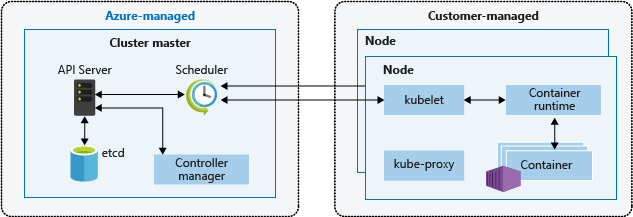
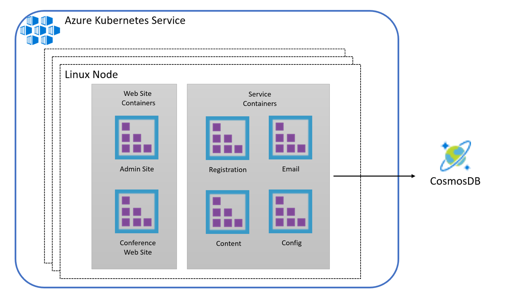

<!--

Cloud-native applications

Whiteboard design session trainer guide

February 2020

Information in this document, including URL and other Internet Web site references, is subject to change without notice. Unless otherwise noted, the example companies, organizations, products, domain names, e-mail addresses, logos, people, places, and events depicted herein are fictitious, and no association with any real company, organization, product, domain name, e-mail address, logo, person, place or event is intended or should be inferred. Complying with all applicable copyright laws is the responsibility of the user. Without limiting the rights under copyright, no part of this document may be reproduced, stored in or introduced into a retrieval system, or transmitted in any form or by any means (electronic, mechanical, photocopying, recording, or otherwise), or for any purpose, without the express written permission of Microsoft Corporation.

Microsoft may have patents, patent applications, trademarks, copyrights, or other intellectual property rights covering subject matter in this document. Except as expressly provided in any written license agreement from Microsoft, the furnishing of this document does not give you any license to these patents, trademarks, copyrights, or other intellectual property.

The names of manufacturers, products, or URLs are provided for informational purposes only and Microsoft makes no representations and warranties, either expressed, implied, or statutory, regarding these manufacturers or the use of the products with any Microsoft technologies. The inclusion of a manufacturer or product does not imply endorsement of Microsoft of the manufacturer or product. Links may be provided to third party sites. Such sites are not under the control of Microsoft and Microsoft is not responsible for the contents of any linked site or any link contained in a linked site, or any changes or updates to such sites. Microsoft is not responsible for webcasting or any other form of transmission received from any linked site. Microsoft is providing these links to you only as a convenience, and the inclusion of any link does not imply endorsement of Microsoft of the site or the products contained therein.

© 2020 Microsoft Corporation. All rights reserved.

Microsoft and the trademarks listed at <https://www.microsoft.com/en-us/legal/intellectualproperty/Trademarks/Usage/General.aspx> are trademarks of the Microsoft group of companies. All other trademarks are property of their respective owners.

**Contents**

-->
<!-- TOC -->
<!--

- [Trainer information](#trainer-information)
  - [Role of the trainer](#role-of-the-trainer)
  - [Whiteboard design session flow](#whiteboard-design-session-flow)
  - [Before the whiteboard design session: How to prepare](#before-the-whiteboard-design-session-how-to-prepare)
  - [During the whiteboard design session: Tips for an effective whiteboard design session](#during-the-whiteboard-design-session-tips-for-an-effective-whiteboard-design-session)
- [Cloud-native applications whiteboard design session student guide](#cloud-native-applications-whiteboard-design-session-student-guide)
  - [Abstract and learning objectives](#abstract-and-learning-objectives)
  - [Step 1: Review the customer case study](#step-1-review-the-customer-case-study)
    - [Customer situation](#customer-situation)
    - [Customer needs](#customer-needs)
    - [Customer objections](#customer-objections)
    - [Infographic for common scenarios](#infographic-for-common-scenarios)
  - [Step 2: Design a proof of concept solution](#step-2-design-a-proof-of-concept-solution)
  - [Step 3: Present the solution](#step-3-present-the-solution)
  - [Wrap-up](#wrap-up)
  - [Additional references](#additional-references)
- [Cloud-native applications whiteboard design session trainer guide](#cloud-native-applications-whiteboard-design-session-trainer-guide)
  - [Step 1: Review the customer case study](#step-1-review-the-customer-case-study-1)
  - [Step 2: Design a proof of concept solution](#step-2-design-a-proof-of-concept-solution-1)
  - [Step 3: Present the solution](#step-3-present-the-solution-1)
  - [Wrap-up](#wrap-up-1)
  - [Preferred target audience](#preferred-target-audience)
  - [Preferred solution](#preferred-solution)
  - [Checklist of preferred objection handling](#checklist-of-preferred-objection-handling)
  - [Customer quote (to be read back to the attendees at the end)](#customer-quote-to-be-read-back-to-the-attendees-at-the-end)

-->
<!-- /TOC -->
<!--

# Trainer information

Thank you for taking time to support the whiteboard design sessions as a trainer!

## Role of the trainer

An amazing trainer:

- Creates a safe environment in which learning can take place.

- Stimulates the participant's thinking.

- Involves the participant in the learning process.

- Manages the learning process (on time, on topic, and adjusting to benefit participants).

- Ensures individual participant accountability.

- Ties it all together for the participant.

- Provides insight and experience to the learning process.

- Effectively leads the whiteboard design session discussion.

- Monitors quality and appropriateness of participant deliverables.

- Effectively leads the feedback process.

## Whiteboard design session flow

Each whiteboard design session uses the following flow:

**Step 1: Review the customer case study (15 minutes)**

**Outcome**

Analyze your customer's needs:, including:

- Customer's background, situation, needs and technical requirements.

- Current customer infrastructure and architecture.

- Potential issues, objectives and blockers.

**Step 2: Design a proof of concept solution (60 minutes)**

**Outcome**

Design a solution and prepare to present the solution to the target customer audience in a 15-minute chalk-talk format.

- Determine your target customer audience.

- Determine customer's business needs to address your solution.

- Design and diagram your solution.

- Prepare to present your solution.

**Step 3: Present the solution (30 minutes)**

**Outcome**

Present solution to your customer:

- Present solution.

- Respond to customer objections.

- Receive feedback.

**Wrap-up (15 minutes)**

- Review preferred solution.

## Before the whiteboard design session: How to prepare

Before conducting your first whiteboard design session:

- Read the Student guide (including the case study) and Trainer guide.

- Become familiar with all key points and activities.

- Plan the point you want to stress, which questions you want to drive, transitions, and be ready to answer questions.

- Prior to the whiteboard design session, discuss the case study to pick up more ideas.

- Make notes for later.

## During the whiteboard design session: Tips for an effective whiteboard design session

**Refer to the Trainer guide** to stay on track and observe the timings.

**Do not expect to memorize every detail** of the whiteboard design session.

When participants are doing activities, you can **look ahead to refresh your memory**.

- **Adjust activity and whiteboard design session pace** as needed to allow time for presenting, feedback, and sharing.

- **Add examples, points, and stories** from your own experience. Think about stories you can share that help you make your points clearly and effectively.

- **Consider creating a "parking lot"** to record issues or questions raised that are outside the scope of the whiteboard design session or can be answered later. Decide how you will address these issues, so you can acknowledge them without being derailed by them.

***Have fun**! Encourage participants to have fun and share!*

**Involve your participants.** Talk and share your knowledge but always involve your participants, even while you are the one speaking.

**Ask questions** and get them to share to fully involve your group in the learning process.

**Ask first**, whenever possible. Before launching into a topic, learn your audience's opinions about it and experiences with it. Asking first enables you to assess their level of knowledge and experience and leaves them more open to what you are presenting.

**Wait for responses**. If you ask a question such as, "What's your experience with (fill in the blank)?" then wait. Do not be afraid of a little silence. If you leap into the silence, your participants will feel you are not serious about involving them and will become passive. Give participants a chance to think, and if no one answers, patiently ask again. You will usually get a response.

# Cloud-native applications whiteboard design session student guide

## Abstract and learning objectives

In this whiteboard design session, you will learn about the choices related to building and deploying containerized applications in Azure, critical decisions around this, and other aspects of the solution, including ways to lift-and-shift parts of the application to reduce applications changes.

By the end of this design session you will be better able to design solutions that target Azure Kubernetes Service (AKS) and define a DevOps workflow for containerized applications.

## Step 1: Review the customer case study

**Outcome**

Analyze your customer's needs.

Timeframe: 15 minutes

Directions: With all participants in the session, the facilitator/SME presents an overview of the customer case study along with technical tips.

1. Meet your table participants and trainer.

2. Read all of the directions for steps 1-3 in the student guide.

3. As a table team, review the following customer case study.

### Customer situation

Fabrikam Medical Conferences provides conference web site services tailored to the medical community. They started out 10 years ago building a few conference sites for a small conference organizer. Since then, word of mouth has spread, and Fabrikam Medical Conferences is now a well-known industry brand. They now handle over 100 conferences per year and growing.

Medical conferences are typically low budget web sites as the conferences are usually between 100 to only 1500 attendees at the high end. At the same time, the conference owners have significant customization and change demands that require turnaround on a dime to the live sites. These changes can impact various aspects of the system from UI through to the back end, including conference registration and payment terms.

The VP of Engineering at Fabrikam, Arthur Block, has a team of 12 developers who handle all aspects of development, testing, deployment, and operational management of their customer sites. Due to customer demands, they have issues with the efficiency and reliability of their development and DevOps workflows.

The conference sites are currently hosted on-premises with the following topology and platform implementation:

- The conference web sites are built with the MEAN stack (Mongo, Express, Angular, Node.js).

- Web sites and APIs are hosted on Windows Server machines.

- MongoDB is also running on a separate cluster of Windows Server machines.

Customers are considered "tenants", and each tenant is treated as a unique deployment whereby the following happens:

- Each tenant has a database in the MongoDB cluster with its own collections.

- A copy of the most recent functional conference code base is taken and configured to point at the tenant database.

  - This includes a web site code base and an administrative site code base for entering conference content such as speakers, sessions, workshops, and sponsors.

- Modifications to support the customer's styles, graphics, layout, and other custom requests are applied.

- The conference owner is given access to the admin site to enter event details.

  - They will continue to use this admin site each conference, every year.

  - They have the ability to add new events and isolate speakers, sessions, workshops, and other details.

- The tenant's code (conference and admin web site) is deployed to a specific group of load balanced Windows Server machines dedicated to one or more tenant. Each group of machines hosts a specific set of tenants, and this is distributed according to scale requirements of the tenant.

- Once the conference site is live, the inevitable requests for changes to the web site pages, styles, registration requirements, and any number of custom requests begin.

Arthur is painfully aware that this small business, which evolved into something bigger, has organically grown into what should be a fully multi-tenanted application suite for conferences. However, the team is having difficulty approaching this goal. They are constantly updating the code base for each tenant and doing their best to merge improvements into a core code base they can use to spin up new conferences. The pace of change is fast, the budget is tight, and they simply do not have time to stop and restructure the core code base to support all the flexibility customers require.

Arthur is looking to take a step in this direction with the following goals in mind:

- Reduce regressions introduced in a single tenant when changes are made.

  - One of the issues with the code base is that it has many dependencies across features. Seemingly simple changes to an area of code introduce issues with layout, responsiveness, registration functionality, content refresh, and more.

  - To avoid this, he would like to rework the core code base so that registration, email notifications and templates, content and configuration are cleanly separated from each other and from the front end.

  - Ideally, changes to individual areas will no longer require a full regression test of the site; however, given the number of sites they manage, this is not tenable.

- Improve the DevOps lifecycle.

  - The time it takes to onboard a new tenant, launch a new site for an existing tenant, and manage all the live tenants throughout the lifecycle of the conference is highly inefficient.

  - By reducing the effort to onboard customers, manage deployed sites, and monitor health, the company can contain costs and overhead as they continue to grow. This may allow for time to improve the multi-tenant platform they would like to build for long-term growth.

- Increase visibility into system operations and health.

  - The team has little to no aggregate views of health across the web sites deployed.

While multi-tenancy is a goal for the code base, even with this in place, Arthur believes there will always be the need for custom copies of code for a particular tenant who requires a one-off custom implementation. Arthur feels that Docker containers may be a good solution to support their short-term DevOps and development agility needs, while also being the right direction once they reach a majority multi-tenant application solution.

### Customer needs

1. Reduce the overhead in time, complexity, and cost for deploying new conference tenants.

2. Improve the reliability of conference tenant updates.

3. Choose a suitable platform for their Docker container strategy on Azure. The platform choice should:

    - Make it easy to deploy and manage infrastructure.

    - Provide tooling to help them with monitoring and managing container health and security.

    - Make it easier to manage the variable scale requirements of the different tenants, so that they no longer have to allocate tenants to a specific load balanced set of machines.

    - Provide a vendor neutral solution so that a specific on-premises or cloud environment does not become a new dependency.

4. Migrate data from MongoDB on-premises to CosmosDB with the least change possible to the application code.

5. Continue to use Git repositories for source control and integrate into a CICD workflow.

6. Prefer a complete suite of operational management tools with:

    - UI for manual deployment and management during development and initial POC work.

    - APIs for integrated CICD automation.

    - Container scheduling and orchestration.

    - Health monitoring and alerts, visualizing status.

    - Container image scanning.

7. Complete an implementation of the proposed solution for a single tenant to train the team and perfect the process.

### Customer objections

1. There are many ways to deploy Docker containers on Azure. How do those options compare and what are motivations for each?

2. Is there an option in Azure that provides container orchestration platform features that are easy to manage and migrate to, that can also handle our scale and management workflow requirements?

### Infographic for common scenarios

_Kubernetes Architecture_

>**Note**: This diagram is an illustration of the Kubernetes topology, illustrating the master nodes managed by Azure, and the agent nodes where Customers can integrate and deploy applications.

<https://docs.microsoft.com/en-us/azure/aks/intro-kubernetes>

_CICD to Azure Kubernetes Service with Azure DevOps_

<https://cloudblogs.microsoft.com/opensource/2018/11/27/tutorial-azure-devops-setup-cicd-pipeline-kubernetes-docker-helm/>

## Step 2: Design a proof of concept solution

**Outcome**

Design a solution and prepare to present the solution to the target customer audience in a 15-minute chalk-talk format.

Timeframe: 60 minutes

**Business needs**

Directions: With all participants at your table, answer the following questions and list the answers on a flip chart:

1. Who should you present this solution to? Who is your target customer audience? Who are the decision makers?

2. What customer business needs do you need to address with your solution?

**Design**

Directions: With all participants at your table, respond to the following questions on a flip chart:

_High-level architecture_

1. Based on the customer situation, what containers would you propose as part of the new microservices architecture for a single conference tenant?

2. Without getting into the details (the following sections will address the particular details), diagram your initial vision of the container platform, the containers that should be deployed (for a single tenant), and the data tier.

_Choosing a container platform on Azure_

1. List the potential platform choices for deploying containers to Azure.

2. Which would you recommend and why?

3. Describe how the customer can provision their Azure Kubernetes Service (AKS) environment to get their POC started.

_Containers, discovery, and load balancing_

1. Describe the high-level manual steps developers will follow for building images and running containers on Azure Kubernetes Service (AKS) as they build their POC. Include the following components in the summary:

    - The Git repository containing their source.

    - Docker image registry.

    - Steps to build Docker images and push to the registry.

    - Run containers using the Kubernetes dashboard.

2. What options does the customer have for a Docker image registry and container scanning, and what would you recommend?

3. How will the customer configure web site containers so that they are reachable publicly at port 80/443 from Azure Kubernetes Service (AKS)?

4. Explain how Azure Kubernetes Service (AKS) can route requests to multiple web site containers hosted on the same node at port 80/443

_Scalability considerations_

1. Explain to the customer how Azure Kubernetes Service (AKS) and their preconfigured Scale Sets support cluster auto-scaling.

_Automating DevOps workflows_

1. Describe how Azure DevOps can help the customer automate their continuous integration and deployment workflows and the Azure Kubernetes Service (AKS) infrastructure.

2. Describe the recommended approach for keeping Azure Kubernetes Service (AKS) nodes up to date with the latest security patches or supported Kubernetes versions.

**Prepare**

Directions: With all participants at your table:

1. Identify any customer needs that are not addressed with the proposed solution.

2. Identify the benefits of your solution.

3. Determine how you will respond to the customer's objections.

Prepare a 15-minute chalk-talk style presentation to the customer.

## Step 3: Present the solution

**Outcome**

Present a solution to the target customer audience in a 15-minute chalk-talk format.

Timeframe: 30 minutes

**Presentation**

Directions:

1. Pair with another table.

2. One table is the Microsoft team and the other table is the customer.

3. The Microsoft team presents their proposed solution to the customer.

4. The customer makes one of the objections from the list of objections.

5. The Microsoft team responds to the objection.

6. The customer team gives feedback to the Microsoft team.

7. Tables switch roles and repeat Steps 2-6.

## Wrap-up

Timeframe: 15 minutes

Directions: Tables reconvene with the larger group to hear the facilitator/SME share the preferred solution for the case study.

## Additional references

|                                 |                                                                                                  |
| ------------------------------- | :----------------------------------------------------------------------------------------------- |
| **Description**                 | **Links**                                                                                        |
| Azure Kubernetes Services (AKS) | <https://docs.microsoft.com/en-us/azure/aks/intro-kubernetes/>                                   |
| Kubernetes                      | <https://kubernetes.io/docs/home/>                                                               |
| AKS FAQ                         | <https://docs.microsoft.com/en-us/azure/aks/faq>                                                   |
| Autoscaling AKS                 | <https://github.com/kubernetes/autoscaler>                                                         |
| AKS Cluster Autoscaler          | <https://docs.microsoft.com/en-us/azure/aks/cluster-autoscaler>                                    |
| Upgrading an AKS cluster        | <https://docs.microsoft.com/en-us/azure/aks/upgrade-cluster>                                       |
| Azure Pipelines                 | <https://docs.microsoft.com/en-us/azure/devops/pipelines/>                                       |
| Container Security              | <https://docs.microsoft.com/en-us/azure/container-instances/container-instances-image-security/> |
| Image Quarantine                | <https://github.com/Azure/acr/tree/master/docs/preview/quarantine/>                              |
| Container Monitoring Solution   | <https://docs.microsoft.com/en-us/azure/azure-monitor/insights/containers>                       |

# Cloud-native applications whiteboard design session trainer guide

## Step 1: Review the customer case study

- Check in with your table participants to introduce yourself as the trainer.

- Ask, "What questions do you have about the customer case study?"

- Briefly review the steps and timeframes of the whiteboard design session.

- Ready, set, go! Let the table participants begin.

## Step 2: Design a proof of concept solution

- Check in with your tables to ensure that they are transitioning from step to step on time.

- Provide some feedback on their responses to the business needs and design.

  - Try asking questions first that will lead the participants to discover the answers on their own.

- Provide feedback for their responses to the customer's objections.

  - Try asking questions first that will lead the participants to discover the answers on their own.

## Step 3: Present the solution

- Determine which table will be paired with your table before Step 3 begins.

- For the first round, assign one table as the presenting team and the other table as the customer.

- Have the presenting team present their solution to the customer team.

  - Have the customer team provide one objection for the presenting team to respond to.

  - The presentation, objections, and feedback should take no longer than 15 minutes.

  - If needed, the trainer may also provide feedback.

## Wrap-up

- Have the table participants reconvene with the larger session group to hear the facilitator/SME share the following preferred solution.

## Preferred target audience

Arthur Block, VP Engineering at Fabrikam Medical Conferences.

The primary audience is the technical strategic decision-maker with influential solution architects or lead technical personnel in development or operations. For this example, this could include the VP Engineering and his core team. Usually we talk to the key architects, developers, and infrastructure managers who report to the CIO or equivalent, or to key solution sponsors or those that represent the business unit IT or developers that report to those sponsors.

## Preferred solution

After evaluating the options for container platforms on Azure and discussing Azure Kubernetes Service (AKS) features with the team at Microsoft, Fabrikam Medical Conferences decided to move forward with Azure Kubernetes Service (AKS).

They also decided to move forward with Azure DevOps for container DevOps workflows.

**Design**

*High-level architecture*

1. Based on the customer situation, what containers would you propose as part of the new microservices architecture for a single conference tenant?
  Each tenant will have the following containers:

     - **Conference Web site**: The SPA application that will use configuration settings to handle custom styles for the tenant.

     - **Admin Web site**: The SPA application that conference owners use to manage conference configuration details, manage attendee registrations, manage campaigns, and communicate with attendees.

     - **Registration service**: The API that handles all registration activities, creating new conference registrations with the appropriate package selections, and associated cost.

     - **Email service**: The API that handles email notifications to conference attendees during registration, or when the conference owners choose to engage the attendees through their admin site.

     - **Config service**: The API that handles conference configuration settings such as dates, locations, pricing tables, early bird specials, countdowns, and related.

     - **Content service**: The API that handles content for the conference such as speakers, sessions, workshops, and sponsors.

2. Without getting into the details (the following sections will address the particular details), diagram your initial vision of the container platform, the containers that should be deployed (for a single tenant), and the data tier.

    The solution will use Azure Kubernetes Service (AKS), which means that the container cluster topology is provisioned according to the number of requested nodes. The proposed containers deployed to the cluster are illustrated below. The data tier is provided by Cosmos DB outside of the container platform:

*Choosing a container platform on Azure*

1. List the potential platform choices for deploying containers to Azure.

    **Azure Web App for Containers**

    Azure Web App for Containers specifically targets container deployments, which makes it easy to run containers in a fully managed App Service Plan. This option is ideal for solutions that do not require the features offered by an orchestration platform such as Kubernetes.

    **Azure Container Instances**

    Azure Container Instances provide a serverless approach to running containers on demand and at scale enabling additional compute power and elasticity for select workloads - with the security of hypervisor isolation.

    **Windows Server Containers on Windows Server**

    Windows Server Containers allow Windows applications to be containerized. Windows Server 2016 or later versions support the installation of Docker Engine to run containers. For orchestration features you can also set up a cluster with an orchestration platform such as Docker Engine (Community or Enterprise), Kubernetes or other platforms - if you want to take responsibility for managing the clustering and related configurations.

    **Azure Kubernetes Service (AKS)**

    Azure Kubernetes Service (AKS) is the easiest way to manage a Kubernetes cluster on Azure - providing you with a managed control plane and configurable cluster with automatic updates and easy scaling capabilities. AKS removes the management overhead of container orchestration cluster, allowing teams to focus on the application and core DevOps workflows relevant to the solution.

2. Which would you recommend and why?

    Azure Kubernetes Service (AKS) is the recommended platform for the following reasons:

    - It has the necessary orchestration features without the management overhead of the control plane.

    - Ability to monitor and manage applications using a Management UI. This will also make it easier to view the overall state of all tenant applications in a single pane, and drill down into the health of an individual tenant easily.

    - Integration with Container Monitoring Solution in Azure for additional visibility into containers running in the AKS cluster from the Azure Portal, without connecting to the Kubernetes control plane.

    - Full set of integrated features, working out of the box including load balancing, service discovery, self-healing capabilities, scheduling, orchestration, task monitoring, and more.

    - Simple REST API supporting automation with DevOps workflows.

    - Open source, mature, and production tested platform.

    Generally, if the customer has experience with one of the supported orchestrators, you can apply that experience in Azure Kubernetes Service (AKS). There is a great deal of momentum in the community behind Kubernetes, and with Microsoft providing a fully managed solution based on this platform, it is the natural choice.

3. Describe how the customer can provision their Azure Kubernetes Service (AKS) environment to get their POC started.

    - The Azure Kubernetes Service (AKS) environment is deployed using a few simple Azure CLI commands.

*Containers, discovery and load-balancing*

1. Describe the high-level manual steps developers will follow for building images and running containers on Azure Kubernetes Service (AKS) as they build their POC. Include the following components in the summary:

   - The Git repository containing their source.

   - Docker image registry.

   - Steps to build Docker images and push to the registry.

   - Run containers using the Kubernetes dashboard.

   The basic workflow is to build an image from the service source repository, push the image to a registry from which it is deployed, and run as a container.

   A Dockerfile describing each container can reside in the Git repository together with the source. Using command line tools, the developers can build Docker images and push to the registry. A CI process can also automate building images and push to the registry when changes are checked in using Azure DevOps build pipelines.

   To deploy and run a container, the developer can:

   - Securely access the Kubernetes dashboard and create a deployment specifying an image from the repository manually

   - POST a service definition file (JSON) to the REST API using `kubectl` from the command line. This process can also be automated as part of a CD process using Azure DevOps release pipelines.

   - Create Azure DevOps CICD build and release pipelines to automate building images and deploying them to run in the cluster.

2. What options does the customer have for a Docker image registry, and what would you recommend?

   The image registry is core to the CICD workflow and must be a production worthy implementation as it is the source of container images, versioning, deployment, upgrade, and rollback strategies. Registry images can also be used for cross-environment promotion (between development, test, staging, and production for example).

   The following are a few natural options for image registries that could support Azure container deployments:

   - Azure Container Registry is a natural fit with Azure deployments, and it integrates well with deployment options previously mentioned for Docker containers in Azure. This includes an integrated experience in the Azure portal to view the repositories, images, tags, and the contents of manifests associated with an image. In addition, Azure Container Registry has new security features including image quarantine (currently in preview).

   - For development, you can also consider a public Docker Hub account. As all images in the public Docker Hub repository are public; however, this is not typically viable for corporate assets.

   - You can optionally pay for a private repository on Docker Hub, which enables you to control who can access your repository. This comes at a reasonable cost and is fully managed.

   - You can deploy and manage your own Docker Registry in Azure VMs---which would have to be clustered for high availability and this is not trivial to set up. This is not a recommended option when a hosted repository can fit solution requirements.

   Deploying and configuring a Docker Registry, clustered or not, is a complex and time-consuming task. We recommend the use of Azure Container Registry where possible for Azure solutions.

3. How will the customer configure web site containers so that they are reachable publicly at port 80/443 from Azure Kubernetes Service (AKS)?

   When you configure services for a Kubernetes deployment, you can choose to use the public load balancer such that each service instance will be accessible through the Azure load balancer. So long as the required ports are openly accessible, the Azure load balancer will be able to route traffic to all available service instances associated with the endpoint.

   Kubernetes also seamlessly supports load balanced services without making them publicly accessible. Requests from within the cluster can reach internal services and will load balanced across all service instances.

4. Explain how Azure Kubernetes Service (AKS) can route requests to multiple web site containers hosted on the same node at port 80/443

   The location of a container across all nodes in the Azure Kubernetes Service (AKS) cluster should not matter to calling clients. A client application will send a request to a particular endpoint (URL) and expect it to find the correct container instance to service the request. Container routing is an important part of this.

   Web application and api service containers bind to random ports on their host node allowing multiple instances per node. Kubernetes supports dynamic service port discovery and will choose between all instances across nodes to route requests.

*Scalability considerations*

1. Explain to the customer how Azure Kubernetes Service (AKS) supports cluster auto-scaling.

   You can scale the agent nodes in the cluster with the Kubernetes Autoscaler as of Kubernetes 1.10.

*Automating DevOps workflows*

1. Describe how Azure DevOps can help the customer automate their continuous integration and deployment workflows and the Azure Kubernetes Service (AKS) infrastructure.

   With Azure DevOps you can create build definitions that, on commit or check-in can produce build artifacts from the latest source (for example) and build Docker images, then push them to a Docker image repository such as Azure Container Registry. This build definition can be configured to respond to specific folder changes, can build one or more Docker image based on different project folders, and tag images with build number, required image repository tags and other information useful to your image promotion workflows.

   To trigger deployment, you can also use Azure DevOps to produce release definitions that can create or update services in AKS. You may, for example, want your development cluster to always deploy the latest images as code is committed. On the other hand, for test, UAT or production clusters you may want to manually run release jobs based on a specific image tag of the environment in order to control when a new version of a service or services are released.

2. Describe the recommended approach for keeping Azure Kubernetes Service (AKS) nodes up to date with the latest security patches or supported Kubernetes versions.

   Azure applies security patches on a nightly schedule however you must reboot the servers to apply the update. This can be done through the Azure portal or Azure CLI, for example.

   You can upgrade the cluster to a later version of Kubernetes using Azure CLI commands.

## Checklist of preferred objection handling

1. There are many ways to deploy Docker containers on Azure. How do those options compare and what are motivations for each?

   The best of all worlds is to go with a managed orchestration platform like AKS -- native to Azure. It reduces the cost and management overhead of the cluster, while still providing a solution that supports growth, scale, and native management tooling.

    With Kubernetes you will have additional features at your fingertips beyond the pure Docker approach including:

    - The Kubernetes dashboard includes web interface and remote APIs for managing, running, and scaling containers, including CICD integration options.

    - The kubectl command line tool for engaging remote Kubernetes APIs and assisting with automation.

    - Built-in dynamic service discovery simplifies the deployment of new container instances to a load balanced environment.

2. Is there an option in Azure that provides container orchestration platform features that are easy to manage and migrate to, that can also handle our scale and management workflow requirements?

    The easiest way to move to containers on Azure is to deploy containers to the Linux variant of App Service. However, this option does not provide a full-featured container orchestration platform with highly customizable load balancing, dynamic service discovery, and a holistic approach to container monitoring.

    Azure Container Instances also provide a simple way to manage individual containers without management tooling.

    Azure Kubernetes Service (AKS) provides a fully managed service with the full set of orchestration and management tools. This is the best possible choice for reduced management overhead while still having access to the features provided with orchestration platforms like Kubernetes.

## Customer quote (to be read back to the attendees at the end)

"With Azure Kubernetes Service (AKS) we feel confident we can make the move to a container-based platform with the right DevOps support in place to be successful with a small team."

- Arthur Block, VP of Engineering at Fabrikam Medical Conferences

-->

クラウド ネイティブ アプリケーション

ホワイトボード設計セッション トレーナー用ガイド

2020 年 2 月

このドキュメントに記載されている情報 (URL や他のインターネット Web サイト参照を含む) は、将来予告なしに変更することがあります。別途記載されていない場合、このソフトウェアおよび関連するドキュメントで使用している会社、組織、製品、ドメイン名、電子メール アドレス、ロゴ、人物、場所、出来事などの名称は架空のものです。実在する商品名、団体名、個人名などとは一切関係ありません。お客様ご自身の責任において、適用されるすべての著作権関連法規に従ったご使用をお願いいたします。著作権法による制限に関係なく、マイクロソフトの書面による許可なしに、このドキュメントの一部または全部を複製したり、検索システムに保存または登録したり、別の形式に変換したりすることは、手段、目的を問わず禁じられています。ここでいう手段とは、複写や記録など、電子的、または物理的なすべての手段を含みます。

マイクロソフトは、このドキュメントに記載されている内容に関し、特許、特許申請、商標、著作権、またはその他の無体財産権を有する場合があります。別途マイクロソフトのライセンス契約上に明示の規定のない限り、このドキュメントはこれらの特許、商標、著作権、またはその他の知的財産権に関する権利をお客様に許諾するものではありません。

製造元名、製品名、URL は、情報提供のみを目的としており、これらの製造元またはマイクロソフトのテクノロジを搭載した製品の使用について、マイクロソフトは、明示的、黙示的、または法令によるいかなる表明も保証もいたしません。製造元または製品に対する言及は、マイクロソフトが当該製造元または製品を推奨していることを示唆するものではありません。掲載されているリンクは、外部サイトへのものである場合があります。これらのサイトはマイクロソフトの管理下にあるものではなく、リンク先のサイトのコンテンツ、リンク先のサイトに含まれているリンク、または当該サイトの変更や更新について、マイクロソフトは一切責任を負いません。リンク先のサイトから受信した Web キャストまたはその他の形式での通信について、マイクロソフトは責任を負いません。マイクロソフトは受講者の便宜を図る目的でのみ、これらのリンクを提供します。また、リンクの掲載は、マイクロソフトが当該サイトまたは当該サイトに掲載されている製品を推奨していることを示唆するものではありません。

© 2020 Microsoft Corporation. All rights reserved.

Microsoft および <https://www.microsoft.com/en-us/legal/intellectualproperty/Trademarks/Usage/General.aspx> (英語) に掲載されているその他の商標は、マイクロソフト グループ各社の商標です。その他すべての商標は、その所有者に帰属します。

**目次**

<!-- TOC -->

- [トレーナー情報](#トレーナー情報)
  - [トレーナーの役割](#トレーナーの役割)
  - [ホワイトボード設計セッションの流れ](#ホワイトボード設計セッションの流れ)
  - [ホワイトボード設計セッション開始前: 準備について](#ホワイトボード設計セッション開始前:-準備について)
  - [ホワイトボード設計セッション進行中: ホワイトボード設計セッションの効果を高めるためのヒント](#ホワイトボード設計セッション進行中:-ホワイトボード設計セッションの効果を高めるためのヒント)
- [クラウド ネイティブ アプリケーションホワイトボード設計セッション生徒用ガイド](#クラウド-ネイティブ-アプリケーションホワイトボード設計セッション生徒用ガイド)
  - [概要と学習の目的](#概要と学習の目的)
  - [ステップ 1: 顧客事例の確認](#ステップ-1:-顧客事例の確認)
    - [顧客の状況](#顧客の状況)
    - [顧客のニーズ](#顧客のニーズ)
    - [顧客の反論](#顧客の反論)
    - [一般的なシナリオのインフォグラフィック](#一般的なシナリオのインフォグラフィック)
  - [ステップ 2: 概念実証ソリューションの設計](#ステップ-2:-概念実証ソリューションの設計)
  - [ステップ 3: ソリューションのプレゼンテーション](#ステップ-3:-ソリューションのプレゼンテーション)
  - [まとめ](#まとめ)
  - [参考資料](#参考資料)
- [クラウド ネイティブ アプリケーションホワイトボード設計セッション トレーナー用ガイド](#クラウド-ネイティブ-アプリケーションホワイトボード設計セッション-トレーナー用ガイド)
  - [ステップ 1: 顧客事例の確認](#ステップ-1:-顧客事例の確認-1)
  - [ステップ 2: 概念実証ソリューションの設計](#ステップ-2:-概念実証ソリューションの設計-1)
  - [ステップ 3: ソリューションのプレゼンテーション](#ステップ-3:-ソリューションのプレゼンテーション-1)
  - [まとめ](#まとめ-1)
  - [想定される顧客担当者](#想定される顧客担当者)
  - [想定されるソリューション](#想定されるソリューション)
  - [想定される反論への対応のチェックリスト](#想定される反論への対応のチェックリスト)
  - [顧客の声 (最後に参加者にもう一度読んでいただく)](#顧客の声-(最後に参加者にもう一度読んでいただく))

<!-- /TOC -->

# トレーナー情報

お忙しい中、トレーナーとしてホワイトボード設計セッションにお力添えいただきありがとうございます。

## トレーナーの役割

トレーナーには以下のことが求められます。

- 学習を安全に行える環境を作成すること。

- 参加者の思考を促すこと。

- 参加者を学習プロセスに積極的に参加させること。

- 学習プロセスを管理すること (時間を守る、トピックに沿う、参加者のメリットになるように調整する)。

- 個々の参加者が確実に理解できるようにすること。

- 参加者全員をまとめること。

- 学習プロセスに関連する知見や経験を提示すること。

- ホワイトボード設計セッションの議論を効果的にリードすること。

- 参加者の成果物の品質と適切であるかどうかを監督すること。

- フィードバック プロセスを効果的にリードすること。

## ホワイトボード設計セッションの流れ

各ホワイトボード設計セッションは以下の手順で進められます。

**ステップ 1: 顧客事例の確認 (15 分)**

**成果**

以下のような観点から顧客のニーズを分析する。

- 顧客の背景、状況、ニーズ、技術的要件

- 顧客の現在のインフラストラクチャとアーキテクチャ

- 想定される問題、反論、障害

**ステップ 2: 概念実証ソリューションの設計 (60 分)**

**成果**

ソリューションを設計し、15 分の講義形式で提供先の顧客の担当者に行うソリューションのプレゼンテーションに向けて準備する。

- 提案先の顧客の担当者を把握します。

- ソリューションで対応する顧客のニーズを把握します。

- ソリューションを設計し、図示します。

- ソリューションのプレゼンテーションに向けて準備します。

**ステップ 3: ソリューションのプレゼンテーション (30 分)**

**成果**

顧客に向けてソリューションのプレゼンテーションを行う。

- ソリューションのプレゼンテーションを行います。

- 顧客からの反論に対応します。

- フィードバックを受けます。

**まとめ (15 分)**

- 採用されたソリューションを再検討します。

## ホワイトボード設計セッション開始前: 準備について

ホワイトボード設計セッションを開始する前に、以下の準備を行います。

- 生徒用ガイド (顧客事例を含む) とトレーナー用ガイドを熟読します。

- すべてのキー ポイントと作業についてよく理解します。

- 重点を置くポイント、参加者から引き出したい質問、伝え方を計画し、質問に答えられるように準備します。

- ホワイトボード設計セッションを開始する前に顧客事例について検討し、アイデアをさらに掘り出します。

- 後で利用できるようにメモを取ります。

## ホワイトボード設計セッション進行中: ホワイトボード設計セッションの効果を高めるためのヒント

**トレーナー用ガイド**を参照して、トピックに沿って進めながらタイミングを計ります。

ホワイトボード設計セッションの**詳細をすべて覚えることはありません**。

参加者が作業を行っている間に、**その先を見通して内容を思い出して**みましょう。

- 必要に応じて**作業とホワイトボード設計セッションのペース**を調整し、プレゼンテーション、フィードバック、共有の時間を確保します。

- 自身の経験から**例、注意点、筋書きを追加**します。注意点を明確化し効果的に伝えられるような筋書きを考えましょう。

- **「一時退避所」を設けて**、ホワイトボード設計セッションの範囲外の問題や疑問が発生したらいったん保留し、後で回答できるようにします。このような問題を解決する方法を決めておくと、トピックから脱線することなく対応することができます。

**セッションを楽しみましょう**。全員で楽しむように参加者に働きかけます。

**参加者に積極的な参加を促します。** 自身の知識を話すときにも、常に参加者の積極的な参加を促しましょう。

**参加者に質問を投げかけて**、グループが積極的に学習プロセスに参加するようにします。

可能な限り **最初に質問する** ようにします。トピックの内容に入る前に、そのトピックに関する参加者の意見や経験を把握します。最初に質問すると、参加者の知識や経験のレベルを評価できるうえ、参加者がトレーナーの意見に対してオープンに対応できます。

**回答を待ちます**。「(○○の) 経験は?」といった質問を投げかけた後は、答えが返ってくるまで待ちます。多少の沈黙が生じてもかまいません。慌ててトレーナーが沈黙を破ると、参加者は積極的な参加を求められているわけではないと感じ、受身の姿勢になりがちです。参加者に考えるきっかけを与え、回答がないようなら再度質問を繰り返しましょう。そうすればたいていは回答が得られます。

# クラウド ネイティブ アプリケーションホワイトボード設計セッション生徒用ガイド

## 概要と学習の目的

このホワイトボード設計セッションでは、Azure でコンテナー化アプリケーションを構築およびデプロイする方法の選び方とそれに関する重要な決定事項、アプリケーションの一部をクラウドに移行してアプリケーションの変更を削減する方法などのソリューションに関することを学びます。

このホワイトボード設計セッションを修了すると、Azure Kubernetes Service (AKS) 向けソリューションの設計やコンテナー化アプリケーションの DevOps ワークフローの定義のスキルが向上します。

## ステップ 1: 顧客事例の確認

**成果**

顧客のニーズを分析する。

時間: 15 分

指示: セッション参加者全員が集まり、進行役または SME が顧客事例の概要と技術的なヒントを提示します。

1. 自班の参加者とトレーナーが集まります。

2. 生徒用ガイドのステップ 1 ～ 3 の指示をすべて読みます。

3. 班全体で下記の顧客事例を確認します。

### 顧客の状況

Fabrikam Medical Conferences では、医療コミュニティ向けにカスタマイズされた会議 Web サイト サービスを提供しています。同社は 10 年前、小規模な会議運営者に向けて会議サイトを複数構築しました。その後、Fabrikam Medical Conferences のブランドは口コミで業界に広まりました。現在では年間 100 回以上の会議を扱い、その数はさらに増加しています。

通常、医療関連の会議は参加者数が 100 名からせいぜい 1500 名程度で、Web サイトの予算も少額です。同時に、会議運営者からは大幅なカスタマイズや稼働中のサイトへの応答時間を極小にする変更などが求められます。このような変更は、会議の登録や支払い条件など、UI からバックエンドまでシステムにさまざまな影響を与えます。

Fabrikam のエンジニアリング担当バイス プレジデントを務める Arthur Block は開発者 12 名のチームを所有しており、このチームで顧客サイトの開発、テスト、デプロイメント、運用管理をすべて担当しています。顧客の要望により、チームでは開発および DevOps のワークフローの効率と信頼性に関する問題を抱えています。

現在、会議サイトは以下のテクノロジとプラットフォームが実装されたオンプレミス環境でホストされています。

- MEAN スタック (Mongo、Express、Angular、Node.js) で構築された会議 Web サイト

-  Windows Server マシンでホストされている Web サイトと API

- 独立した Windows Server マシン クラスターで実行されている MongoDB

顧客は「テナント」と見なされます。各テナントは以下のような独立したデプロイメントとして扱われます。

- 各テナントの MongoDB クラスターに、自身のコレクションを有するデータベースが存在します。

- 使用可能な最新の会議サイト コード ベースが取得され、テナント データベースを指定するように構成されます。

  - これには、Web サイトのコード ベースと、講演者、セッション、ワークショップ、スポンサーなどの会議に関するコンテンツを入力する管理サイトのコード ベースが含まれます。

- 変更を加えてスタイル、グラフィック、レイアウトなどの顧客の要望に対応することができます。

- 会議運営者は、管理サイトにアクセスしてイベントの詳細を入力できます。

  - 各会議の管理サイトは、毎年継続的に使用されます。

  - 新規イベントを追加したり、講演者、セッション、ワークショップなどの詳細を分離したりできます。

- テナントのコード (会議用および管理用の Web サイト) は、特定の Windows Server マシン グループにデプロイされます。このグループは負荷分散が構成されていて、1 つ以上のテナントで占用されます。各マシン グループでは特定セットのテナントがホストされ、テナントのスケーリング要件に基づいて分散されます。

- 会議サイトが実際に使用され始めると、Web サイトのページ、スタイル、登録要件、その他あらゆるカスタマイズの要望が生まれることは避けられません。

Arthur Block は、小規模だったビジネスが成長し、完全なマルチテナント アプリケーション会議スイートへと根本的に変化していることを実感しています。しかし、チームはこの目標の達成に苦戦しています。チームでは、各テナントのコード ベースを常に更新しメインのコード ベースに改良をマージして、新しい会議をすばやく作成できるようにすることに全力で取り組んでいます。変更は急速に進められ予算も抑えられているため、いったん立ち止まってメインのコード ベースを再構築し、顧客の要件のすべてに柔軟に対応できるようにする時間はありません。

チームでは、以下の目標を念頭にこの指示の各ステップを進めていきます。

- 変更時に単一テナントで発生する回帰の減少

  - コード ベースに関する問題の 1 つに、機能間に多数の依存関係が存在することがあります。コードのある部分にちょっとした変更を加えたために、レイアウト、応答性、登録機能、内容の更新などの問題が発生することがあります。

  - これを防ぐため、メインのコード ベースを再構築して登録、電子メール通知やテンプレート、内容や構成を相互間およびフロント エンドから明確に独立させます。

  - 一部に変更を加えてもサイトの回帰テストを完全に行う必要がないようにするのが理想的ですが、管理対象のサイト数を考えると現実的ではありません。

- DevOps ライフサイクルの改善

  - 会議のライフサイクル全体において、新規テナントの実装、既存テナントでの新規サイトの立ち上げ、稼働中の全テナントの管理に要する時間は、大幅な効率低下につながっています。

  - 顧客の実装、デプロイしたサイトの管理、正常性の監視などの労力を削減すると、成長を続けながらコストやオーバーヘッドを抑えることができます。これにより、長期的な成長に対応できるようにマルチテナント プラットフォームを改良する時間が生まれます。

- システムの運用状況と正常性の可視性向上

  - デプロイした Web サイト全体の正常性を集約的に表示する機能がまったく実装されていないか、または不十分です。

コード ベースのマルチテナント化を目標として掲げていますが、これを実装したとしても、ワンオフのカスタマイズされた実装を必要とする特定のテナントに向けたカスタム コードが必要になることが予想されます。チームでは、短期的な DevOps とアジャイルな開発のニーズに応えるには、マルチテナント アプリケーション ソリューションとして主要な地位を占めている Docker コンテナーが適切であり、有力なソリューションになり得ると考えています。

### 顧客のニーズ

1. 新規会議テナントのデプロイに要する時間とコストを削減し、作業も簡素化する。

2. 会議テナントの更新の信頼性を向上する。

3. Azure での Docker コンテナー戦略に適したプラットフォームを選択する。以下の観点からプラットフォームを選択します。

    - インフラストラクチャのデプロイと管理が容易なこと。

    - コンテナーの正常性とセキュリティの監視や管理に使用するツールが提供されること。

    - 各種テナントのさまざまなスケーリング要件を管理しやすく、特定の負荷分散マシン セットにテナントを割り当てる必要がないこと。

    - ベンダー ニュートラルなソリューションが提供され、特定のオンプレミス環境やクラウド環境に依存しないこと。

4. 最小限のアプリケーション コード変更でオンプレミスの MongoDB から CosmosDB にデータを移行する。

5. ソース管理と CI/CD ワークフローへの統合には引き続き Git リポジトリを使用する。

6. 以下の機能を含む完全な運用管理ツール スイートを導入する。

    - 開発や初期の POC 段階の作業で手動によるデプロイや管理に使用する UI。

    - 統合型 CI/CD の自動化に使用する API。

    - コンテナーのスケジュール設定とオーケストレーション。

    - 正常性の監視とアラート生成、状態の可視化。

    - コンテナー イメージのスキャン。

7. 提案されたソリューションを単一テナントに実装し、チームのトレーニングを実施してプロセスを完遂させる。

### 顧客の反論

1. Azure に Docker コンテナーをデプロイする方法にはさまざまなものがある。これらをどのようにして比較し、それぞれのメリットを理解すればよいのか?

2. 管理や移行が容易なコンテナー オーケストレーション プラットフォーム機能を Azure で使用する方法はあるのか、また自社のスケーリング要件や管理ワークフローの要件に対応できるか?

### 一般的なシナリオのインフォグラフィック

_Kubernetes アーキテクチャ_

>**注意**: この図は、Azure で管理されるマスター ノードと、顧客がアプリケーションの統合やデプロイを行うことができるエージェント ノードを含む Kubernetes トポロジを示したものです。

<https://docs.microsoft.com/ja-jp/azure/aks/intro-kubernetes>

_Azure DevOps を使用した Azure Kubernetes Service への CI/CD_

<https://cloudblogs.microsoft.com/opensource/2018/11/27/tutorial-azure-devops-setup-cicd-pipeline-kubernetes-docker-helm/> (英語)

## ステップ 2: 概念実証ソリューションの設計

**成果**

ソリューションを設計し、15 分の講義形式で提供先の顧客の担当者に行うソリューションのプレゼンテーションに向けて準備する。

時間: 60 分

**ビジネス ニーズ**

指示: 班の参加者全員で以下の質問に回答し、フリップ チャートに回答の一覧を記載します。

1. ソリューションを提案する相手は? 提案先の顧客の担当者は? 意思決定者は?

2. このソリューションで解決が必要な顧客のビジネス ニーズは?

**設計**

指示: 班の参加者全員でフリップ チャートに記載された以下の質問に回答します。

_アーキテクチャの概要_

1. 顧客の状況に基づいて、単一の会議テナントに向けた新しいマイクロサービス アーキテクチャの一部として提案するコンテナーを選択します。

2. 詳細には触れずに (各種の詳細については後のセクションで扱います)、コンテナー プラットフォームの初期構想、(単一のテナントに) デプロイするコンテナー、データ層を図示します。

_Azure で使用するコンテナー プラットフォームの選択_

1. Azure にコンテナーをデプロイする際に考えられるプラットフォームを列挙します。

2. 推奨するプラットフォームとその理由を示します。

3. 顧客の Azure Kubernetes Service (AKS) 環境をプロビジョニングし POC を開始する方法について説明します。

_コンテナー、検出、負荷分散_

1. イメージの構築、および POC 構築時の Azure Kubernetes Service (AKS) でのコンテナー実行において開発者が手動で行う手順の概要を示します。概要には以下の項目を含めます。

    - ソースを格納する Git リポジトリ

    - Docker イメージ レジストリ

    - Docker イメージを構築しレジストリにプッシュする手順

    - Kubernetes ダッシュボードからコンテナーを実行する手順

2. Docker イメージ レジストリとコンテナー スキャンの方法のうち顧客が実行可能なものを検討し、推奨する方法を決定します。

3. Azure Kubernetes Service (AKS) からインターネットを通じてポート 80/443 経由でアクセスできるように Web サイトのコンテナーを構成する方法を検討します。

4. ポート 80/443 でホストされている同一ノードの複数の Web サイト コンテナーに Azure Kubernetes Service (AKS) の要求をルーティングできるようにする方法を説明します。

_スケーラビリティに関する考慮事項_

1. Azure Kubernetes Service (AKS) と事前構成済みの Scale Sets でクラスターの自動スケーリングをサポートする方法を顧客に説明します。

_DevOps ワークフローの自動化_

1. Azure DevOps が顧客の CI/CD ワークフローと Azure Kubernetes Service (AKS) インフラストラクチャの自動化にどのように貢献するかについて説明します。

2. Azure Kubernetes Service (AKS) ノードにセキュリティ修正プログラムやサポート対象のバージョンの Kubernetes を適用し最新状態に保つために推奨する方法について説明します。

**準備**

指示: 班の参加者全員と以下を行います。

1. 提案したソリューションでは解決されない顧客のニーズを把握します。

2. ソリューションのメリットを把握します。

3. 顧客の反論に対応する方法を検討します。

15 分の講義形式で顧客に行うソリューションのプレゼンテーションに向けて準備します。

## ステップ 3: ソリューションのプレゼンテーション

**成果**

15 分の講義形式で提供先の顧客の担当者にソリューションのプレゼンテーションを行う。

時間: 30 分

**プレゼンテーション**

指示:

1. 他の班と組みます。

2. 一方の班はマイクロソフト チームを、もう一方の班は顧客を担当します。

3. マイクロソフト チームは、提案するソリューションのプレゼンテーションを顧客に向けて行います。

4. 顧客側は、反論リストの中からいずれかの反論を行います。

5. マイクロソフト チームは反論に対応します。

6. 顧客側はマイクロソフト チームにフィードバックを提供します。

7. 役割を入れ替えてステップ 2 ～ 6 を繰り返します。

## まとめ

時間: 15 分

指示: 各班が集まり、進行役や SME が事例に適したソリューションを発表します。

## 参考資料

|                                 |                                                                                                  |
| ------------------------------- | :----------------------------------------------------------------------------------------------- |
| **説明**                 | **リンク**                                                                                        |
| Azure Kubernetes Services (AKS) | <https://docs.microsoft.com/ja-jp/azure/aks/intro-kubernetes>                                   |
| Kubernetes                       | <https://kubernetes.io/docs/home/> (英語)                                                               |
| AKS の FAQ                         | <https://docs.microsoft.com/ja-jp/azure/aks/faq>                                                   |
| AKS の自動スケーリング                | <https://github.com/kubernetes/autoscaler> (英語)                                                         |
| AKS クラスターの自動スケーリング機能          | <https://docs.microsoft.com/ja-jp/azure/aks/cluster-autoscaler>                                    |
| AKS クラスターのアップグレード        | <https://docs.microsoft.com/ja-jp/azure/aks/upgrade-cluster>                                       |
| Azure Pipelines                | <https://docs.microsoft.com/ja-jp/azure/devops/pipelines/?view=azure-devops> (英語)                                       |
| コンテナーのセキュリティ              | <https://docs.microsoft.com/ja-jp/azure/container-instances/container-instances-image-security> |
| イメージの検疫                | <https://github.com/Azure/acr/tree/master/docs/preview/quarantine/> (英語)                              |
| コンテナー監視ソリューション   | <https://docs.microsoft.com/ja-jp/azure/azure-monitor/insights/containers>                       |

# クラウド ネイティブ アプリケーションホワイトボード設計セッション トレーナー用ガイド

## ステップ 1: 顧客事例の確認

- 自班の参加者と対面し、トレーナーとして自己紹介します。

- 「この顧客事例について不明な点を挙げてください」と問いかけます。

- ホワイトボード設計セッションのステップと時間を大まかに確認します。

- これで準備完了です。自班の参加者にセッションを始めていただきます。

## ステップ 2: 概念実証ソリューションの設計

- 各ステップを時間どおりに進められるように自班の参加者と確認します。

- ビジネス ニーズや設計に関する参加者からの回答にフィードバックを返します。

  - 参加者が自身で答えにたどり着くように導く質問を最初に投げかけるようにします。

- 顧客の反論への対応に対してフィードバックを返します。

  - 参加者が自身で答えにたどり着くように導く質問を、最初に投げかけるようにします。

## ステップ 3: ソリューションのプレゼンテーション

- ステップ 3 を始める前に、自班と組む相手の班を決めます。

- 1 巡目にプレゼンテーションを行う班と顧客側を演じる班を割り当てます。

- プレゼンテーション チームは、顧客チームにソリューションのプレゼンテーションを行います。

  - 顧客チームはプレゼンテーション チームに反論を 1 つ提示し、プレゼンテーション チームはこれに対応します。

  - プレゼンテーションから反論、フィードバックの提供までを 15 分以内にまとめます。

  - 必要に応じてトレーナーもフィードバックを提供します。

## まとめ

- 参加者は大きなセッション グループに再び合流し、ソリューションに関する以下の想定について進行役や SME から説明を受けます。

## 想定される顧客担当者

Arthur Block (Fabrikam Medical Conferences エンジニアリング担当バイス プレジデント)

主な対象は技術戦略の意思決定者、および大きな影響力を持つソリューション アーキテクト、開発や運用を担う主任技術担当者となります。今回の例では、エンジニアリング担当バイス プレジデントと彼の中核チームがこれに含まれます。通常は、CIO やそのレベルの人物に報告を行う主要アーキテクト、開発者、インフラストラクチャ管理者、およびソリューションの主なスポンサーやスポンサーに報告を行う IT 部門の代表者、開発者が対象となります。

## 想定されるソリューション

Azure のコンテナー プラットフォームの各種オプションを評価しマイクロソフトのチームと共に Azure Kubernetes Service (AKS) の機能を検討した結果、Fabrikam Medical Conferences は Azure Kubernetes Service (AKS) への移行を決定しました。

また、コンテナーの DevOps ワークフローには Azure DevOps を使用することも決定しました。

**設計**

*アーキテクチャの概要*

1. 顧客の状況に基づいて、単一の会議テナントに向けた新しいマイクロサービス アーキテクチャの一部として提案するコンテナーを選択します。
  各テナントには以下のコンテナーが含まれます。

     - **会議 Web サイト**: テナントのスタイルをカスタマイズする構成設定に使用する SPA アプリケーション。

     - **管理 Web サイト**: 会議運営者が会議の詳細な構成、出席者の登録、キャンペーンの管理、出席者とのコミュニケーションに使用する SPA アプリケーション。

     - **登録サービス**: 登録作業の処理をすべて行う API。適切なパッケージを選択し関連コストを適切に決定して会議登録サービスを新規作成します。

     - **電子メール サービス**: 登録時の会議出席者への電子メール通知、および会議運営者が管理サイトで出席者を選ぶ場合の処理を行う API。

     - **構成サービス**: 日付、場所、料金表、早期申込割引、カウントダウンなどの会議の構成設定を処理する API。

     - **コンテンツ サービス**: 講演者、セッション、ワークショップ、スポンサーなどの会議関連コンテンツを処理する API。

2. 詳細には触れずに (各種の詳細については後のセクションで扱います)、コンテナー プラットフォームの初期構想、(単一のテナントに) デプロイするコンテナー、データ層を図示します。

    このソリューションでは Azure Kubernetes Service (AKS) を使用します。このため、コンテナー クラスター トポロジはノードの要求数に応じてプロビジョニングされます。下の図は、提案されたコンテナーがクラスターにデプロイされた様子を示しています。データ層はコンテナー プラットフォームの外部に存在する Cosmos DB にプロビジョニングされます。

*Azure で使用するコンテナー プラットフォームの選択*

1. Azure にコンテナーをデプロイする際に考えられるプラットフォームを列挙します。

    **Azure Web App for Containers**

    Azure Web App for Containers はコンテナーのデプロイメントを特に意識した製品で、フルマネージドの App Service プランでコンテナーを容易に実行できます。このオプションは、Kubernetes などのオーケストレーション プラットフォームの機能を必要としないソリューションに最適です。

    **Azure Container Instances**

    Azure Container Instances はコンテナーをオンデマンド、大規模、サーバーレスで実行する製品で、特定のワークロードに対してコンピューティング能力を追加したり弾力的に対応することができ、ハイパーバイザー分離により安全性も高くなっています。

    **Windows Server 上の Windows Server コンテナー**

    Windows Server コンテナーでは、Windows アプリケーションをコンテナー化できます。Windows Server 2016 またはそれ以降のバージョンでは、Docker Engine をインストールするとコンテナーを実行できます。クラスターや関連する構成を管理したい場合は、Docker Engine (Community または Enterprise) や Kubernetes などのオーケストレーション プラットフォームを備えたクラスターをセットアップするとオーケストレーション機能も使用できます。

    **Azure Kubernetes Service (AKS)**

    Azure Kubernetes Service (AKS) は Azure で最も容易に Kubernetes クラスターを管理できる製品で、マネージド型の制御プレーン、自動更新機能、使いやすいスケーリング機能を備えています。AKS を使用するとコンテナー オーケストレーション クラスターのオーバーヘッドが削減されるため、チームはアプリケーションやソリューションに関連する主要な DevOps ワークフローに集中できます。

2. 推奨するプラットフォームとその理由を示します。

    以下の理由から、プラットフォームには Azure Kubernetes Service (AKS) を推奨します。

    - 必要なオーケストレーション機能を備えており、制御プレーンの管理オーバーヘッドを抑制できる。

    - 管理 UI でアプリケーションの監視や管理を行える。単一ウィンドウからすべてのテナント アプリケーションの全般的な状態を表示したり、個々のテナントの正常性をドリルダウンしたりすることが容易にできます。

    - Azure のコンテナー監視ソリューションと統合し、AKS クラスターで実行されているコンテナーを Kubernetes の制御プレーンに接続しないでも Azure Portal から確認することができる。

    - 負荷分散、サービス検出、自己復旧、スケジュール設定、オーケストレーション、タスク監視などの機能が豊富に統合されていて、そのままの状態ですぐに使用できる。

    - シンプルな REST API で DevOps ワークフローの自動化がサポートされている。

    - オープン ソースで熟成が進んでおり、プラットフォームとしての運用実績もある。

    ほとんどの場合、サポートされているオーケストレーション機能のいずれかを使用した経験があれば、その経験を Azure Kubernetes Service (AKS) でも活用できます。Kubernetes のコミュニティは非常に活発で、マイクロソフトと協力してこのプラットフォームを基盤とするフルマネージド ソリューションを提供しています。そのため、AKS が選ばれるのは当然のことです。

3. 顧客の Azure Kubernetes Service (AKS) 環境をプロビジョニングし POC を開始する方法について説明します。

    - Azure Kubernetes Service (AKS) 環境は、Azure CLI の簡単なコマンドをいくつか実行してデプロイします。

*コンテナー、検出、負荷分散*

1. イメージの構築、および POC 構築時の Azure Kubernetes Service (AKS) でのコンテナー実行において開発者が手動で行う手順の概要を示します。概要には以下の項目を含めます。

   - ソースを格納する Git リポジトリ

   - Docker イメージ レジストリ

   - Docker イメージを構築しレジストリにプッシュする手順

   - Kubernetes ダッシュボードからコンテナーを実行する手順

   基本的には、サービスのソース リポジトリからイメージを構築し、そのイメージをデプロイ元のレジストリにプッシュし、コンテナーとして実行するという流れになります。

   各コンテナーの内容を示す Dockerfile は、ソースと同じ Git リポジトリに格納できます。Docker イメージの構築とレジストリへのプッシュは、コマンドライン ツールで行います。Azure DevOps のビルド パイプラインで変更をチェックインする場合、イメージの構築とレジストリへのプッシュは CI プロセスでも自動化できます。

   コンテナーをデプロイして実行すると、以下のことをできるようになります。

   - Kubernetes ダッシュボードに安全にアクセスし、手動でリポジトリのイメージを指定してデプロイメントを作成する。

   - コマンドライン ツールで `kubectl` を実行し、サービス定義ファイル (JSON) を REST API に POST する。このプロセスは、Azure DevOps のリリース パイプラインを使用して CD プロセスの一部として自動化することもできます。

   - Azure DevOps の CI/CD のビルド パイプラインとリリース パイプラインを作成し、イメージの構築やそのイメージをクラスターにデプロイして実行する作業を自動化する。

2. 顧客が選択できる Docker イメージ レジストリのオプションについて検討し、推奨するものを決定します。

   イメージ レジストリはコンテナーのイメージ、バージョン管理、デプロイメント、アップグレード、ロールバックに関する戦略の原点となるため、CI/CD ワークフローの中でも特に重要であり、運用に耐えられる実装である必要があります。レジストリのイメージは環境間での昇格 (開発、テスト、ステージング、運用などの環境の相互間) にも使用できます。

   Azure でコンテナーのデプロイメントがサポートされる一般的なイメージ レジストリには、以下のようなものがあります。

   - Azure Container Registry は Azure デプロイメントに適していて、先に述べた Azure 上の Docker コンテナーのデプロイメント オプションと高度に統合できます。この機能では、Azure Portal の統合エクスペリエンスからリポジトリ、イメージ、タグ、イメージに関連付けられているマニフェストの内容を表示できます。また、Azure Container Registry はイメージの検疫 (現在プレビュー中) などの新しいセキュリティ機能も備えています。

   - 開発では、パブリック Docker Hub アカウントも使用できます。パブリック Docker Hub リポジトリのイメージはすべてパブリックであるため、たいていは企業資産としての使用には不適です。

   - 追加料金を支払うと、プライベート リポジトリの Docker Hub を使用することもできます。この場合、自身のリポジトリにアクセスできるユーザーを制限できます。また、お手頃な価格でフルマネージドにできます。

   - 自身の Docker レジストリを Azure VM にデプロイして管理することができます。この場合、高可用性を得るにはクラスター化する必要があり、セットアップにはそれなりに手間がかかります。ホストされるリポジトリがソリューションの要件に適合している場合は、このオプションはおすすめしません。

   クラスター化するか否かにかかわらず、Docker レジストリのデプロイと構成は複雑で時間がかかります。Azure Container Registry は Azure ソリューションに対応しているため、使用することをおすすめします。

3. Azure Kubernetes Service (AKS) からインターネット経由でポート 80/443 にアクセスできるように Web サイトのコンテナーを構成する方法を検討します。

   Kubernetes デプロイメント用のサービスを構成する場合、パブリック ロード バランサーを使用すると、Azure Load Balancer から各サービス インスタンスにアクセスできます。必要なポートに自由にアクセスできる限り、エンドポイントに関連付けられている稼働中のすべてのサービス インスタンスに Azure Load Balancer からトラフィックをルーティングできます。

   Kubernetes でも、パブリックにアクセス可能な状態にしないでも使用可能な負荷分散されたサービスがシームレスにサポートされています。クラスター内からの要求は内部サービスに送られ、すべてのサービス インスタンスの間で負荷分散されます。

4. ポート 80/443 でホストされている同一ノードの複数の Web サイト コンテナーに Azure Kubernetes Service (AKS) の要求をルーティングできるようにする方法を説明します。

   コンテナーが Azure Kubernetes Service (AKS) クラスターの全ノード中のどこに存在していても、クライアントの呼び出しには影響しません。クライアント アプリケーションから特定のエンドポイント (URL) に送られた要求は、適切なコンテナー インスタンスに転送されて処理されます。この中で、コンテナーのルーティングは重要です。

   Web アプリケーションと API サービス コンテナーはホスト ノードの無作為な番号のポートにバインドされます。このため、1 ノードで複数のインスタンスを扱えます。Kubernetes では動的なサービス ポート検出がサポートされていて、ノード内の全インスタンスの中から要求のルーティング先が選択されます。

*スケーラビリティに関する考慮事項*

1. Azure Kubernetes Service (AKS) でクラスターの自動スケーリングをサポートする方法を顧客に説明します。

   Kubernetes 1.10 では、Kubernetes Autoscaler でクラスター内のエージェント ノードをスケーリングできます。

*DevOps ワークフローの自動化*

1. Azure DevOps が顧客の CI/CD ワークフローと Azure Kubernetes Service (AKS) インフラストラクチャの自動化にどのように貢献するかについて説明します。

   Azure DevOps では、ビルド定義を作成できます。これを使用すると、コミットやチェックインのときに最新のソースなどからビルド成果物を生成し、Docker イメージを構築し、Azure Container Registry などの Docker イメージ リポジトリにプッシュすることができます。ビルド定義を構成すると、特定のフォルダーの変更に対応したり、異なるプロジェクト フォルダーから 1 つまたは複数の Docker イメージを構築したりできます。また、ビルド番号のタグや必須項目であるイメージ リポジトリのタグなど、イメージの昇格ワークフローで役立つ情報を示すタグをイメージに付与することもできます。

   さらに、AKS のサービスの作成や更新を行うリリース定義を Azure DevOps で生成して、デプロイメントのトリガーにすることもできます。たとえば、開発クラスターではコードがコミットされたときに必ず最新のイメージがデプロイされるようにして、テスト、UAT、運用の各環境のクラスターでは特定環境を示すイメージ タグに基づいて手動でリリース ジョブを実行し、サービスの新しいバージョンがリリースされたときに管理できるようにすることが可能です。

2. Azure Kubernetes Service (AKS) ノードにセキュリティ修正プログラムやサポート対象のバージョンの Kubernetes を適用し最新状態に保つために推奨する方法について説明します。

   Azure ではセキュリティ修正プログラムが夜間に適用されますが、更新を適用するにはサーバーを再起動する必要があります。この手順は、Azure Portal や Azure CLI などから実行できます。

   Azure CLI コマンドを使用すると、クラスターの Kubernetes を最新バージョンにアップグレードできます。

## 想定される反論への対応のチェックリスト

1. Azure に Docker コンテナーをデプロイする方法にはさまざまなものがある。これらをどのようにして比較し、それぞれのメリットを理解すればよいのか?

   AKS などの Azure ネイティブなマネージド型オーケストレーション プラットフォームを利用することが理想的です。この場合、クラスターのコストと管理オーバーヘッドを削減しながら、ネイティブな管理ツールがサポートされていて成長やスケーリングに対応可能なソリューションを提供できます。

    Kubernetes では、ただ Docker を使用するだけではなく、以下のような高度な機能を容易に利用できます。

    - Kubernetes ダッシュボードでは、Web インターフェイスやリモート API からコンテナーの管理、実行、スケーリングが可能です。これには CI/CD の統合オプションも含まれます。

    - kubectl コマンドライン ツールではリモート Kubernetes API を使用でき、自動化による作業の補助も可能です。

    - 動的サービス検出機能が組み込まれており、新しいコンテナー インスタンスを負荷分散環境にデプロイする作業を容易に行なえます。

2. 管理や移行が容易なコンテナー オーケストレーション プラットフォーム機能を Azure で使用する方法はあるのか、また自社のスケーリング要件や管理ワークフローの要件に対応できるか?

    Azure でコンテナー環境に移行する最も容易な方法は、Linux 系 App Service にコンテナーをデプロイすることです。しかしこの方法では、高度なカスタマイズが可能な負荷分散、動的サービス検出、包括的なコンテナー監視などの豊富な機能を備えるコンテナー オーケストレーション プラットフォームを使用できません。

    また、Azure Container Instances では管理ツールを使用しなくても簡単に個々のコンテナーを管理できます。

    Azure Kubernetes Service (AKS) では、充実したオーケストレーション ツールや管理ツールを含めたフルマネージド サービスが提供されます。管理オーバーヘッドを削減しながら Kubernetes のようなオーケストレーション プラットフォームの機能を使用したい場合、AKS は最適です。

## 顧客の声 (最後に参加者にもう一度読んでいただく)

「Azure Kubernetes Service (AKS) を選んだ結果、DevOps が適切にサポートされたコンテナー ベースのプラットフォームに安心して移行することができ、小規模なチームとして良い結果が得られています」

- Arthur Block (Fabrikam Medical Conferences エンジニアリング担当バイス プレジデント